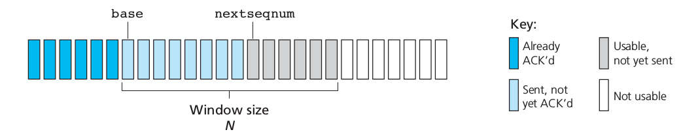
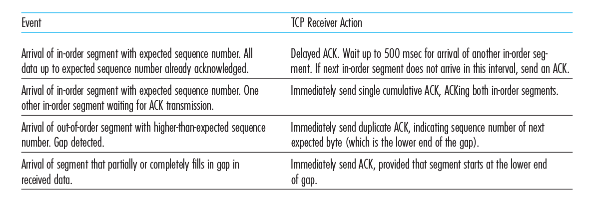

# Chapter 3: Transport Layer

## 3.1 Introduction and Transport-Layer Services

> A **transport-layer** protocol provides for logical communication between application processes running on different hosts

Transport layer converts application layer message into transport layer packets called transport-layer **segments**.

This is done by (possibly) breaking the application messages into smaller chunks and adding a transport-layer header to each chunk to create the transport-layer segment.

### 3.1.1 Relationship between Transport and Network Layers

While transport layer provides logical communication between two application, network layer provides logical communication between two hosts.

The possible services that the transport layer can provide varies on the protocol used. It also depends on the possible services provided by network layer.

The transport layer can provide reliability and security, even though the underlying network layer does not provide such services.

### 3.1.2 Overview of the Transport Layer in the Internet

There are two distinct transport layer protocol available:

1. UDP (User Datagram Protocol): which provides an unreliable, connectionless service to the invoking application
1. TCP (Transmission Control Protocol): which provides a reliable, connection-oriented service to the invoking application.

Internet's network protocol is known as IP (Internet Protocol). The IP service model is a **best-effort** delivery service. This means that IP makes its "best effort" to deliver segments between communicating hosts, but it makes **no guarantees**.

IP does not guarantee:

1. Segment delivery
1. Orderly delivery of segments
1. Integrity of segments

Hence, IP is an unreliable service.

The fundamental responsibility of TCP/UDP is to extend IP's delivery system to process-process communication.

> Extending host-to-host delivery to process-to-process delivery is called **transport-layer multiplexing** and **demultiplexing**.

## 3.2 Multiplexing and Demultiplexing

A process can have one or more **sockets**.

> Sockets are door through which data passes between process and network.

In multiplexing, transport layer takes chunk of data from process, converts it to segments and sends them into the network.

In demultiplexing, transport layer collects segments from network and sends it to corresponding process.

In order to identify which process-to-process communication is happening, transport layer adds header to segments containing source and destination port numbers.

> **Port numbers** are unique identifiers of sockets.

Each port number is a 16 bit number. The port numbers from 0-1023 are **well-known port numbers**.

For TCP, all 4 address informations (source IP, destination IP, source port and destination port) are used during demultiplexing the segment to a socket.

## 3.3 Connectionless Transport: UDP

UDP takes messages from the application process, attaches source and destination port number fields for the multiplexing/demultiplexing service, adds two other small fields, and passes the resulting segment to the network layer.

With UDP there is no handshaking between sending and receiving transport-layer entities before sending a segment. For this reason, UDP is said to be connectionless.

Reasons for using UDP:

1. Finer application-level control over what data is sent, and when
1. No connection establishment
1. No connection state
1. Small packet header overhead

Disadvantage of UDP:

1. Can congest network, crowding out tcp connections
1. Packet loss

### 3.3.1 UDP Segment Structure

The UDP segment contains the following items:

1. Source Port
1. Destination Port
1. Length: Length of header + payload. Segments can be of variable length.
1. Checksum

### 3.3.2 UDP Checksum

The UDP checksum provides for error detection. That is, the checksum is used to determine whether bits within the UDP segment have been altered (for example, by noise in the links or while stored in a router).

UDP at the sender side performs the 1s complement of the sum of all the 16-bit words in the segment, with any overflow encountered during the sum being wrapped around. This result is put in the checksum field of the UDP Segment. At the receiver, all four 16-bit words are added, including the checksum. If no errors are introduced into the packet, then clearly the sum at the receiver will be 1111111111111111. If one of the bits is a 0, then we know that errors have been introduced into the packet.

**Why does UDP Provide Checksum?**

The reason is that there is no guarantee that all the links between source and destination provide error checking; that is, one of the links may use a link-layer protocol that does not provide error checking.

Furthermore, even if segments are correctly transferred across a link, it’s possible that bit errors could be introduced when a segment is stored in a router’s memory.

Given that neither link-by-link reliability nor in-memory error detection is guaranteed, UDP must provide error detection at the transport layer, on an end-end basis, if the end-end data transfer service is to provide error detection.

UDP has no support for recovering from error.

## 3.4 Principles of Reliable Data Transfer

### 3.4.1 Building a Reliable Data Transfer Protocol

#### rdt-1.0: Reliable Data Transfer over a Perfectly Reliable Channel

Nothing to do here. Since channel is reliable, we simply send packets, without doing anything fancy like waiting for feedback or slowing down sending rate.

#### rdt-2.0: Reliable Data Transfer over a Channel with Bit Errors

A more realistic model of the underlying channel is one in which bits in a packet may be corrupted. Such bit errors typically occur in the physical components of a network as a packet is transmitted, propagates, or is buffered.

In real life, lets say talking over phone, how do we deal with garbled words? After each sentence spoken we either say ok or we ask them to repeat what they said. We use **acknowledgements**.

These control messages allow the receiver to let the sender know what has been received correctly, and what has been received in error and thus requires repeating. In a computer network setting, reliable data transfer protocols based on such retransmission are known as **ARQ (Automatic Repeat reQuest)** protocols.

ARQ requires 3 additional protocol capabilities:

1. Error detection: Something like what UDP does.
1. Receive Feedback: Receiver will send positive (ACK) and negative (NAK) acknowledgment as feedback. In principle, these packets need only be one bit long; for example, a 0 value could indicate a NAK and a value of 1 could indicate an ACK.
1. Retransmission. A packet that is received in error at the receiver will be retransmitted by the sender.

In rdt-2.0, sender will send a packet to receiver and wait till it gets ACK reply. If it gets ACK reply, it will send another packet containing information from application layer, else it will resend the packet. Because of this behavior, protocols such as rdt2.0 are known as **stop-and-wait** protocols.

But, the ACK/NAK packets could be corrupted too!

One possible solution is to send enough information with ACK/NAK such that error could be detected and fixed.

Another possible solution is to simply resend the packet if corrupted ACK/NAK is received. But this introduces **Duplicate packet** problem.

A simple solution to this new problem is to add a new field to the data packet and have the sender number its data packets by putting a **sequence number** into this field. The receiver then need only check this sequence number to determine whether or not the received packet is a retransmission.

But notice that, it is possible to get rid of NAK packets from the system. Instead of simply sending ACK packets, if we send the sequence number of last correct packet received, then sender can detect negative acknowledgment by receiving duplicate ACK packet.

#### rdt-3.0: Reliable Data Transfer over a Lossy Channel with Bit Errors

Suppose now that in addition to corrupting bits, the underlying channel can lose packets as well, a not-uncommon event in today’s computer networks.

Two additional concerns must now be addressed by the protocol: how to detect packet loss and what to do when packet loss occurs.

If a packet is lost or ACK gets lost, then no ACK packet will come to sender. It will keep on waiting for it. If we add a **timer** to sender that gets reset each time it receives proper ACK and retransmits packet when times out, then our problem is solved.

### 3.4.2 Pipelined Reliable Data Transfer Protocols

The biggest bottleneck of rdt-3.0 is that it is a stop-and-wait protocol, hence too slow.

For example, if we have two host separated by large distance such that it takes 30 ms to reach from one end to another, then stop-and-wait protocol transmits a single packet over the wire (8000 bits packet takes around 0.08 ms time to be transported through 1 Gbps link) and gets ACK in 30.08 ms, in which it spent $\frac{0.08}{30.08} = 0.00027$ fraction of the time in sending the packet. Such a waste of bandwidth!

The solution to this particular performance problem is simple: Rather than operate in a stop-and-wait manner, the sender is allowed to send multiple packets without waiting for acknowledgments.

Since the many in-transit sender-to-receiver packets can be visualized as filling a pipeline, this technique is known as pipelining. Pipelining has the following consequences for reliable data transfer protocols:

- The range of sequence numbers must be increased, since each in-transit packet (not counting retransmissions) must have a unique sequence number and there may be multiple, in-transit, unacknowledged packets.
- The sender and receiver sides of the protocols may have to buffer more than one packet. Minimally, the sender will have to buffer packets that have been transmitted but not yet acknowledged. Buffering of correctly received packets may also be needed at the receiver, as discussed below.
- The range of sequence numbers needed and the buffering requirements will depend on the manner in which a data transfer protocol responds to lost, corrupted, and overly delayed packets. Two basic approaches toward pipelined error recovery can be identified: Go-Back-N and selective repeat.

### 3.4.3 Go-Back-N (GBN)

In a Go-Back-N (GBN) protocol, the sender is allowed to transmit multiple packets (when available) without waiting for an acknowledgment, but is constrained to have no more than some maximum allowable number, N, of unacknowledged packets in the pipeline.

If we define base to be the sequence number of the oldest unacknowledged packet and nextseqnum to be the smallest unused sequence number (that is, the sequence number of the next packet to be sent), then four intervals in the range of sequence numbers can be identified. See the picture below.

The range of permissible sequence numbers for transmitted but not yet acknowledged packets can be viewed as a window of size N over the range of sequence numbers. As the protocol operates, this window slides forward over the sequence number space. For this reason, N is often referred to as the window size and the GBN protocol itself as a **sliding-window protocol**.

In practice, a packet’s sequence number is carried in a fixed-length field in the packet header. If $k$ is the number of bits in the packet sequence number field, the range of sequence numbers is thus $[0,2k – 1]$. With a finite range of sequence numbers, all arithmetic involving sequence numbers must then be done using modulo $2k$ arithmetic.

GBN uses **cumulative acknowledgment**. The ACK packet tells us that receiver got packet x, it means all packets with sequence number less than x made it to receiver successfully. So basically, for N packets sent to receiver, we always get ACK for a prefix.

When timeout occurs, all packets starting from base onwards are retransmitted. That's why the protocol is name Go-Back-N.

On the receiver's end, it maintains a field called "expectedSeqNum" and receives packets serially one by one. So if any packet comes out-of-order and earlier, it gets ignored and an ACK packet is sent for most recently received in-order packet.

In our GBN protocol, the receiver discards out-of-order packets. Although it may seem silly and wasteful to discard a correctly received (but out-of-order) packet, there is some justification for doing so. Recall that the receiver must deliver data in order to the upper layer. Suppose now that packet n is expected, but packet n + 1 arrives. Because data must be delivered in order, the receiver could buffer (save) packet n + 1 and then deliver this packet to the upper layer after it had later received and delivered packet n. However, if packet n is lost, both it and packet n + 1 will eventually be retransmitted as a result of the GBN retransmission rule at the sender. Thus, the receiver can simply discard packet n + 1. The advantage of this approach is the simplicity of receiver buffering—the receiver need not buffer any out-of-order packets. Thus, while the sender must maintain the upper and lower bounds of its window and the position of nextseqnum within this window, the only piece of information the receiver need maintain is the sequence number of the next in-order packet. This value is held in the variable expectedseqnum. Of course, the disadvantage of throwing away a correctly received packet is that the subsequent retransmission of that packet might be lost or garbled and thus even more retransmissions would be required.

### 3.4.4 Selective Repeat

In GBN protocol, a single loss of packet results in retransmission large number of packets.

As the name suggests, selective-repeat protocols avoid unnecessary retransmissions by having the sender retransmit only those packets that it suspects were received in error (that is, were lost or corrupted) at the receiver.

This individual, as-needed, retransmission will require that the receiver individually acknowledge correctly received packets. A window size of N will again be used to limit the number of outstanding, unacknowledged packets in the pipeline. However, unlike GBN, the sender will have already received ACKs for some of the packets in the window.

The SR receiver will acknowledge a correctly received packet whether or not it is in order. Out-of-order packets are buffered until any missing packets (that is, packets with lower sequence numbers) are received, at which point a batch of packets can be delivered in order to the upper layer.

The window size must be less than or equal to half the size of the sequence number space for SR protocols, otherwise, circular buffer will cause problem (ambiguous packet sequence number possible).

With this, our rdt protocol is almost complete. One assumption we still have in our protocol is that packages cannot reorder. While this is true for a single wire between two host, same cannot be said for network in between. Some router in the middle might put a packet in buffer and emit it later in future. Since we are reusing sequence number in our protocol, we need a way to distinguish packet $x$ we are sending now and another with same sequence number $x$ popping out of nowhere.

One method is that sender will send a packet $x$ only if it is sure that no other packet $x$ is still alive in the network. This is done by assuming that a packet cannot “live” in the network for longer than some fixed maximum amount of time, **TTL (time-to-live)**.

In summery, unreliable data channel has the following problems:

1. Packet corruption: bit errors
1. Packet loss
1. Packet reordering

In order to tackle the three problems above, rdt has the following mechanisms:

1. Checksum for bit error
1. ACK reply for reception feedback
1. Timer for retransmission
1. Sequence number for detecting duplicates and missing packets
1. Pipelining for increasing bandwidth utilization
1. Sliding window buffer for tracking acknowledged packets
1. Cumulative acknowledgment and Go-Back-N protocol
1. Selective retransmission for in case of packet loss
1. TTL for ensuring packet flushing

## 3.5 Connection-Oriented Transport: TCP

### 3.5.1 The TCP Connection

> TCP is said to be **connection-oriented** because before one application process can begin to send data to another, the two processes must first “handshake” with each other—that is, they must send some preliminary segments to each other to establish the parameters of the ensuing data transfer.

TCP connections are point-to-point. Sending to many receivers with a single send is not possible.

TCP first establishes a connection using a **three-way handshake**. The segments sent during handshake are special.

#### Structure of TCP Segment

##### Sequence Number and Acknowledgment Number

In TCP, sequence number is dependent on bytes stream, not on segment stream. So if I send 11 bytes in first segment, then first segment will have sequence number 0 and second segment will have sequence number 11.

Since TCP is full-duplex, it can receive data from B to A in the same session. Hence, in the acknowledgment field, A puts the sequence number of the next byte that A is expecting from B. This is called **piggybacking**, since ACK is coming together with the data segment.

Since TCP always sends the first missing packet number through its ACK field, it is using **cumulative acknowledgment** protocol.

It is not specified in TCP about what to do with out-of-order packets. In practice, the receiver buffers it.

The starting sequence number for two host A and B are chosen randomly to avoid some other packet already alive in network from interfering with current session.

### 3.5.3 Round-Trip Time Estimation and Timeout

#### Estimating the Round-Trip Time

TCP selects a packet at a time and calculates its **RTT (Round Trip Time)**. This is a $SampleRTT$. Next, it combines all $SampleRTT$ into $EstimatedRTT$ using **exponential weighted moving averge**.

$$EstimatedRTT = (1 - \alpha) \cdot EstimatedRTT + \alpha \cdot SampleRTT$$

Usually, $\alpha = 0.125$.

In addition to having an estimate of the RTT, it is also valuable to have a measure of the variability of the RTT.

$$DevRTT = (1 - \beta) \cdot DevRTT + \beta \cdot (SampleRTT - EstimatedRTT)$$

If the $SampleRTT$ values have little fluctuation, then $DevRTT$ will be small; on the other hand, if there is a lot of fluctuation, $DevRTT$ will be large. The recommended value of $\beta$ is $0.25$.

So what should be the timeout for retransmission? When fluctuation in network is high, timeout should be high and vice-versa.

$$TimeoutInterval = EstimatedRTT + 4 \cdot DevRTT$$

An initial TimeoutInterval value of 1 second is recommended. Also, when a timeout occurs, the value of TimeoutInterval is doubled to avoid a premature timeout occurring for a subsequent segment that will soon be acknowledged. However, as soon as a segment is received and EstimatedRTT is updated, the TimeoutInterval is again computed using the formula above.

### 3.5.4 Reliable Data Transfer

#### Single Timer for all unacknowledged packets**

In our earlier development of reliable data transfer techniques, it was conceptually easiest to assume that an individual timer is associated with each transmitted but not yet acknowledged segment. While this is great in theory, timer management can require considerable overhead. Thus, the recommended TCP timer management procedures use only a single retransmission timer, even if there are multiple transmitted but not yet acknowledged segments.

When timeout occurs, TCP retransmits the smallest unacknowledged packet again. Timer gets restarted each time we receive acknowledgment that updates our base segment pointer.

#### Doubling the timeout**
When timeout occurs, we double the timeout before retransmitting. This is a form of congestion control. We stabalize the timer once we get acknowledgment.

#### Fast Retransmit

One of the problems with timeout-triggered retransmissions is that the timeout period can be relatively long. When a segment is lost, this long timeout period forces the sender to delay resending the lost packet, thereby increasing the end-to- end delay. But we can detect packet loss before timeout.

A duplicate ACK is an ACK that reacknowledges a segment for which the sender has already received an earlier acknowledgment.

Because a sender often sends a large number of segments back to back, if one seg- ment is lost, there will likely be many back-to-back duplicate ACKs. If the TCP sender receives three duplicate ACKs for the same data, it takes this as an indication that the segment following the segment that has been ACKed three times has been lost.

In the case that three duplicate ACKs are received, the TCP sender performs a **fast retransmit**, i.e, retransmit before timeout.

TCP is a hybrid of GBN and SR.

### 3.5.5 Flow Control

Each side has a receive buffer. The associated application process will read data from this buffer, but not necessarily at the instant the data arrives. If the application is relatively slow at reading the data, the sender can very easily overflow the connection’s receive buffer by sending too much data too quickly.

> TCP provides a **flow-control** service to its applications to eliminate the possibility of the sender overflowing the receiver’s buffer. Flow control is thus a speed-matching service—matching the rate at which the sender is sending against the rate at which the receiving application is reading.

The sender keeps track of last-byte-sent and last-byte-acknowledged. Thus, sender keeps track of amount bytes that are pushed to network. This amount of data needs to be smaller than empty room in receiver's buffer. The empty room in receivers buffer is called receiver window or **rwnd**. The size of **rwnd** is sent through the segment in a separate field.

It is the sender's responsibility to make sure not to overflow receivers buffer unnecessarily.

The protocol states that when $rwnd = 0$, sender should keep on sending 1 single byte, so that receiver can let sender know when $rwnd$ size increases using the ACK packet.

### 3.5.6 TCP Connection Management

Here is how **three-way handshake** works:

1. The client sends server a tcp segment which contains two things: SYN flag bit turned on and a random sequnce number $client\_isn$. This segment is called **SYN segment**.
1. When server receives the syn segment, it allocates buffer and initiates variable accordingly and replies with a segment known as **SYNACK segment**. This segment contains three things: SYN bit turned on, ACK number equal to $client\_isn+1$ and sequence number equal to $server\_isn$ which is chosen randomly.
1. When client receives SYNACK, it sends an ACK packet with ACK number equal to $server\_isn+1$ and SYN bit off this time. This segment may carry payload.

Either host can tear down the connection by sending a pakcet that has **FIN** flag turned on, which the partner acknowledges and send its own FIN segment back. Upon receiving a FIN segment, host deallocates its resources.
