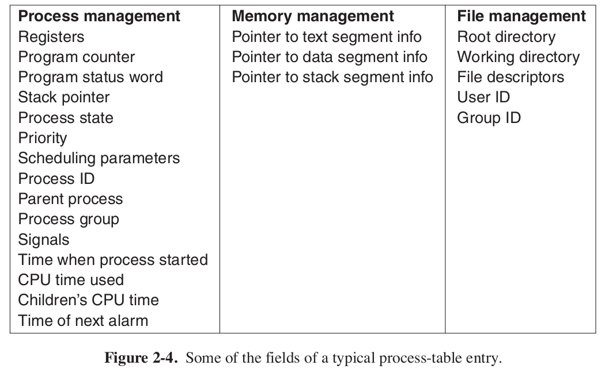
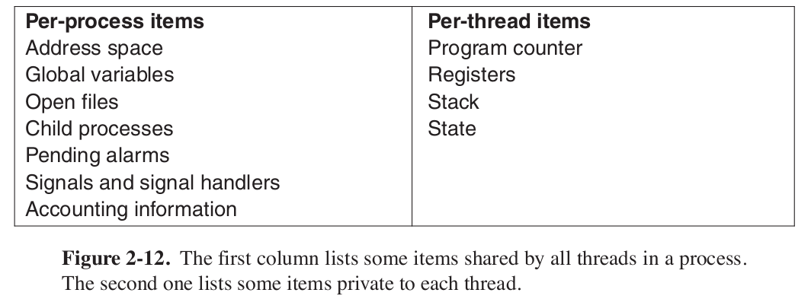
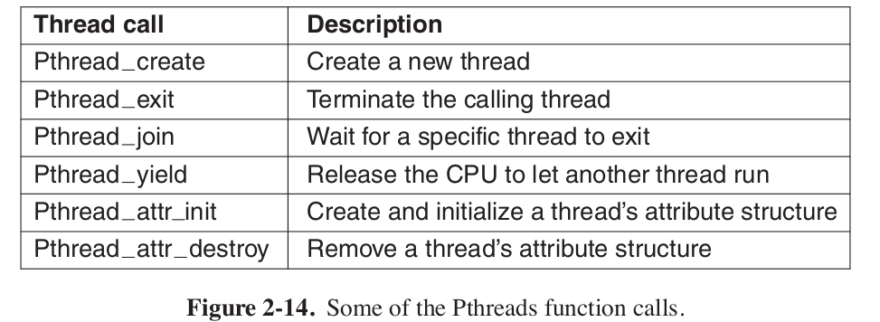

# Chapter 2 - Processes and Threads

# 2.1 Process

## 2.1.1 Process Model

> A **process** is just an instance of an executing program, including the current values of the program counter, registers, and variables. **Conceptually, each process has its own virtual CPU.**

In this chapter, we will assume there is only one CPU.

With the CPU switching back and forth among the processes, the rate at which a process performs its computation will not be uniform and probably not even reproducible if the same processes are run again. Thus, **processes must not be programmed with built-in assumptions about timing.**

**Baking Cake Analogy**: The recipe is the program. The baker is the processor. The ingredients are the input. Cake is the output. Process is the activity where baker reads the recipe, fetches input and produces the output.

## 2.1.2 Process Creation

Four principle event causes process creation:
1. System initialization.
2. Execution of a process-creation system call by a running process.
3. A user request to create a new process.
4. Initiation of a batch job (applicable for mainframe).

> Processes that stay in the background to handle some activity such as email, Web pages, news, printing, and so on are called **daemons**.

A new process is created by having an existing process execute a process creation system call.

In UNIX, there is only one system call to create a new process: **fork**. This call creates an exact clone of the calling process. After the fork , the two processes, the parent and the child, have the same memory image, the same environment strings, and the same open files. That is all there is.

After a process is created, the parent and child have their own distinct address spaces. If either process changes a word in its address space, the change is not visible to the other process. In UNIX, the child’s initial address space is a copy of the parent’s, but there are definitely two distinct address spaces involved; no writable memory is shared.

Some UNIX implementations share the program text between the two since that cannot be modified. Alternatively, the child may share all of the parent’s memory, but in that case the memory is shared copy-on-write, which means that whenever either of the two wants to modify part of the memory, that chunk of memory is explicitly copied first to make sure the modification occurs in a private memory area.

## 2.1.3 Process Termination

1. Normal exit (voluntary).
2. Error exit (voluntary).
3. Fatal error (involuntary).
4. Killed by another process (involuntary).

In some systems, when a process terminates, either voluntarily or otherwise, all processes it created are immediately killed as well. Neither UNIX nor Windows works this way, however. **Killing parent does not kill its child in Unix and Windows.**

## 2.1.4 Process Hierarchies

In UNIX, a process and all of its children and further descendants together form a process group. When a user sends a signal from the keyboard, the signal is delivered to all members of the process group currently associated with the keyboard (usually all active processes that were created in the current window). Individually, each process can catch the signal, ignore the signal, or take the default action, which is to be killed by the signal.

Processes in UNIX cannot disinherit their children.

## 2.1.5 Process States

## 2.1.6 Process Implementation

To implement the process model, the operating system maintains a table, called the **process table**, with one entry per process. Some authors call these entries **process control blocks**.

# 2.2 THREADS

In traditional operating systems, each process has an address space and a single thread of control.

## 2.2.1 Thread Usage

- the ability for the parallel entities to share an address space and all of its data among themselves.
- they are lighter weight than processes, they are easier (i.e., faster) to create and destroy than processes. In many systems, creating a thread goes 10–100 times faster than creating a process.
- Threads yield no performance gain when all of them are CPU bound, but when there is substantial computing and also substantial I/O, having threads allows these activities to overlap, thus speeding up the application.

Example: A person writing a doc and having multiple threads work on it. Having multiple processes will mean having copies of the same doc, which is not what we want.

## 2.2.2 The Classical Thread Model

While threads are often useful, they also introduce a number of complications into the programming model. To start with, consider the effects of the UNIX fork system call. If the parent process has multiple threads, should the child also have them? If not, the process may not function properly, since all of them may be essential.

However, if the child process gets as many threads as the parent, what happens if a thread in the parent was blocked on a read call, say, from the keyboard? Are two threads now blocked on the keyboard, one in the parent and one in the child? When a line is typed, do both threads get a copy of it? Only the parent? Only the child? The same problem exists with open network connections.

Another class of problems is related to the fact that threads share many data structures. What happens if one thread closes a file while another one is still read- ing from it? Suppose one thread notices that there is too little memory and starts allocating more memory. Partway through, a thread switch occurs, and the new thread also notices that there is too little memory and also starts allocating more memory. Memory will probably be allocated twice.

## 2.2.3 POSIX Threads

To make it possible to write portable threaded programs, IEEE has defined a standard for threads in IEEE standard 1003.1c. The threads package it defines is called Pthreads.

