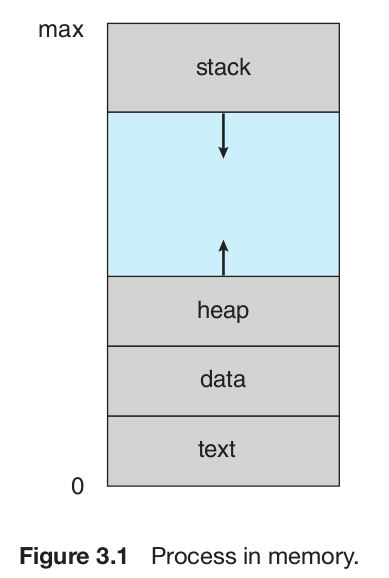
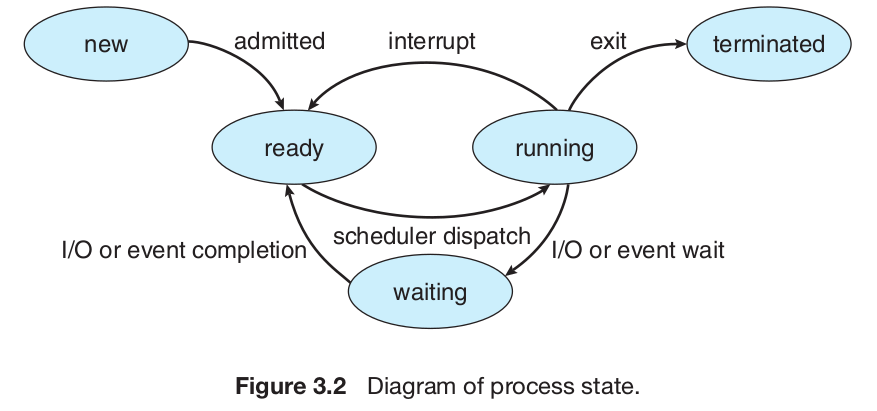
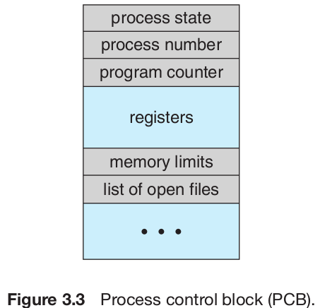
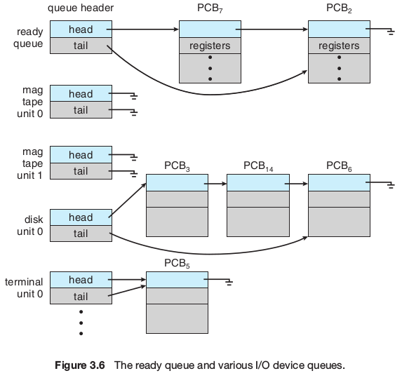
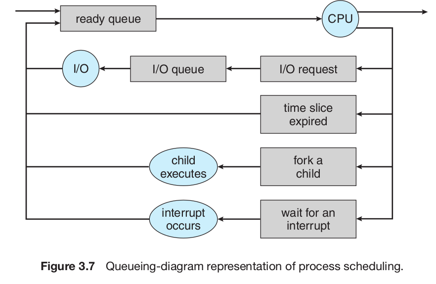

# 3.1 Process Concept

## 3.1.1 The Process



## 3.1.2 Process State



## 3.1.3 Process Control Block



- **Process state**. The state may be new, ready, running, waiting, halted, and so on.

- **Program counter**. The counter indicates the address of the next instruction to be executed for this process.

- **CPU registers**. The registers vary in number and type, depending on the computer architecture. They include accumulators, index registers, stack pointers, and general-purpose registers, plus any condition-code
information. Along with the program counter, this state information must be saved when an interrupt occurs, to allow the process to be continued correctly afterward.

- **CPU-scheduling information**. This information includes a process priority, pointers to scheduling queues, and any other scheduling parameters.

- **Memory-management information**. This information may include such information as the value of the base and limit registers, the page tables, or the segment tables, depending on the memory system used by the

- **Accounting information**. This information includes the amount of CPU and real time used, time limits, account numbers, job or process numbers, and so on.

- **I/O status information**. This information includes the list of I/O devices allocated to the process, a list of open files, and so on.

# 3.2 Process Scheduling

## 3.2.1 Scheduling Queues

As processes enter the system, they are put into a **job queue**, which consists of all processes in the system. The processes that are residing in main memory and are ready and waiting to execute are kept on a list called the **ready queue**.

This queue is generally stored as a linked list. A ready-queue header contains pointers to the first and final PCB s in the list. Each PCB includes a pointer field that points to the next PCB in the ready queue.



The system also includes other queues. When a process is allocated the CPU , it executes for a while and eventually quits, is interrupted, or waits for the occurrence of a particular event, such as the completion of an I/O request. Suppose the process makes an I/O request to a shared device, such as a disk. Since there are many processes in the system, the disk may be busy with the I/O request of some other process. The process therefore may have to wait for the disk. The list of processes waiting for a particular I/O device is called a device queue. Each device has its own **device queue**.



## 3.2.2 Schedulers

A process migrates among the various scheduling queues throughout its lifetime. The operating system must select, for scheduling purposes, processes from these queues in some fashion. The selection process is carried out by the appropriate **scheduler**.

Often, in a batch system, more processes are submitted than can be executed immediately. These processes are spooled to a mass-storage device (typically a disk), where they are kept for later execution. The **long-term scheduler**, or **job scheduler**, selects processes from this pool and loads them into memory for execution. The **short-term scheduler**, or **CPU scheduler**, selects from among the processes that are ready to execute and allocates the CPU to one of them.

The primary distinction between these two schedulers lies in frequency of execution. The short-term scheduler must select a new process for the CPU frequently. Often, the short-term scheduler executes at least once every 100 milliseconds.

The long-term scheduler executes much less frequently; minutes may separate the creation of one new process and the next. The long-term scheduler controls the **degree of multiprogramming** (the number of processes in memory). If the degree of multiprogramming is stable, then the average rate of process creation must be equal to the average departure rate of processes leaving the system. Thus, the long-term scheduler may need to be invoked only when a process leaves the system. Because of the longer interval between executions, the long-term scheduler can afford to take more time to decide which process should be selected for execution.

It is important that the long-term scheduler make a careful selection. In general, most processes can be described as either **I/O bound** or **CPU bound**. It is important that the long-term scheduler select a good process mix of I/O -bound and CPU -bound processes. If all processes are I/O bound, the ready queue will almost always be empty, and the short-term scheduler will have little to do. If all processes are CPU bound, the I/O waiting queue will almost always be empty, devices will go unused, and again the system will be unbalanced.

Some operating systems, such as time-sharing systems, may introduce an additional, intermediate level of scheduling. This **medium-term scheduler** is diagrammed in Figure 3.8. The key idea behind a medium-term scheduler is that sometimes it can be advantageous to remove processes from memory (and from active contention for the CPU ) and thus reduce the degree of multiprogramming. Later, the process can be reintroduced into memory, and its execution can be continued where it left off. This scheme is called **swapping**. The process is swapped out, and is later swapped in, by the medium-term scheduler. Swapping may be necessary to improve the process mix or because a change in memory requirements has overcommitted available memory, requiring memory to be freed up.

## 3.2.3 Context Switch

Interrupts cause the operating system to change a CPU from its current task and to run a kernel routine. Such operations happen frequently on general-purpose systems. When an interrupt occurs, the system needs to save the current **context** of the process running on the CPU so that it can restore that context when its processing is done, essentially suspending the process and then resuming it. The context is represented in the PCB of the process.

Switching the CPU to another process requires performing a **state save** of the current process and a **state restore** of a different process. This task is known as a **context switch**.

Context-switch time is pure overhead, because the system does no useful work while switching. Typical it takes around few milliseconds.

Contexts are saved into main memory (RAM).

# 3.3 Operations on Process

Processes can be created via a create-process system call.

The creating process is called a **parent** process, and the new processes are called the **children** of that process.

Processes are identified according to a unique **process identifier (pid)**, typically an integer number.

When a process creates a new process, two possibilities exist for execution:
1. The parent continues to execute concurrently with its children.
2. The parent waits until some or all of its children have terminated.

**TODO: More research on child address space**

There are also two possibilities for the address space of the new process:
1. The child process is a duplicate of the parent process (it has the same
program and data as the parent).
2. The child process has a new program loaded into it.

# 3.4 Interprocess Communication

A process is **independent** if it cannot affect or be affected by the other processes executing in the system. Any process that does not share data with any other process is independent. A process is **cooperating** if it can affect or be affected by the other processes executing in the system. Clearly, any process that shares data with other processes is a cooperating process.

There are two
fundamental models of interprocess communication:
1. shared memory
2. message passing

Message passing is useful for exchanging smaller amounts of data, because no conflicts need be avoided. Message passing is also easier to implement than shared memory for intercomputer communication. Shared memory allows maximum speed and convenience of communication. Shared memory is faster than message passing, as message- passing systems are typically implemented using system calls and thus require the more time-consuming task of kernel intervention. In contrast, in shared- memory systems, system calls are required only to establish shared-memory regions. Once shared memory is established, all accesses are treated as routine memory accesses, and no assistance from the kernel is required.

## 3.4.1 Shared-Memory Systems

Interprocess communication using shared memory requires communicating processes to establish a region of shared memory. Typically, a shared-memory region resides in the address space of the process creating the shared-memory segment. Other processes that wish to communicate using this shared-memory segment must attach it to their address space.

Recall that, normally, the operating system tries to prevent one process from accessing another process’s memory. Shared memory requires that two or more processes agree to remove this restriction. They can then exchange information by reading and writing data in the shared areas.

The form of the data and the location are determined by these processes and are not under the operating system’s control. The processes are also responsible for ensuring that they are not writing to the same location simultaneously.

### Producer Consumer Problem

A producer process produces information that is consumed by a
consumer process.

One solution to the producer–consumer problem uses shared memory. To allow producer and consumer processes to run concurrently, we must have available a buffer of items that can be filled by the producer and emptied by the consumer. This buffer will reside in a region of memory that is shared by the producer and consumer processes. A producer can produce one item while the consumer is consuming another item. The producer and consumer must be synchronized, so that the consumer does not try to consume an item that has not yet been produced.

Two types of buffers can be used. The **unbounded buffer** places no practical limit on the size of the buffer. The consumer may have to wait for new items, but the producer can always produce new items. The **bounded buffer** assumes a fixed buffer size. In this case, the consumer must wait if the buffer is empty, and the producer must wait if the buffer is full.

```
#define BUFFER SIZE 10
typedef struct {
  . . .
}item;
item buffer[BUFFER SIZE];
int in = 0;
int out = 0;

item nextProduced;
while (true) {
  /* produce an item in nextProduced */
  while (((in + 1) % BUFFER SIZE ) == out)
    ; /* do nothing */
  buffer[in] = nextProduced;
  in = (in + 1) % BUFFER SIZE ;
}
```

## 3.4.2 Message-Passing Systems

Message passing provides a mechanism to allow processes to communicate and to synchronize their actions without sharing the same address space and is particularly useful in a distributed environment, where the communicating processes may reside on different computers connected by a network.

A message-passing facility provides at least two operations: `send` (message) and `receive` (message). Messages sent by a process can be of either fixed or variable size. If only fixed-sized messages can be sent, the system-level implementation is straightforward. This restriction, however, makes the task of programming more difficult.

If processes P and Q want to communicate, they must send messages to and receive messages from each other; a **communication link** must exist between them.

### 3.4.2.1 Naming

Processes that want to communicate must have a way to refer to each other. They can use either **direct** or **indirect** communication.

#### Direct Communication

Under direct communication, each process that wants to communicate must explicitly name the recipient or sender of the communication.

- `send(P, message)` - Send a message to process P .
- `receive(Q, message)` - Receive a message from process Q .

A communication link in this scheme has the following properties:
- A link is established automatically between every pair of processes that want to communicate. The processes need to know only each other’s identity to communicate.
- A link is associated with exactly two processes.
- Between each pair of processes, there exists exactly one link.

This scheme exhibits symmetry in addressing; that is, both the sender process and the receiver process must name the other to communicate. A variant of this scheme employs asymmetry in addressing.

- send(P, message) —Send a message to process P .
- receive(id, message) —Receive a message from any process; the variable id is set to the name of the process with which communication has taken place.

The disadvantage in both of these schemes (symmetric and asymmetric) is that we need to explicitly name sender/receiver. Change in pid of on process thus breaks the code.

#### Indirect Communication

With **indirect communication**, the messages are sent to and received from **mailboxes**, or **ports**. A mailbox can be viewed abstractly as an object into which messages can be placed by processes and from which messages can be removed. Each mailbox has a unique identification.

In this scheme, a process can communicate with some other process via a number of different mailboxes. Two processes can communicate only if the processes have a shared mailbox, however.

In this scheme, a communication link has the following properties:

- A link is established between a pair of processes only if both members of the pair have a shared mailbox.
- A link may be associated with more than two processes.
- Between each pair of communicating processes, there may be a number of different links, with each link corresponding to one mailbox.

### 3.4.2.2 Synchronization

Communication between processes takes place through calls to send() and receive() primitives. Message passing may be either **blocking** or **nonblocking** - also known as **synchronous** and **asynchronous**.
