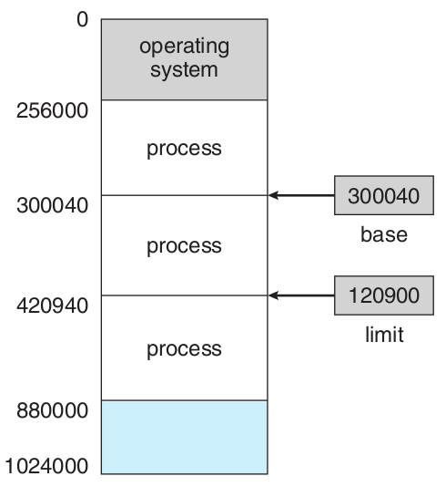
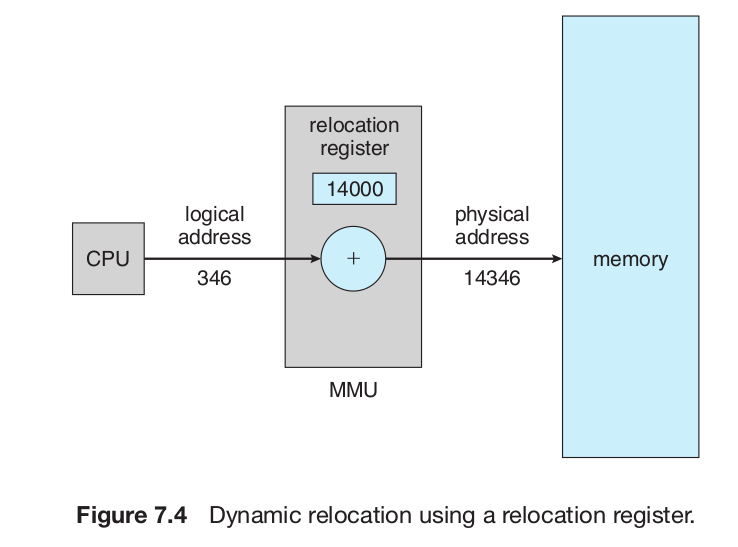
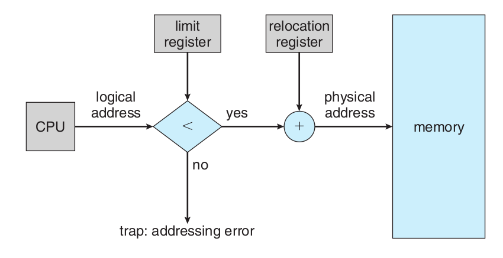
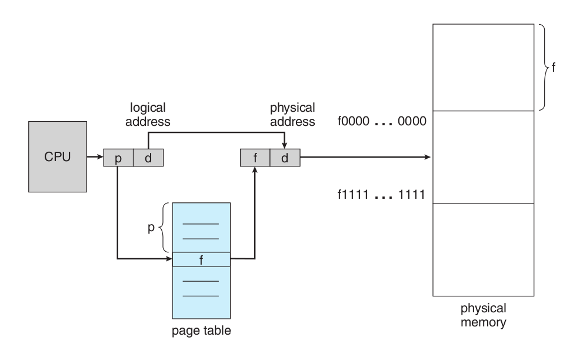
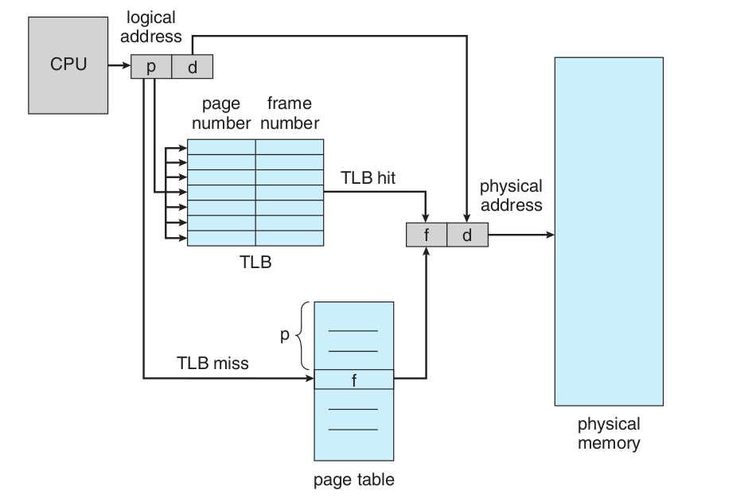

# Main Memory

# 7.1 Background

## 7.1.1 Basic Hardware

Main memory and the registers built into the processor itself are the only storage that the CPU can access directly.

There are machine instructions that take memory addresses as arguments, but none that take disk addresses.

Therefore, any instructions in execution, and any data being used by the instructions, must be in one of these direct-access storage devices. If the data are not in memory, they must be moved there before the CPU can operate on them.

Registers that are built into the CPU are generally accessible within one cycle of the CPU clock. Most CPU s can decode instructions and perform simple operations on register contents at the rate of one or more operations per clock tick. The same cannot be said of main memory, which is accessed via a transaction on the memory bus. Completing a memory access may take many cycles of the CPU clock. In such cases, the processor normally needs to **stall**.

This situation is intolerable because of the frequency of memory accesses. The remedy is to add fast memory between the CPU and main memory. A memory buffer used to accommodate a speed differential, called a **cache**.

### Memory Protection

We need to make sure that each process has a separate memory space. To do this, we need the ability to determine the range of legal addresses that the process may access and to ensure that the process can access only these legal addresses.

We can provide this protection by using two registers, usually
a **base** and a **limit**. The base register holds the smallest legal physical memory address; the limit register specifies the size of the range.

Protection of memory space is accomplished by having the CPU hardware compare every address generated in user mode with the registers. Any attempt by a program executing in user mode to access operating-system memory or other users’ memory results in a trap to the operating system, which treats the attempt as a fatal error. This scheme prevents a user program from (accidentally or deliberately) modifying the code or data structures of either the operating system or other users.

The base and limit registers can be loaded only by the operating system, which uses a special privileged instruction. Since privileged instructions can be executed only in kernel mode, and since only the operating system executes in kernel mode, only the operating system can load the base and limit registers. This scheme allows the operating system to change the value of the registers but prevents user programs from changing the registers’ contents.

The operating system, executing in kernel mode, is given unrestricted access to both operating system memory and users’ memory. This provision allows the operating system to load users’ programs into users’ memory, to dump out those programs in case of errors, to access and modify parameters of system calls, and so on.

## 7.1.2 Address Binding

Usually, a program resides on a disk as a binary executable file. To be executed, the program must be brought into memory and placed within a process.

Depending on the memory management in use, the process may be moved between disk and memory during its execution. The processes on the disk that are waiting to be brought into memory for execution form the **input queue**.

Addresses in the source program are generally symbolic (such as count). A compiler will typically **bind** these symbolic addresses to relocatable addresses (such as “14 bytes from the beginning of this module”). The linkage editor or loader will in turn bind the relocatable addresses to absolute addresses (such as 74014). Each binding is a mapping from one address space to another.

## 7.1.3 Logical Versus Physical Address Space

An address generated by the CPU is commonly referred to as a **logical address**, whereas an address seen by the memory unit, that is, the one loaded into the **memory-address register** of the memory, is commonly referred to as a **physical address**.

The compile-time and load-time address-binding methods generate identical logical and physical addresses. However, the execution-time address- binding scheme results in differing logical and physical addresses. In this case, we usually refer to the logical address as a **virtual address**.

The run-time mapping from virtual to physical addresses is done by a hardware device called the **memory-management unit ( MMU )**.

The base register is now called a **relocation register**. The value in the relocation register is added to every address generated by a user process at the time the address is sent to memory.

We now have two different types of addresses: logical addresses (in the range 0 to max) and physical addresses (in the range R + 0 to R + max for a base value R). The user generates only logical addresses and thinks that the process runs in locations 0 to max.

## 7.1.4 Dynamic Loading

In our discussion so far, it has been necessary for the entire program and all data of a process to be in physical memory for the process to execute. The size of a process has thus been limited to the size of physical memory. To obtain better memory-space utilization, we can use **dynamic loading**.

With dynamic loading, a routine is not loaded until it is called. All routines are kept on disk in a relocatable load format. The main program is loaded into memory and is executed. When a routine needs to call another routine, the calling routine first checks to see whether the other routine has been loaded. If it has not, the relocatable linking loader is called to load the desired routine into memory and to update the program’s address tables to reflect this change. Then control is passed to the newly loaded routine.

The advantage of dynamic loading is that an unused routine is never loaded. This method is particularly useful when large amounts of code are needed to handle infrequently occurring cases.

Dynamic loading does not require special support from the operating system. It is the responsibility of the users to design their programs to take advantage of such a method. Operating systems may help the programmer, however, by providing library routines to implement dynamic loading.

# 7.2 Swapping

A process must be in memory to be executed. A process, however, can be swapped temporarily out of memory to a backing store and then brought back into memory for continued execution.

Swapping requires a backing store. The backing store is commonly a fast disk. It must be large enough to accommodate copies of all memory images for all users, and it must provide direct access to these memory images. The system maintains a ready queue consisting of all processes whose memory images are on the backing store or in memory and are ready to run. Whenever the CPU scheduler decides to execute a process, it calls the dispatcher. The dispatcher checks to see whether the next process in the queue is in memory. If it is not, and if there is no free memory region, the dispatcher swaps out a process currently in memory and swaps in the desired process. It then reloads registers and transfers control to the selected process.

Swapping is constrained by other factors as well. If we want to swap a process, we must be sure that it is completely idle.

# 7.3 Contiguous Memory Allocation

The memory is usually divided into two partitions: one for the resident operating system and one for the user processes. Since the interrupt vector is often in low memory, programmers usually place the operating system in low memory as well.

## 7.3.1 Memory Mapping and Protection

Same as relocation register protection. Each memory address is first checked against limit to see if it is smaller; if so, relocation register is added to get physical address.

## 7.3.2 Memory Allocation

One of the simplest methods for allocating memory is to divide memory into several **fixed-sized partitions**. Each partition may contain exactly one process. Thus, the degree of multiprogramming is bound by the number of partitions.

In this multiple-partition method, when a partition is free, a process is selected from the input queue and is loaded into the free partition. When the process terminates, the partition becomes available for another process.

In the **variable-partition** scheme, the operating system keeps a table indicating which parts of memory are available and which are occupied. Initially, all memory is available for user processes and is considered one large block of available memory, a hole. Eventually, as you will see, memory contains a set of holes of various sizes.

This procedure is a particular instance of the general **dynamic storage-allocation** problem, which concerns how to satisfy a request of size n from a list of free holes. There are many solutions to this problem. The first-fit, best-fit, and worst-fit strategies are the ones most commonly used to select a free hole from the set of available holes.

## 7.3.3 Fragmentation

Both the first-fit and best-fit strategies for memory allocation suffer from **external fragmentation**. As processes are loaded and removed from memory, the free memory space is broken into little pieces. External fragmentation exists when there is enough total memory space to satisfy a request but the available spaces are not contiguous; storage is fragmented into a large number of small holes.

Depending on the total amount of memory storage and the average process size, external fragmentation may be a minor or a major problem. Statistical analysis of first fit, for instance, reveals that, even with some optimization, given N allocated blocks, another 0.5 N blocks will be lost to fragmentation. That is, one-third of memory may be unusable! This property is known as the **50-percent rule**.

Memory fragmentation can be internal as well as external. Consider a multiple-partition allocation scheme with a hole of 18,464 bytes. Suppose that the next process requests 18,462 bytes. If we allocate exactly the requested block, we are left with a hole of 2 bytes. The overhead to keep track of this hole will be substantially larger than the hole itself. The general approach to avoiding this problem is to break the physical memory into fixed-sized blocks and allocate memory in units based on block size. With this approach, the memory allocated to a process may be slightly larger than the requested memory. The difference between these two numbers is **internal fragmentation** - unused memory that is internal to a partition.

One solution to the problem of external fragmentation is **compaction**. Move all holes towards right until it merges into a single large hole. This process is expensive. Another method would be allocation non-contiguous memory.

# 7.4 Paging

Paging is a memory-management scheme that permits the physical address space of a process to be noncontiguous. Paging avoids external fragmentation and the need for compaction.

## 7.4.1 Basic Method

The basic method for implementing paging involves breaking physical memory into fixed-sized blocks called **frames** and breaking logical memory into blocks of the same size called **pages**.

When a process is to be executed, its pages are loaded into any available memory frames from their source (a file system or the backing store). The backing store is divided into fixed-sized blocks that are of the same size as the memory frames.

Every address generated by the CPU is divided into two parts: a page number (p) and a page offset (d). The page number is used as an index into a page table. The page table contains the base address of each page in physical memory. This base address is combined with the page offset to define the physical memory address that is sent to the memory unit.

If the size of the logical address space is $2^m$ and a page size is $2^n$ addressing units (bytes or words), then the high-order m − n bits of a logical address designate the page number and the n low-order bits designate the page offset.

When we use a paging scheme, we have no external fragmentation: any free frame can be allocated to a process that needs it. However, we may have some internal fragmentation.

Small page sizes reduces internal fragmentation but increases page table over head. Today, pages typically are between
4 KB and 8 KB in size.

When a process arrives in the system to be executed, its size, expressed in pages, is examined. Each page of the process needs one frame. Thus, if the process requires n pages, at least n frames must be available in memory. If n frames are available, they are allocated to this arriving process. The first page of the process is loaded into one of the allocated frames, and the frame number is put in the page table for this process. The next page is loaded into another frame, its frame number is put into the page table, and so on.

The user program views memory as one single space containing only this one program.

Since the operating system is managing physical memory, it must be aware of the allocation details of physical memory—which frames are allocated, which frames are available, how many total frames there are, and so on. This information is generally kept in a data structure called a **frame table**. The frame table has one entry for each physical page frame, indicating whether the latter is free or allocated and, if it is allocated, to which page of which process or processes.

## 7.4.2 Hardware Support

Each process contains a **page-table base register ( PTBR )** in PCB that points to page table. If we store the page table in main memory, then accessing any address takes two memory access as we have to lookup page table once and then the actual frame.

The standard solution to this problem is to use a special, small, fast- lookup hardware cache, called a **translation look-aside buffer ( TLB )**. The TLB is associative, high-speed memory. Each entry in the TLB consists of two parts: a key (or tag) and a value. When the associative memory is presented with an item, the item is compared with all keys simultaneously. If the item is found, the corresponding value field is returned. The search is fast; the hardware, however, is expensive. Typically, the number of entries in a TLB is small, often numbering between 64 and 1,024.

The TLB is used with page tables in the following way. The TLB contains only a few of the page-table entries. When a logical address is generated by the CPU , its page number is presented to the TLB . If the page number is found, its frame number is immediately available and is used to access memory. The whole task may take less than 10 percent longer than it would if an unmapped memory reference were used.

If the page number is not in the TLB (known as a **TLB miss**), a memory reference to the page table must be made. When the frame number is obtained, we can use it to access memory. In addition, we add the page number and frame number to the TLB , so that they will be found quickly on the next reference. If the TLB is already full of entries, the operating system must select one for replacement. Replacement policies range from least recently used ( LRU ) to random. Furthermore, some TLB s allow certain entries to be wired down, meaning that they cannot be removed from the TLB . Typically, TLB entries for kernel code are wired down.

Some TLBs store **address-space identifiers ( ASIDs )** in each TLB entry. An ASID uniquely identifies each process and is used to provide address-space protection for that process. When the TLB attempts to resolve virtual page numbers, it ensures that the ASID for the currently running process matches the ASID associated with the virtual page. If the ASID s do not match, the attempt is treated as a TLB miss. In addition to providing address-space protection, an ASID allows the TLB to contain entries for several different processes simultaneously. If the TLB does not support separate ASID s, then every time a new page table is selected (for instance, with each context switch), the TLB must be flushed (or erased) to ensure that the next executing process does not use the wrong translation information.

The percentage of times that a particular page number is found in the TLB is called the hit ratio. An 80-percent hit ratio, for example, means that we find the desired page number in the TLB 80 percent of the time. If it takes 20 nanoseconds to search the TLB and 100 nanoseconds to access memory, then a mapped-memory access takes 120 nanoseconds when the page number is in the TLB . If we fail to find the page number in the TLB (20 nanoseconds), then we must first access memory for the page table and frame number (100 nanoseconds) and then access the desired byte in memory (100 nanoseconds), for a total of 220 nanoseconds. To find the effective memory-access time, we weight the case by its probability:

effective access time = 0.80 × 120 + 0.20 × 220 = 140 nanoseconds.

In this example, we suffer a 40-percent slowdown in memory-access time.

## 7.4.3 Protection
