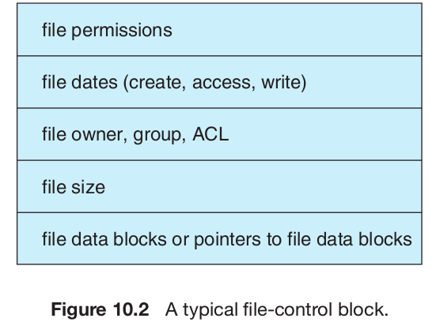
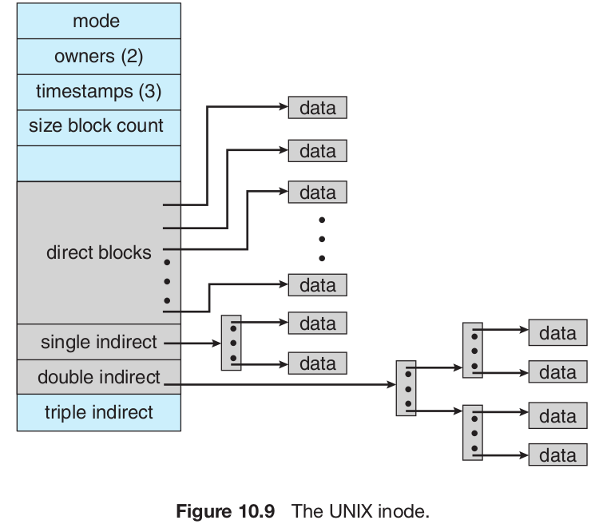

# Chapter 10 File System Implementation

# 10.1 File System Structure

- A disk can be rewritten in place
- A disk can access directly any block of information it contains.

To improve I/O efficiency, I/O transfers between memory and disk are performed in units of blocks. Each block has one or more sectors. Depending on the disk drive, sector size varies from 32 bytes to 4,096 bytes; the usual size is 512 bytes.

The lowest level, the I/O control, consists of **device drivers** and interrupt handlers to transfer information between the main memory and the disk system. A device driver can be thought of as a translator. Its input consists of high-level commands such as “retrieve block 123.” Its output consists of low- level, hardware-specific instructions that are used by the hardware controller, which interfaces the I/O device to the rest of the system.

# 10.2 File-System Implementation

## 10.2.1 Overview

Several on-disk and in-memory structures are used to implement a file system.

**On Disk**

1. A **boot-control block** (per volume) can contain information needed by the system to boot an operating system from that volume. If the disk does not contain an operating system, this block can be empty. It is typically the first block of a volume. In UFS , it is called the boot block; in NTFS , it is the partition boot sector.
1. A **volume-control block** (per volume) contains volume (or partition) details, such as the number of blocks in the partition, the size of the blocks, a free-block count and free-block pointers, and a free- FCB count and FCB pointers. In UFS , this is called a superblock; in NTFS , it is stored in the master file table.
1. A **directory structure** (per file system) is used to organize the files. In UFS , this includes file names and associated inode numbers. In NTFS , it is stored in the master file table.
1. A per-file **FCB** contains many details about the file. It has a unique identifier number to allow association with a directory entry. In NTFS , this information is actually stored within the master file table, which uses a relational database structure, with a row per file.

**On memory**

The in-memory information is used for both file-system management and performance improvement via caching. The data are loaded at mount time, updated during file-system operations, and discarded at dismount.

1. An in-memory **mount table** contains information about each mounted volume.
1. An in-memory **directory-structure cache** holds the directory information of recently accessed directories. (For directories at which volumes are mounted, it can contain a pointer to the volume table.)
1. The **system-wide open-file table** contains a copy of the FCB of each open file, as well as other information.
1. The per-process open-file table contains a pointer to the appropriate entry in the system-wide open-file table, as well as other information.
1. Buffers hold file-system blocks when they are being read from disk or written to disk.

**How to create new file**

To create a new file, an application program calls the logical file system. The logical file system knows the format of the directory structures. To create a new file, it allocates a new FCB. The system then reads the appropriate directory into memory, updates it with the new file name and FCB , and writes it back to the disk.

Now that a file has been created, it can be used for I/O . First, though, it must be opened. The open() call passes a file name to the logical file system. The open() system call first searches the system-wide open-file table to see if the file is already in use by another process. If it is, a per-process open-file table entry is created pointing to the existing system-wide open-file table. This algorithm can save substantial overhead. If the file is not already open, the directory structure is searched for the given file name. Parts of the directory structure are usually cached in memory to speed directory operations. Once the file is found, the FCB is copied into a system-wide open-file table in memory. This table not only stores the FCB but also tracks the number of processes that have the file open.

Next, an entry is made in the per-process open-file table, with a pointer to the entry in the system-wide open-file table and some other fields. These other fields may include a pointer to the current location in the file (for the next read() or write() operation) and the access mode in which the file is open.

When a process closes the file, the per-process table entry is removed, and the system-wide entry’s open count is decremented. When all users that have opened the file close it, any updated metadata is copied back to the disk-based directory structure, and the system-wide open-file table entry is removed.

The caching aspects of file-system structures should not be overlooked. Most systems keep all information about an open file, except for its actual data blocks, in memory.

## 10.2.2 Partitions and Mounting

A disk can be sliced into multiple **partitions**.

Each partition can be either “raw,” containing no file system, or “cooked,” containing a file system.

**Raw disk** is used where no file system is appropriate. UNIX swap space can use a raw partition, for example, as it uses its own format on disk and does not use a file system.

Boot information can be stored in a separate partition. It has its own format, because system cannot interpret the file-system format at boot time. Boot information is usually a sequential series of blocks, loaded as an image into memory. Execution of the image starts at a predefined location, such as the first byte. This boot loader in turn knows enough about the file-system structure to be able to find and load the kernel and start it executing.

The **root partition**, which contains the operating-system kernel and sometimes other system files, is mounted at boot time.

## 10.2.3 Virtual File Systems

Data structures and procedures are used to isolate the basic system-call functionality from the implementation details. Thus, the file-system implementation consists of three major layers.

The first layer is the file-system interface, based on the open() , read() , write() , and close() calls and on file descriptors.

The second layer is called the virtual file system ( VFS ) layer.

**VFS architecture in Linux**

The four main object types defined by the Linux VFS are:

1. The **inode object**, which represents an individual file
1. The **file object**, which represents an open file
1. The **superblock object**, which represents an entire file system
1. The **dentry object**, which represents an individual directory entry

# 10.3 Directory Implementation

## 10.3.1 Linear List

The simplest method of implementing a directory is to use a linear list of file names with pointers to the data blocks. But it has many restrictions. Searching is linear.

Another method would be hashing.

# 10.4 Allocation Methods

## 10.4.1 Contiguous Allocation

Simple to implement. Can easily access $k_{th}$ block of file.

Causes external fragmentation. Takes long time to compact. File size needs to be fixed.

## 10.4.2 Linked Allocation

No external fragmentation. Files can be extended easily and can have arbitrary size.

Only supports sequential access to blocks in file; no direct access. Lots of random disk access. Pointers also eats up space.

The usual solution to this problem is to collect blocks into multiples, called clusters, and to allocate clusters rather than blocks. For instance, the file system may define a cluster as four blocks and operate on the disk only in cluster units.

Yet another problem of linked allocation is reliability. What
would happen if a pointer were lost or damaged?

An important variation on linked allocation is the use of a **file-allocation table (FAT)**. A section of disk at the beginning of each volume is set aside to contain the table. The table has one entry for each disk block and is indexed by block number. The FAT is used in much the same way as a linked list. The directory entry contains the block number of the first block of the file. The table entry indexed by that block number contains the block number of the next block in the file. This chain continues until it reaches the last block, which has a special end-of-file value as the table entry.

## 10.4.3 Indexed Allocation

Each file has its own index block, which is an array of disk-block addresses. The i th entry in the index block points to the i th block of the file. The directory contains the address of the index block. To find and read the i th block, we use the pointer in the i th index-block entry. This scheme is similar to the paging scheme

When the file is created, all pointers in the index block are set to nil. When the ith block is first written, a block is obtained from the free-space manager, and its address is put in the ith index-block entry.

The pointer overhead of the index block is generally greater than the pointer overhead of linked allocation.

**How do we reduce this overhead?**

In UFS, the use a method that is to keep the first, say, 15 pointers of the index block in the file’s inode. The first 12 of these pointers point to direct blocks; that is, they contain addresses of blocks that contain data of the file. Thus, the data for small files (of no more than 12 blocks) do not need a separate index block. If the block size is 4 KB , then up to 48 KB of data can be accessed directly. The next three pointers point to indirect blocks. The first points to a single indirect block, which is an index block containing not data but the addresses of blocks that do contain data. The second points to a double indirect block, which contains the address of a block that contains the addresses of blocks that contain pointers to the actual data blocks. The last pointer contains the address of a triple indirect block.

# 10.5 Free-Space Management

## 10.5.1 Bit Vector

Frequently, the free-space list is implemented as a bit map or bit vector. Each block is represented by 1 bit. If the block is free, the bit is 1; if the block is allocated, the bit is 0.
