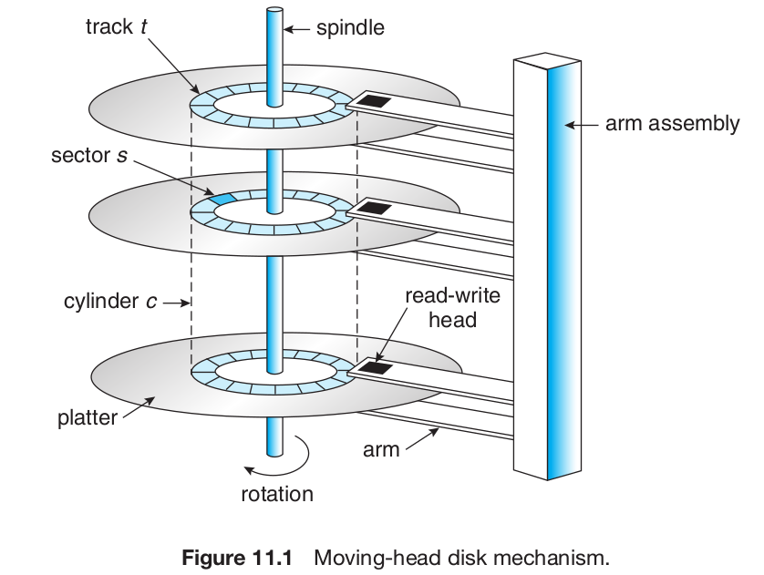

# Chapter 11 Mass Storage Structure

# 11.1 Overview

## 11.1.1 Magnetic Disks

Each disk platter has a flat circular shape, like a CD. The two surfaces of a platter are covered with a magnetic material. We store information by recording it magnetically on the platters.

The surface of a platter is logically divided into circular tracks, which are subdivided into sectors. The set of tracks that are at one arm position makes up a cylinder.

The transfer rate is the rate at which data flow between the drive and the computer. The positioning time, sometimes called the random-access time, consists of the time necessary to move the disk arm to the desired cylinder, called the seek time, and the time necessary for the desired sector to rotate to the disk head, called the rotational latency.

# 11.2 Disk Structure

Modern disk drives are addressed as large one-dimensional arrays of logical blocks, where the logical block is the smallest unit of transfer. The size of a logical block is usually 512 bytes.

The one-dimensional array of logical blocks is mapped onto the sectors of the disk sequentially. Sector 0 is the first sector of the first track on the outermost cylinder. The mapping proceeds in order through that track, then through the rest of the tracks in that cylinder, and then through the rest of the cylinders from outermost to innermost.

# 11.4 Disk Scheduling

1. FCFS (First Come First Serve): Wild swings between extreme locations.
1. SSTF (Shortest Seek Time First): Zigzags
1. SCAN Algorithm: Scans from one A to B to A.
1. CSCAN (Circular SCAN): Scans from one to another end and repeats from beginning.
1. LOOK Scheduling: Why bother going to end if there is nothing? C-LOOK Scheduling.

Either SSTF or LOOK is a reasonable choice for the default algorithm.

# 11.5 Disk Management

## 11.5.1 Disk Formatting

A new magnetic disk is a blank slate: it is just a platter of a magnetic recording material. Before a disk can store data, it must be divided into sectors that the disk controller can read and write. This process is called **low-level formatting**, or **physical formatting**.

**Low Level Formatting**

Low-level formatting fills the disk with a special data structure for each sector. The data structure for a sector typically consists of a header, a data area (usually 512 bytes in size), and a trailer.

The header and trailer contain information used by the disk controller, such as a sector number and an **error-correcting code ( ECC )**.

**ECC**

When the controller writes a sector of data during normal I/O , the ECC is updated with a value calculated from all the bytes in the data area. When the sector is read, the ECC is recalculated and compared with the stored value. If the stored and calculated numbers are different, this mismatch indicates that the data area of the sector has become corrupted and that the disk sector may be bad.

The ECC is an error-correcting code because it contains enough information, if only a few bits of data have been corrupted, to enable the controller to identify which bits have changed and calculate what their correct values should be. It then reports a recoverable soft error. The controller automatically does the ECC processing whenever a sector is read or written.

**Partition and Logical Formatting**

Before it can use a disk to hold files, the operating system still needs to record its own data structures on the disk.

The first step is to **partition** the disk into one or more groups of cylinders. The operating system can treat each partition as though it were a separate disk. For instance, one partition can hold a copy of the operating system’s executable code, while another holds user files.

The second step is **logical formatting**, or creation of a file system. In this step, the operating system stores the initial file-system data structures onto the disk. These data structures may include maps of free and allocated space (a FAT or inodes) and an initial empty directory.

**Clusters**

To increase efficiency, most file systems group blocks together into larger chunks, frequently called **clusters**. Disk I/O is done via blocks, but file system I/O is done via clusters, effectively assuring that I/O has more sequential-access and fewer random-access characteristics.

# 11.7 RAID Structure

redundant arrays of independent disks

## 11.7.1 Improvement of Reliability via Redundancy

The simplest (but most expensive) approach to introducing redundancy is to duplicate every disk. This technique is called mirroring. With mirroring, a logical disk consists of two physical disks, and every write is carried out on both disks. The result is called a mirrored volume. If one of the disks in the volume fails, the data can be read from the other. Data will be lost only if the second disk fails before the first failed disk is replaced.

## 11.7.2 Improvement in Performance via Parallelism

With multiple disks, we can improve the transfer rate as well (or instead) by striping data across the disks. In its simplest form, data striping consists of splitting the bits of each byte across multiple disks; such striping is called **bit-level striping**.
