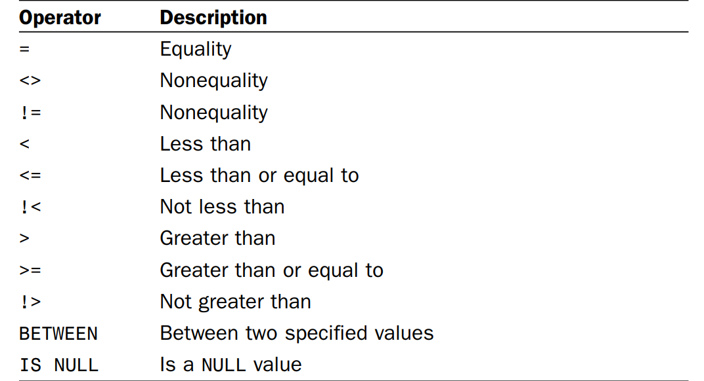

# SQL Statements and Case
It is important to note that SQL statements are not case sensitive. Therefore, SELECT is the same as select, which is the same as Select. Many SQL developers find that using uppercase for all SQL keywords and lowercase for column and table names makes code easier to read and debug.

# Retrieving Multiple Columns
Use comma separated column names. Do not use trailing comma as it will raise error.

# Retrieving Distinct Rows
```
SELECT DISTINCT vend_id
FROM products;
```
Distinct applies to all selected columns. `DISTINCT a, b, c` would select all possible distinct combination.

# Limiting Results

```
SELECT prod_name
FROM products
limit 5;
```

# Sorting Data
```
SELECT prod_name
FROM products
ORDER BY prod_name;
```

# Sorting by Multiple Columns

To sort by multiple columns, simply specify the column names separated by commas.

```
SELECT prod_id, prod_price, prod_name
FROM products
ORDER BY prod_price, prod_name;
```

# Specifying Sort Direction
To sort by descending order, you must specify the keyword DESC.
```
SELECT prod_id, prod_price, prod_name
FROM products
ORDER BY prod_price DESC;
```

# Sorting Descending on Multiple Columns
If you want to sort in descending order on multiple columns, be sure each column has its own DESC keyword.

# Case Sensitivity and Sort Orders

If case matters, then it is possible to get result as following: A, B, C, a, b, c. Result varies from dbms to dbms. In mysql, case matters.

# Position of the ORDER BY Clause
When specifying an ORDER BY clause, be sure that it is after the FROM clause. Using clauses out of order will generate an error message.

# WHERE Clause Position
When using both ORDER BY and WHERE clauses, make sure ORDER BY comes after WHERE; otherwise, an error will be generated.

# The WHERE Clause Operators


# Checking for a Range of Values
```
SELECT prod_name, prod_price
FROM products
WHERE prod_price BETWEEN 5 AND 10;
```

# Checking for No Value
The SELECT statement has a special WHERE clause that can be used to check for columns with NULL values, the IS NULL clause. The syntax looks like this:

```
SELECT prod_name
FROM products
WHERE prod_price IS NULL;
```

# Using the IN Operator

```
SELECT prod_name, prod_price
FROM products
WHERE vend_id IN (1002,1003)
ORDER BY prod_name;
```

# Creating Calculated Fields

## Concatenating Fields
```
SELECT vend_name + ‘ (‘ + vend_country + ‘)’
FROM vendors
ORDER BY vend_name;
```
Since fields are fixed length columns, it will look better with trimming.
```
SELECT RTrim(vend_name) + ‘ (‘ + RTrim(vend_country) + ‘)’
FROM vendors
ORDER BY vend_name;
```

## Using Aliases
```
SELECT RTrim(vend_name) + ‘ (‘ + RTrim(vend_country) + ‘)’ AS vend_title
FROM vendors
ORDER BY vend_name;
```

## Delimiting Column Names

`SELECT [Last Name] AS LastName`

# How to Test Calculations
SELECT provides a great way to test and experiment with functions and calculations. Although SELECT is usually used to retrieve data from a table, the FROM clause may be omitted to simply access and work with expressions. For example, SELECT 3 * 2; would return 6 , SELECT Trim(‘ abc ‘); would return abc , and SELECT GetDate() uses the GetDate() function to return the current date and time. You get the idea; use SELECT to experiment as needed.

# Using Data Manipulation Functions

## Text Manipulation Functions


# Summarizing Data

## Using Aggregate Functions

- Avg()
- Count(): Count(*) or Count(col). Second one ignores null value.
- Max()
- Min()
- Sum()

# Grouping Data

Grouping enables you to divide data into logical sets so you can perform aggregate calculations on each group.

```
SELECT vend_id, Count(*) AS num_prods
FROM products
GROUP BY vend_id;
```

The GROUP BY clause instructs SQL Server to sort the data and group it by vend_id.

- GROUP BY clauses can contain as many columns as you want. This enables you to nest groups, providing you with more granular control over how data is grouped.
- If you have multiple groups specified in your GROUP BY clause, data is summarized at the last specified group. In other words, all the columns specified are evaluated together when grouping is established (so you won’t get data back for each individual column level).
- Every column listed in GROUP BY must be a retrieved column or a valid expression (but not an aggregate function). If an expression is used in the SELECT statement, that same expression must be specified in GROUP BY . Aliases cannot be used.
- **Aside from the aggregate calculations statements, every column in your SELECT statement should be present in the GROUP clause.**
- If the grouping column contains a row with a NULL value, NULL will be returned as a group. If there are multiple rows with NULL values, they’ll all be grouped together.
- **The GROUP BY clause must come after any WHERE clause and before any ORDER BY clause.**

## HAVING

HAVING is very similar to WHERE . In fact, all types of WHERE clauses you learned about thus far can also be used with HAVING . The only difference is that WHERE filters rows and HAVING filters groups.

Here’s another way to look at it: WHERE filters before data is grouped, and HAVING filters after data is grouped. This is an important distinction; rows that are eliminated by a WHERE clause are not included in the group.

HAVING and GROUP BY cannot be used with columns of type text, ntext, and image.

# Order of clauses

SELECT, FROM, WHERE, GROUP BY, HAVING, ORDER BY

# Subqueries

With the notable exception of subqueries used in conjunction with EXISTS (as will be shown shortly), subquery SELECT statements can only retrieve a single column, and attempting to retrieve multiple columns will return an error.

## Correlated Subquery

```
SELECT cust_name,
  cust_state,
  (SELECT Count(*)
    FROM orders
    WHERE orders.cust_id = customers.cust_id) AS orders
FROM customers
ORDER BY cust_name;
```

# Joining Tables

```
SELECT xyz
FROM a, b, c
```
The above produces cartesian product of the three sets. It's a cross join.
