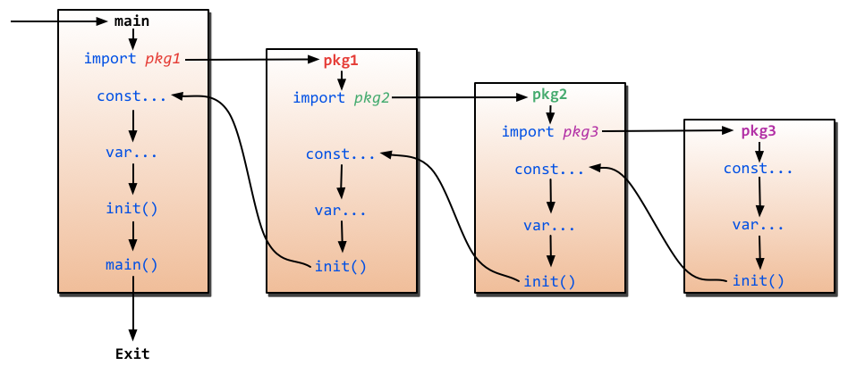

# Package

- A package is a directory: **package = directory**
- A package cannot have sub-directory.
- All files in a package must be in same directory
- All files must start with a package declaration

## Export

To export a function, variable or anything, just capitalize the first letter.

## Name of packages

- Keep them small and short. Usually one lowercase word.
- No underscores

## main function

From the spec: [Program execution](https://golang.org/ref/spec#Program_execution)
> A complete program is created by linking a single, unimported package called the main package with all the packages it imports, transitively. The main package must have package name main and declare a function main that takes no  arguments and returns no value.
>
> func main() { … }
>
> Program execution begins by initializing the main package and then invoking the function main. When that function invocation returns, the program exits. It does not wait for other (non-main) goroutines to complete.

Therefore, a complete program must have a main package with a main function. Program will start from main function and once it returns, program will end.

## init function

A package can also have an init function. It is guranteed that init function will run before main function.

## Execuation flow of packages

First imports will be called. Next constants will be declared. After that variables will be initiated. Next comes init() and finally main() if any.

Reference: [StackOverflow: When is the init() function run?](https://stackoverflow.com/questions/24790175/when-is-the-init-function-run)

# Resources

1. [Go Talks - Organizing Go Code](https://talks.golang.org/2014/organizeio.slide#4)
