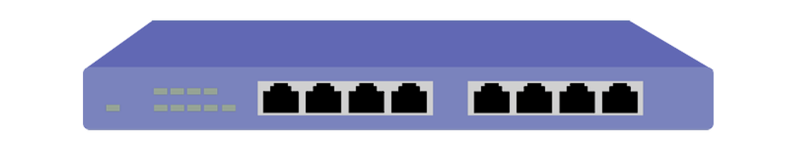
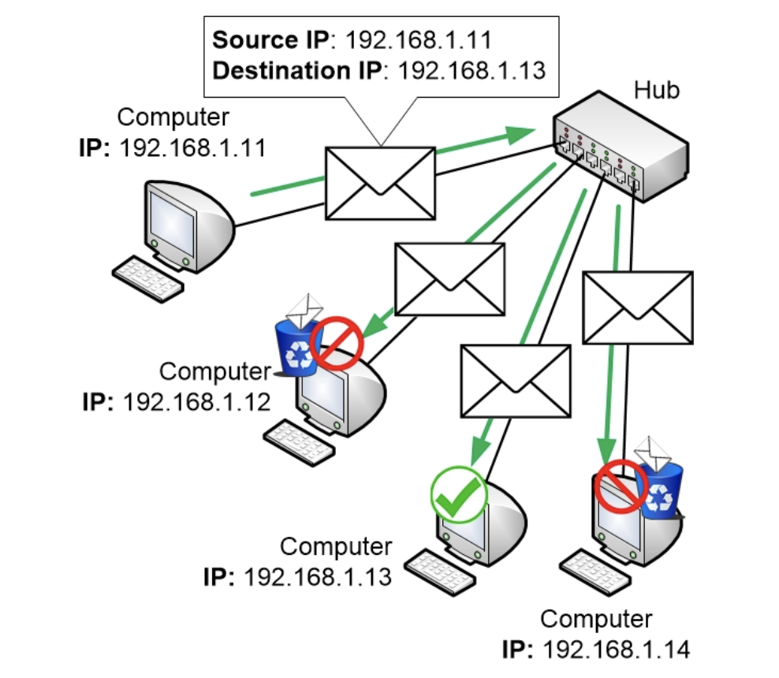
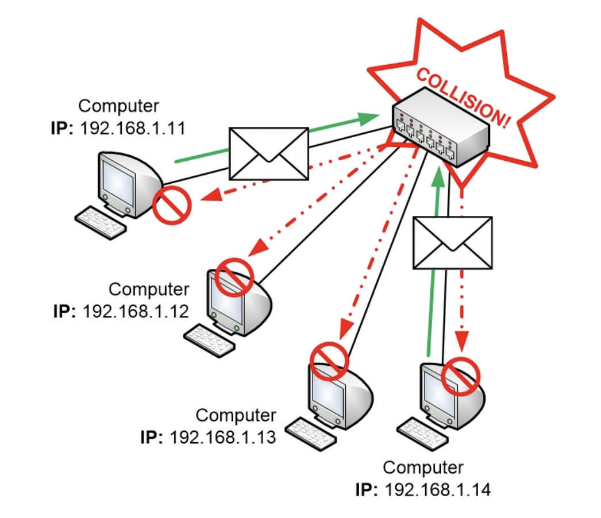

# Hub

A hub is a network equipment with several interfaces called ports (not the one from OS). If we connect computers to these ports they will be able to talk with each other.

People confuse hubs and switches. Know that hubs are antique legacy devices that no longer belong in any computer network. Switch on the other hand is a modern day device.

## Problems with Hub

### They are unintegillent

All a hub ever does is to copy electrical signals that are entering one port to all other ports.

This means that a hub is **unintegillent**. It doesn't care about network traffic or addresses at all.

### They do unnecessary work

This results in lot of unnecessary work by the network. Apart from the actual receiver, all other computers must discard the packet.

### They are Half Duplex
Another downside of hubs is that only one computer can talk at a time through a hub. When one computer is talking every other computer must stay completely silent. This is because the electrical signals of multiple computers that talk simultaneously will mix together in the hub, creating disturbances to the signals so that neither signal can be interpreted.

If two computers talk at the same time a collision occurs. When this happens all computers will notice the disturbances and must stop talking for a while before trying again. This also makes a hub really slow. Only one device can communicate at a time, and when a collision accidentally occurs every device must be silent for a while.

The more computers you connect to a hub the bigger the risk gets for collisions to happen since more involved devices will indirectly compete with each other for the available communication time slots.

#### Half Duplex vs Full Duplex
When only one device at a time can communicate on a network, it is called **Half Duplex**. Hub is always Half Duplex.

If multiple device can talk at once then it is called **Full Duplex**. Switches are full duplex.
