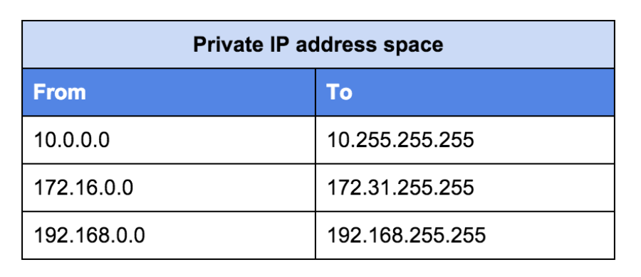
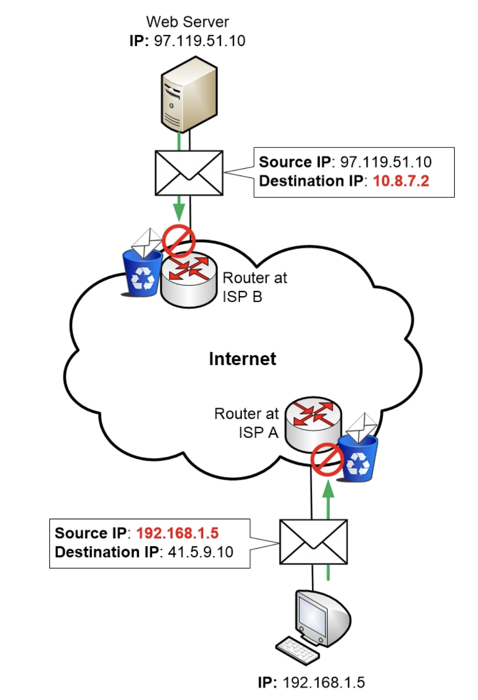
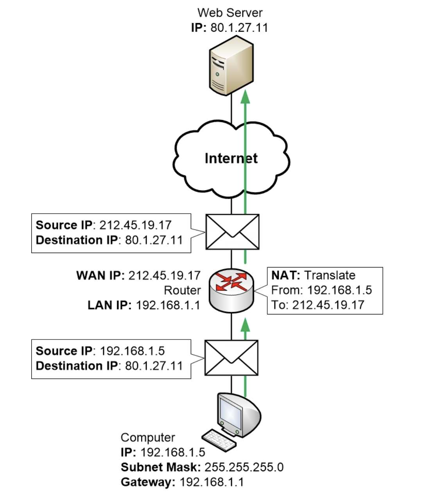
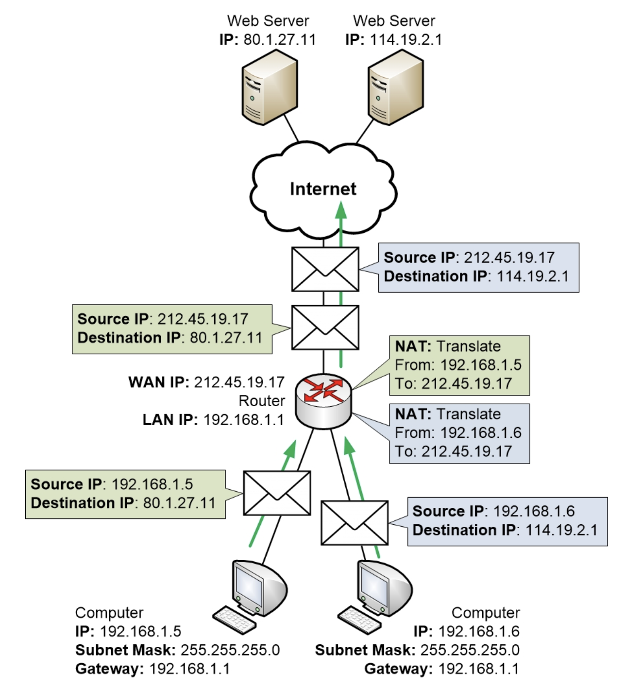

Go back to [Network Index](../README.md)

# NAT and Port Forward

# Public and Private IP Address

In order to avoid ip address conflict, all clients should have unique ip address on the internet. But there are some execptions.

The addresses above are reserved for using in LAN and they don't need to be unique on internet (but they must be unique within a single LAN).

Tthe above special addresses are called **Private addresses**. They cannot be used on the Internet, they can only be used within local networks. If you try to use Private addresses on the Internet then your **Internet Service Provider will block your traffic** automatically, sensing that the traffic is coming from a Private IP address. This automatic block is being done to avoid any IP address conflicts on the Internet. These addresses are used in so many places that without the block we would have guaranteed and constant IP address conflicts all over the Internet.

> If my pc is on a LAN and has a private IP address, then how am I able to surf the internet?

# Address Translation (NAT)

Since public IP addresses are limited and thus we are forced to use private IP addresses at home, how do we connect to internet?

If we try to connect directly with the private IP, ISP will block us.

The solution is to share a public IP. All the clients with private IP addresses on a LAN will share a single public address. This is done by using Address Translation or Network Address Translation.

## How NAT Works?

When a computer wants to communicate it sends off a packet with data. The packet always has two IP addresses inscribed in the envelope or header of the packet.

Source Address, which is the IP address of the sender. This has to be entered into the packet so the receiver knows where it should send its replies, like a “return address”
Destination address, the IP address of the receiver that the packet is being sent to
In a home network where a computer wants to talk to something on the Internet, the source address will be a Private IP address on the LAN. The destination address of the packet will be a Public IP address of a server on the Internet. If that packet is sent to the Internet then the ISP will block and throw away the packet since it has a private IP address as its source.

To fix this problem the home router steps in and translates the source address from a private address to a public IP address. The router itself has a public IP address on its outside WAN interface. It got that public IP address from the ISP. The router will simply let every client on the inside LAN share that single public IP address.

When the router sends the packet on to the Internet the packet will appear to come from the home router’s public IP address. From the perspective of the ISPs and the web server, the packet is coming from the public IP address of the home router. When the web server replies back to the computer it will send its reply back to the public IP address of the home router, and the ISP finds its way back there without any trouble.

What about when there are multiple clients? Well, the router keeps track about which packet belongs to which client. You don't have to worry.

# Port Forward

> What if there is traffic from outside that wants to connect to a web server on our LAN. How would the router know, which client on the LAN is the web server?

There is no way for the router to know. We have to configure the router such that when traffic from outside hits a particular port of the router, the router will send it to a host that we configured. This is called port forwarding.
