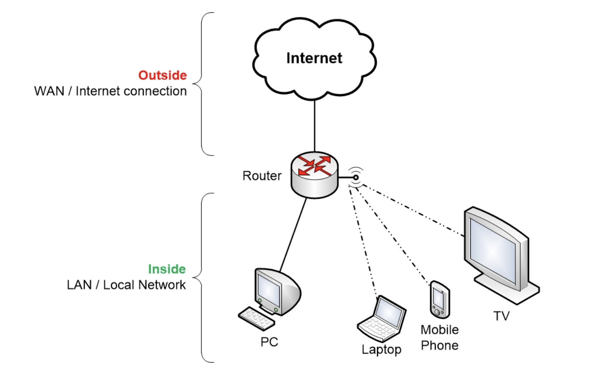
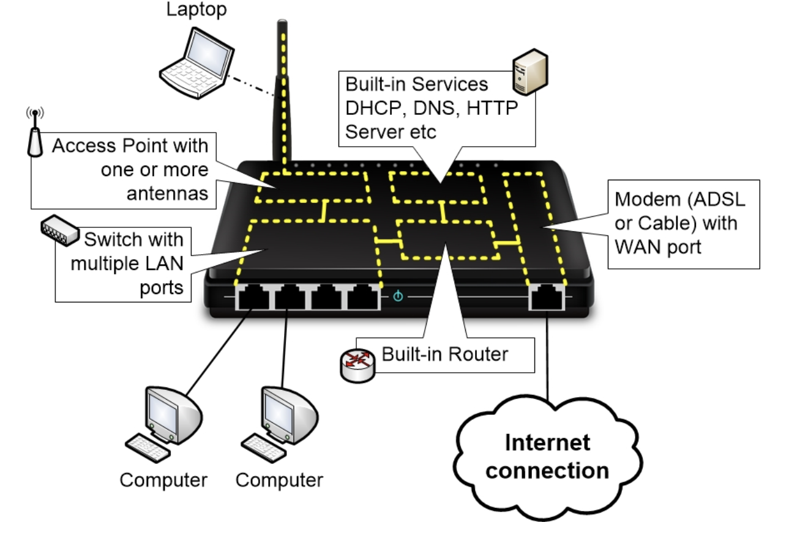
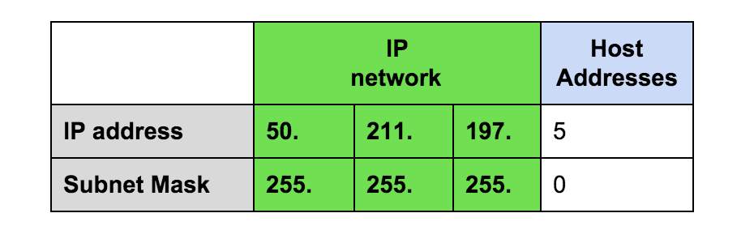
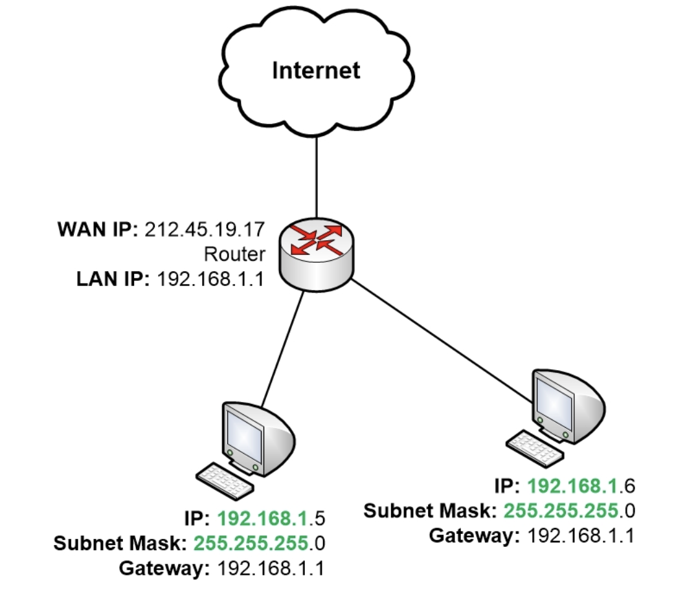

Go back to [Network Index](../README.md)

# Router

The main role of a Router is to route data traffic. The router knows in which directions different destinations are, and when it receives data traffic it will forward the traffic in the direction of the destination. A router always picks the best route it has knowledge about for the data traffic that it is forwarding.

In a home network, the router plays a vital role. It connects its two end points: outside and inside.

On outside lies WAN (wide arean network) and on inside lies LAN (local area network).

Router allows computers to communicate with each other, regardless of whether they are inside or outside.

# Router is not just Router

Our home router comes with more than "routing" features.

A home router has the following parts:

1. Switch
2. Access point
3. Modem
4. Router
5. DHCP
6. Address translation
7. Port Forward
8. Firewall
9. DNS
10. Web interface

From the picture we can see, internal computers can communicate through switch alone. No need to go through router. Same for wifi communication: access point to switch.

# IP Address

IP Address consists of two parts: **IP Network** and Host address.

## IP Network
On a LAN, computers can talk with each other as long as they are under the same ip network. If the computers belong to different IP networks then they have to communicate with each other via a router.

The main purpose of a router is to be able to forward traffic to different destinations. Within computer networking, those destinations are different IP networks.

> So how do you know if two IP addresses are on the same IP network or on two different IP networks?

## Subnet Mask

An IP address is always combined with a Subnet Mask, and it is the Subnet Mask that determines which part of the IP address that belongs to the IP network and which part that belongs to host addresses.

Basically, you AND ip address with subnet mask. The result is the ip network. The remaining bits are for host address.

## Network Address

Each ip network also has a name. The name of an ip network is the smallest possible ip address for that network. For example, in the figure above, 50.211.197.5 belongs to the ip network that has the following network address 50.211.197.0

IP address is for a single device in a network. Network address is for the whole network.

## Default Gateway

> So computers that are in same ip network can communicate directly with each other. What about computers that are in different ip network? How do they communicate?

They must go through router.

> But how do they find out where is the router?

Using Default Gateway.

In the local network, there must be a router for inter-network communication and the address of that router is configured to all clients of the LAN network. The address of the router is called Default Gateway. We could have just called it "Router Address".

If you look at the picture above, you will notice that router has two IP. Using one IP it communicates with inside network and using another it communicates with outside. Because after all, two computers can communicate directly with each other if they are in same ip network.
