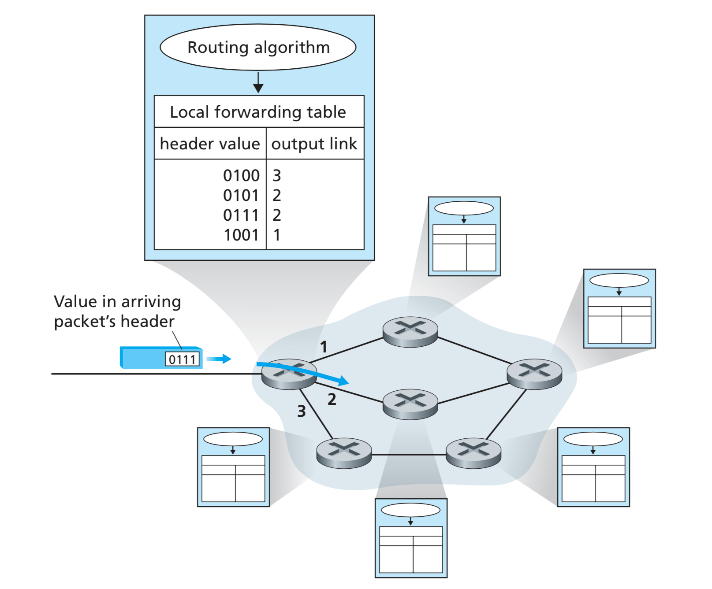
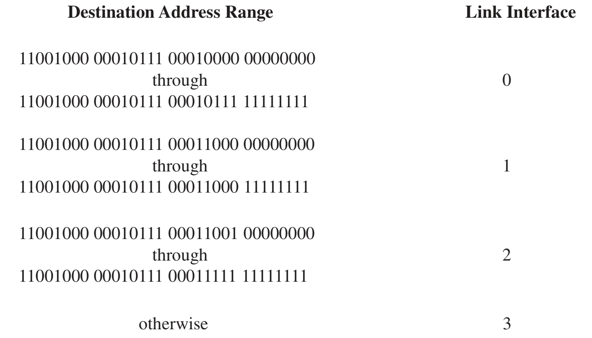
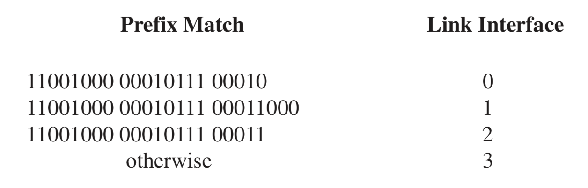
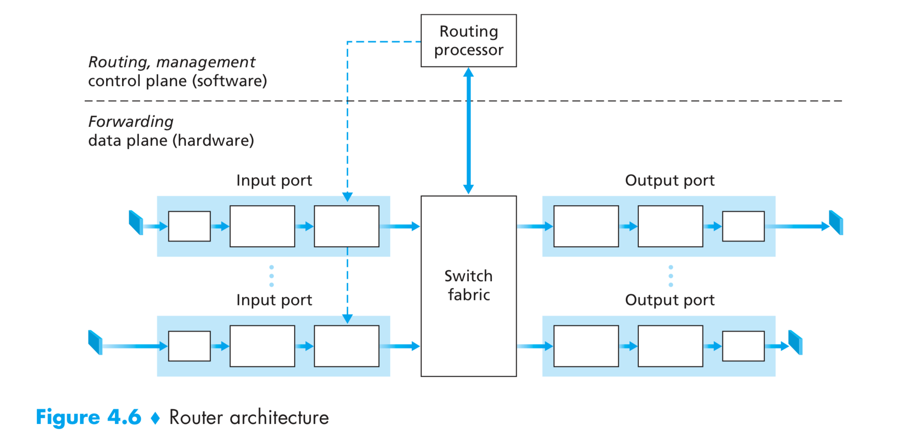
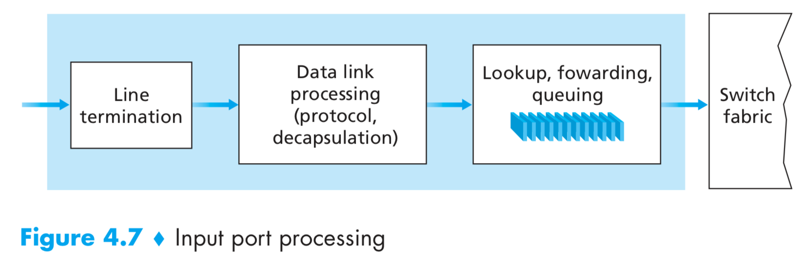
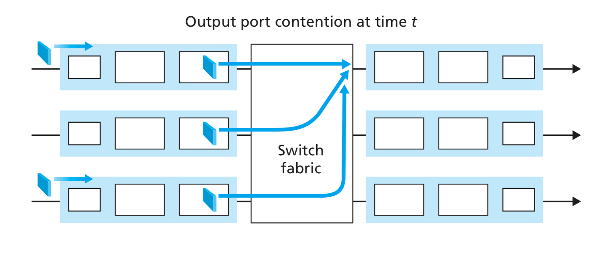
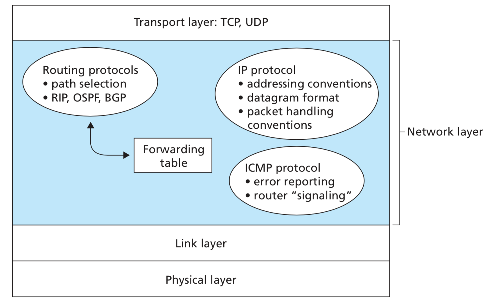
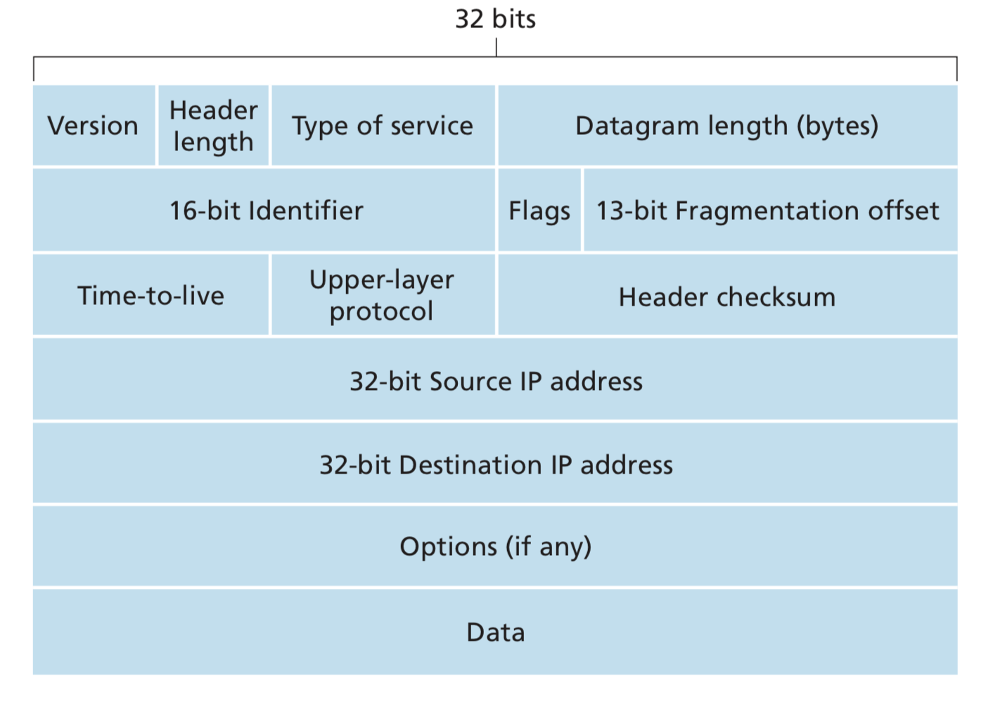
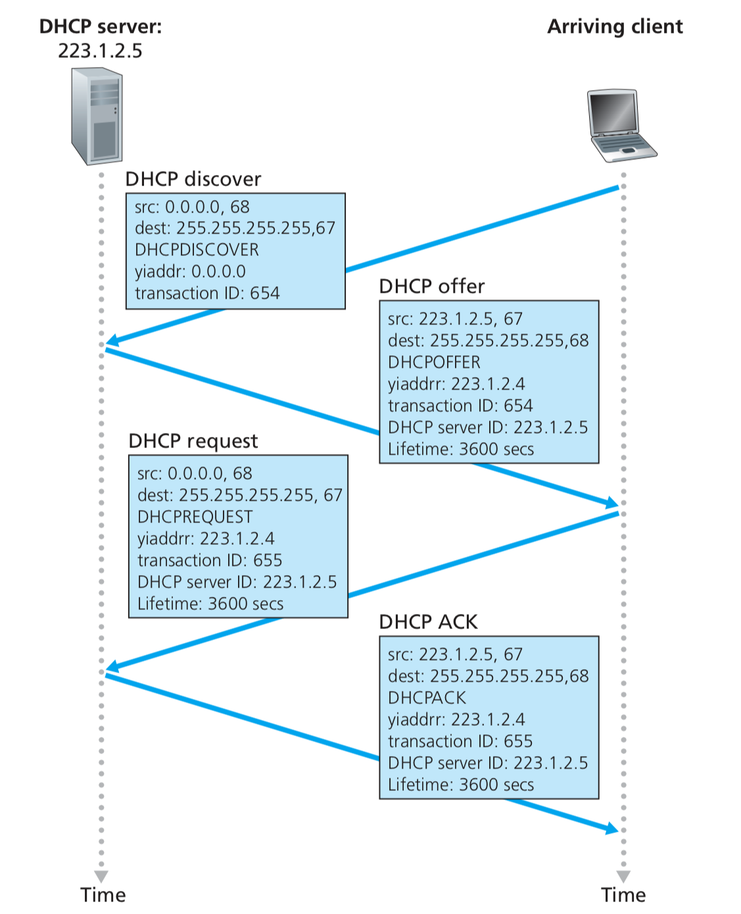
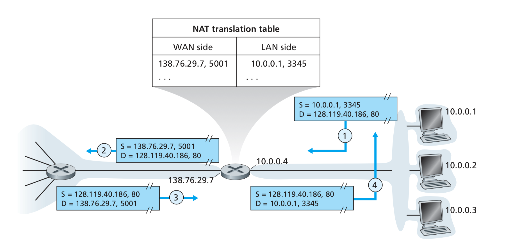

# Network Layer

Role of the network layer is to move packets from a sending host to a receiving host.

## Forwarding vs Routing

Forwarding involves the transfer of a packet from an incoming link to an outgoing link within a single router. 

Routing involves all of a network's routers, whose collective interactions via routing protocols determine the paths that packets take on their trips from source to destination node.

## Forwarding Table

- Every router has a **forwarding table**.
- A router forwards a packet by examin- ing the value of a field in the arriving packet’s header, and then using this header value to index into the router’s forwarding table.
- > How the forwarding tables in the routers are con- figured?
  - The routing algorithm determines the values that are inserted into the routers’ forwarding tables.
  - The routing algorithm may be centralized (e.g., with an algorithm executing on a central site and downloading routing information to each of the routers) or decentralized (i.e., with apiece of the distributed routing algorithm running in each router).
  - A router receives routing protocol messages, which are used to configure its forward- ing table.

## Network Service Models

Internet uses "Best Effort" model, which mean it provides no service at all.

## Virtual Circuit and Datagram Networks

- A network layer can provide connectionless service or connection service between two hosts.
- In all major computer network architectures to date (Internet, ATM, frame relay, and so on), the network layer provides either a host-to-host connectionless serv- ice or a host-to-host connection service, but not both.
- Computer networks that provide only a connection service at the network layer are called **virtual-circuit (VC) networks**; computer networks that provide only a connectionless service at the network layer are called **datagram networks**.

## Datagram Networks

- In a datagram network, each time an end system wants to send a packet, it stamps the packet with the address of the destination end system and then pops the packet into the network
- Each router has a forwarding table that maps destination addresses to link interfaces.
- Suppose that all destination addresses are 32 bits. A brute-force implemen- tation of the forwarding table would have one entry for every possible destination address. Since there are more than 4 billion possible addresses, this option is totally out of the question.
- the router matches a prefix of the packet’s desti- nation address with the entries in the table; if there’s a match, the router forwards the packet to a link associated with the match.
- When there are multiple matches, the router uses the longest prefix matching rule.
- The time scale at which this forwarding state information changes is relatively slow. Indeed, in a datagram network the forwarding tables are modified by the routing algorithms, which typically update a forwarding table every one-to- five minutes or so.
- Because forwarding tables in datagram networks can be modified at any time, a series of packets sent from one end system to another may follow different paths through the network and may arrive out of order.

## Router

Components of a Router:

- Input/Output Ports 
  - It performs the physical layer function of terminating an incoming physical link  at a router. This is shown in the left most box of input port and rightmost box of  output port.
  - An input port also performs link-layer functions needed to interoperate with the  link layer at the other side of the incoming link; this is represented by the middle  boxes in the input and output ports.
  - the lookup function is also performed at the input port; this will occur in the rightmost box of the input port.
  - Control packets (for example, packets carrying routing protocol information) are forwarded from an input port to the routing processor.
- Switching Fabric
  - The switching fabric connects the router’s input ports to its output ports. This switching fabric is completely contained within the router— a network inside of a network router!
- Routing processor
  - The routing processor executes the routing protocols, maintains routing tables and attached link state infor- mation, and computes the forwarding table for the router.

Router Fowarding Functions:

- A router’s input ports, output ports, and switching fabric together implement the forwarding function and are almost always implemented in hardware
- These forwarding functions are sometimes collectively referred to as the router forwarding plane.

Analogy will be a junction with many roads connected to it. A car comes in, tells an attendant at the junction where he wants to go, enters roundabout and eventually exits from another road.

### Input Processing

- The forwarding table is computed and updated by the routing processor, with a shadow copy typically stored at each input port.
- The forwarding table is copied from the routing processor to the line cards over a sepa- rate bus (e.g., a PCI bus)
- With a shadow copy, forwarding decisions can be made locally, at each input port, without invoking the centralized routing processor on a per-packet basis and thus avoiding a centralized processing bottleneck.
- a packet may be temporarily blocked from entering the switching fabric if packets from other input ports are cur- rently using the fabric.
- A blocked packet will be queued at the input port and then scheduled to cross the fabric at a later point in time.
- Other actions:
  - physical- and link-layer processing must occur
  - the packet’s version number, checksum and time-to-live field must be checked and the latter two fields rewritten
  - counters used for network management (such as the number of IP datagrams received) must be updated

The input port steps of looking up an IP address (“match”) then sending the packet into the switching fabric (“action”) is a specific case of a more general **“match plus action”** abstraction that is performed in many networked devices, not just routers.

### Switching

### Output Processing

- A consequence of output port queuing is that a packet scheduler at the output port must choose one packet among those queued for transmission.
- Packet scheduling plays a crucial role in providing **quality-of-service guarantees**.
- Similarly, if there is not enough memory to buffer an incoming packet, a decision must be made to either drop the arriving packet (a policy known as **drop-tail**) or remove one or more already-queued packets to make room for the newly arrived packet.

## The Internet Protocol (IP): Forwarding and Addressing in the Internet

The Internet’s network layer has three major components:

- The first component is the IP protocol
- The second major component is the routing component, which determines the path a datagram follows from source to destination
- The final component of the network layer is a facility to report errors in datagrams and respond to requests for certain network-layer information.

## Datagram Format

A network-layer packet is referred to as a datagram.

- **Version Number**: These 4 bits specify the IP protocol version of the datagram. By looking at the version number, the router can determine how to interpret the remainder of the IP datagram.
- **Header Length**: Because an IPv4 datagram can contain a variable number of options (which are included in the IPv4 datagram header), these 4 bits are needed to determine where in the IP datagram the data actually begins.
- **Type of Service**: The type of service (TOS) bits were included in the IPv4 header to allow different types of IP datagrams (for example, datagrams particularly requiring low delay, high throughput, or reliability) to be distinguished from each other. For example, it might be useful to distinguish real-time datagrams (such as those used by an IP telephony application) from non-real-time traffic (for exam- ple, FTP)
- **Datagram Length**: This is the total length of the IP datagram (header plus data), measured in bytes. Since this field is 16 bits long, the theoretical maximum size of the IP datagram is 65,535 bytes. However, datagrams are rarely larger than 1,500 bytes.
- **Identifier, flags, fragmentation offset**: These three fields have to do with so-called IP fragmentation
- **Time-to-live**: The time-to-live (TTL) field is included to ensure that datagrams do not circulate forever (due to, for example, a long-lived routing loop) in the network. This field is decremented by one each time the datagram is processed by a router. If the TTL field reaches 0, the datagram must be dropped.
- **Protocol**: This field is used only when an IP datagram reaches its final destina- tion. The value of this field indicates the specific transport-layer protocol to which the data portion of this IP datagram should be passed.
- **Header Checksum**
  - The header checksum aids a router in detecting bit errors in a received IP datagram. The header checksum is computed by treating each 2 bytes in the header as a number and summing these numbers using 1s complement arithmetic.
  - A router computes the header checksum for each received IP datagram and detects an error condition if the checksum carried in the datagram header does not equal the computed check- sum.
  - Routers typically discard datagrams for which an error has been detected.
  - Note that the checksum must be recomputed and stored again at each router, as the TTL field, and possibly the options field as well, may change.
  - > why does TCP/IP perform error checking at both the transport and network layers?
    - only the IP header is checksummed at the IP layer, while the TCP/UDP checksum is computed over the entire TCP/UDP segment.
    - TCP/UDP and IP do not necessarily both have to belong to the same pro- tocol stack. TCP can, in principle, run over a different protocol (for example, ATM) and IP can carry data that will not be passed to TCP/UDP.

## IP Datagram Fragmentation

> What to do if router sees that MTU (Maximum Transmission Unit) of outgoing link is smaller than incoming link?

The solution is to fragment the data in the IP datagram into two or more smaller IP datagrams, encapsulate each of these smaller IP datagrams in a separate link-layer frame;and send these frames over the outgoing link. Each of these smaller data- grams is referred to as a **fragment**.

- The designers of IPv4 felt that reassembling data- grams in the routers would introduce significant complication into the protocol and put a damper on router performance.
- Sticking to the prin- ciple of keeping the network core simple, the designers of IPv4 decided to put the job of datagram reassembly in the end systems rather than in network routers.
- When a destination host receives a series of datagrams from the same source, it needs to determine whether any of these datagrams are fragments of some original, larger datagram.
- If some datagrams are fragments, it must further determine when it has received the last fragment and how the fragments it has received should be pieced back together to form the original datagram.
- To allow the destination host to perform these reassembly tasks, the designers of IP (version 4) put identification, flag, and fragmentation offset fields in the IP datagram header.
- Because IP is an unreliable service, one or more of the fragments may never arrive at the destination. For this reason, in order for the destination host to be absolutely sure it has received the last fragment of the original datagram, the last fragment has a flag bit set to 0, whereas all the other fragments have this flag bit set to 1. Also, in order for the des- tination host to determine whether a fragment is missing (and also to be able to reassemble the fragments in their proper order), the offset field is used to specify where the fragment fits within the original IP datagram.

> Can fragmanted datagrams be fragmanted again? If yes, how? If no, why not?

### Reassembly

The receiver knows that a packet is a fragment if at least one of the following conditions is true:

- The "more fragments" flag is set. (This is true for all fragments except the last.)
- The "fragment offset" field is nonzero. (This is true for all fragments except the first.)

The receiver identifies matching fragments using the foreign and local address, the protocol ID, and the identification field. The receiver reassembles the data from fragments with the same ID using both the fragment offset and the more fragments flag.

When the receiver has all fragments, they can be correctly ordered by using the offsets, and reassembled to yield the original data segment.
### Cost of Fragmentation

- First, it complicates routers and end systems, which need to be designed to accommodate datagram fragmentation and reassembly.
- Second, fragmentation can be used to create lethal DoS attacks, whereby the attacker sends a series of bizarre and unexpected fragments.
  - A classic example is the Jolt2 attack, where the attacker sends a stream of small fragments to the target host, none of which has an offset of zero. The target can collapse as it attempts to rebuild datagrams out of the degener- ate packets.
  - Another class of exploits sends overlapping IP fragments, that is, frag- ments whose offset values are set so that the fragments do not align properly. Vulnerable operating systems, not knowing what to do with overlapping fragments, can crash.

## IPv4 Addressing

- > What is a subnet?

### Obtaining a Block of Address

- Obtaining a set of addresses from an addresses
- > there must also be a way for the ISP itself to get a block of addresses. Is there a global authority that has ultimate responsibility for managing the IP address space and allocating address blocks to ISPs and other organizations?
  -  Indeed there is! IP addresses are managed under the authority of the Internet Corporation for Assigned Names and Numbers (ICANN)

### Obtaining a Host Address: DHCP

- DHCP server discovery
  - The first task of a newly arriving host is to find a DHCP server with which to interact.
  - This is done using a **DHCP discover message**, which a client sends within a UDP packet to port 67.
  - the DHCP client creates an IP datagram containing its DHCP discover message along with the broadcast destination IP address of 255.255.255.255 and a “this host” source IP address of 0.0.0.0.
- DHCP server offer(s)
  - A DHCP server receiving a DHCP discover message responds to the client with a DHCP offer message that is broadcast to all nodes on the subnet, again using the IP broadcast address of 255.255.255.255.
  - Each server offer message contains the transaction ID of the received discover mes- sage, the proposed IP address for the client, the network mask, and an IP address lease time—the amount of time for which the IP address will be valid.
- DHCP request: The newly arriving client will choose from among one or more server offers and respond to its selected offer with a DHCP request message, echoing back the configuration parameters.
- DHCP ACK: The server responds to the DHCP request message with a DHCP ACK message, confirming the requested parameters.

## Network Address Translation (NAT)

Some people object to NAT:

- Port numbers are meant to be used for addressing processes, not for addressing hosts.
- routers are supposed to process packets only up to layer 3.
- the NAT protocol violates the so-called end-to-end argument; that is, hosts should be talk- ing directly with each other, without interfering nodes modifying IP addresses and port numbers
- we should use IPv6 to solve the shortage of IP addresses, rather than recklessly patching up the problem with a stopgap solution like NAT.

## UPnP

- NAT traversal is increasingly provided by Universal Plug and Play (UPnP), which is a protocol that allows a host to discover and configure a nearby NAT
- UPnP requires that both the host and the NAT be UPnP compatible.
- With UPnP, an application running in a host can request a NAT mapping between its (private IP address, private port number) and the (public IP address, public port number) for some requested public port number.
- If the NAT accepts the request and creates the mapping, then nodes from the outside can initiate TCP connections to (public IP address, public port number).
- Furthermore, UPnP lets the application know the value of (public IP address, public port number), so that the application can advertise it to the outside world.

## Internet Control Message Protocol (ICMP)

- ICMP is used by hosts and routers to communicate net- work-layer information to each other
  - The most typical use of ICMP is for error reporting.
  - For example, every device (such as an intermediate router) forwarding an IP datagram first decrements the time to live (TTL) field in the IP header by one. If the resulting TTL is 0, the packet is discarded and an ICMP time exceeded in transit message is sent to the datagram's source address.
- ICMP is often considered part of IP but architecturally it lies just above IP, as ICMP messages are carried inside IP datagrams.

## Routing Algorithms

- Typically a host is attached directly to one router, the default router for the host (also called the first-hop router for the host).
- We refer to the default router of the source host as the source router and the default router of the destination host as the destination router.
  
Broadly, one way in which we can classify routing algorithms is according to whether they are global or decentralized:

- A **global routing algorithm** computes the least-cost path between a source and destination using complete, global knowledge about the network. Algorithms with global state information are often referred to as link-state (LS) algorithms, since the algorithm must be aware of the cost of each link in the network.
- In a **decentralized routing algorithm**, the calculation of the least-cost path is carried out in an iterative, distributed manner. No node has complete information about the costs of all network links. Instead, each node begins with only the knowledge of the costs of its own directly attached links. Then, through an itera- tive process of calculation and exchange of information with its neighboring nodes (that is, nodes that are at the other end of links to which it itself is attached), a node gradually calculates the least-cost path to a destination or set of destinations.