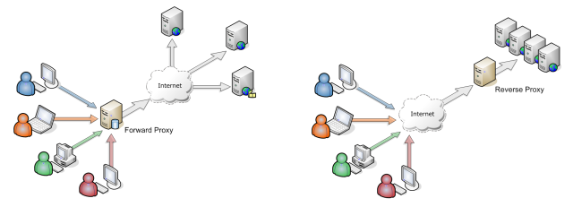

# Proxy (Forward Proxy)

Proxy is a client side concept. Multiple client asks a proxy to send request on their behalf. For example, our router is a proxy, or when we can't access facebook from university, we often go to some proxy-service site and use their site to access fb.

The flow goes as following: Client -> Proxy -> Internet -> Server

Forward proxy is Internet facing proxy used to retrieve service from anywhere.

# Reverse Proxy

Reverse proxy is a server side concept. Here request from Internet is received by a reverse-proxy entity whose duty is to communicate with servers behind it to return proper response to client. For example, Nginx is a reverse proxy.

The flow goes as following: Client -> Internet -> Proxy -> Server

Reverse proxy is Internal facing proxy used as a front-end to control and protect access to servers on private network.

# Resources

1. [Wiki Proxy](https://en.wikipedia.org/wiki/Proxy_server)
