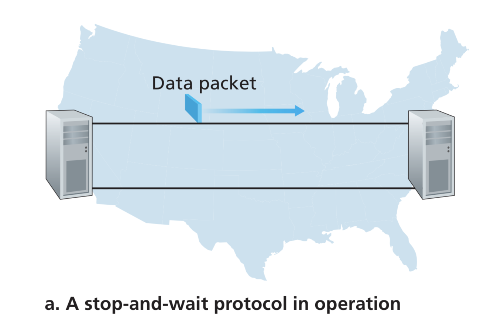
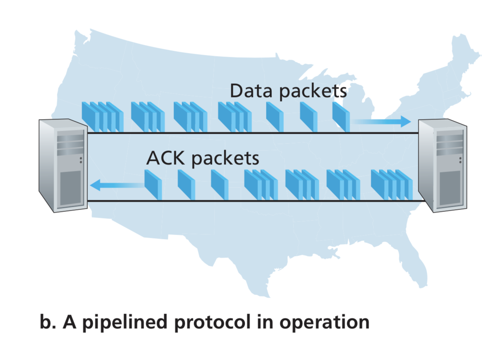
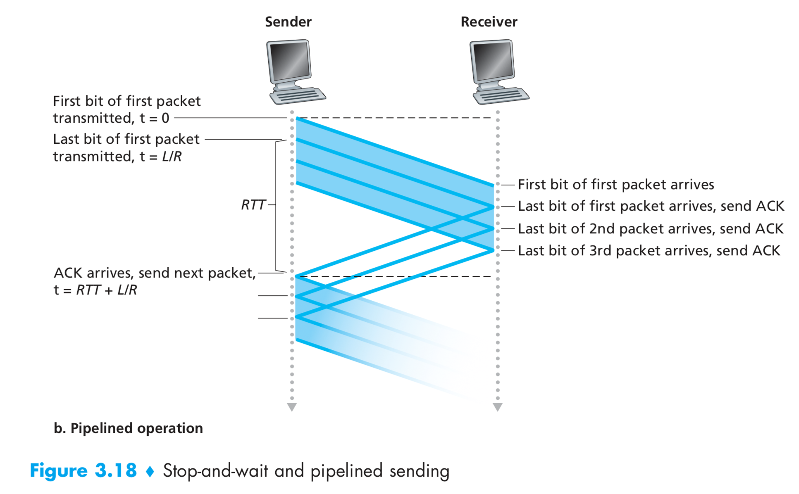
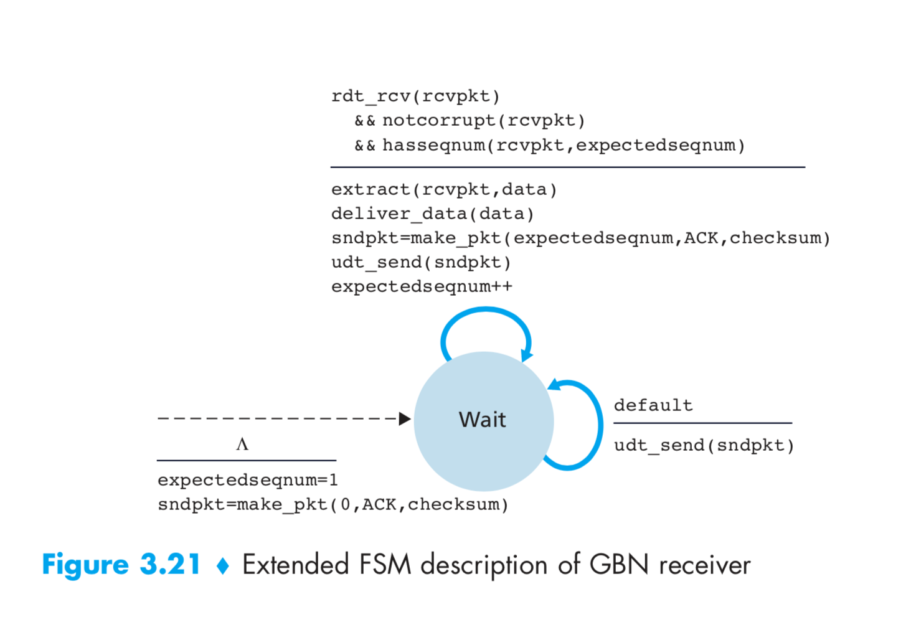
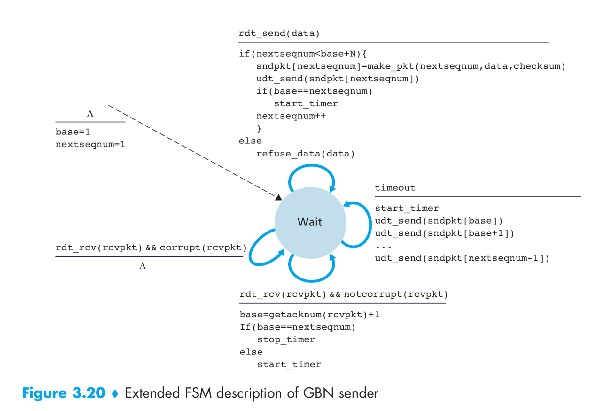
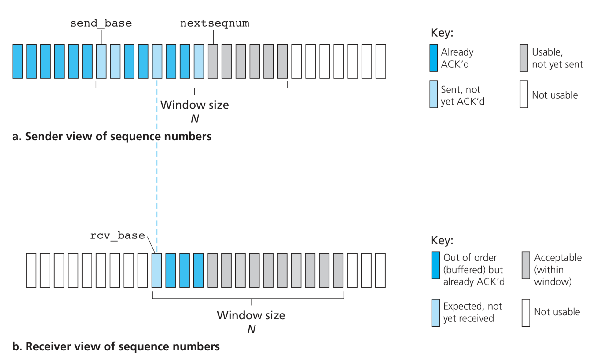
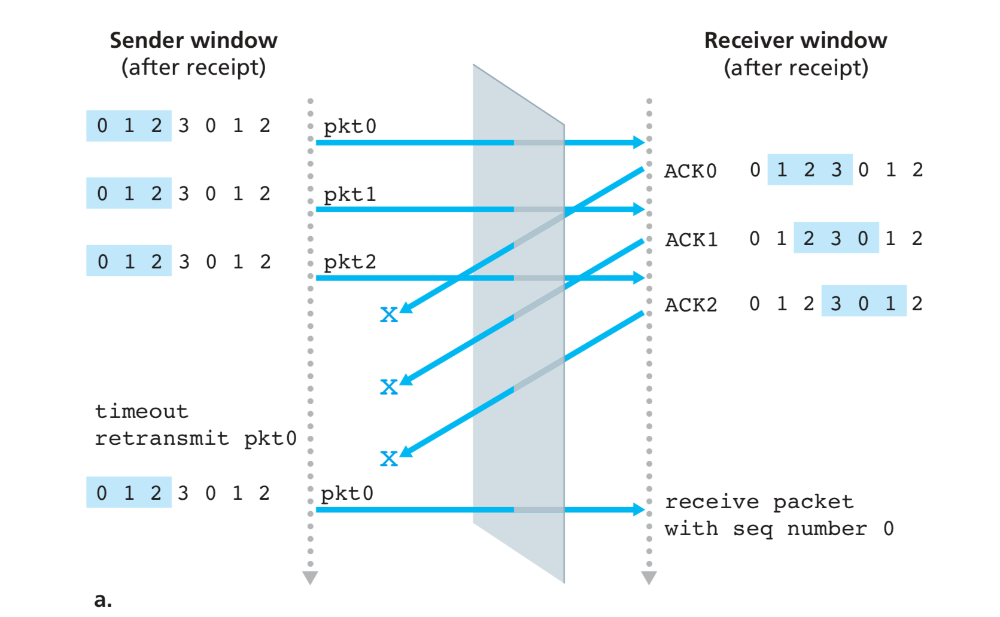

# Reliable Data Transfer

The IP layer is unreliable. What does that mean?

- No gurantee of datagram delivery.
- No gurantee of in-order datagram delivery.
- No gurantee of integrity of datagrams.

So how can we send data with reliablity over the unreliable network?

We now step through a series of protocols, each one becoming more complex, arriving at a flawless, reliable data transfer protocol.

## Reliable Data Transfer over a Perfectly Reliable Channel: rdt1.0

We first consider the simplest case, in which the underlying channel is completely reliable.

## Reliable Data Transfer over a Channel with Bit Errors: rdt2.0

A more realistic model of the underlying channel is one in which bits in a packet may be corrupted. Such bit errors typically occur in the physical components of a network as a packet is transmitted, propagates, or is buffered.

Before developing a protocol for reliably communicating over such a channel, first consider how people might deal with such a situation. Consider how you your- self might dictate a long message over the phone. In a typical scenario, the message taker might say “OK” after each sentence has been heard, understood, and recorded. If the message taker hears a garbled sentence, you’re asked to repeat the garbled sentence. This message-dictation protocol uses both **positive acknowledgments** ("OK") and **negative acknowledgments** ("Please repeat that."). These control messages allow the receiver to let the sender know what has been received correctly, and what has been received in error and thus requires repeating. In a computer network setting, reliable data transfer protocols based on such retransmission are known as **ARQ (Automatic Repeat reQuest)** protocols.

Fundamentally, three additional protocol capabilities are required in ARQ protocols to handle the presence of bit errors:

1. **Error detection**: We use the checksum method like UDP to detect error.
2. **Receiver feedback**: Our rdt2.0 protocol will send ACK and NAK packets back from the receiver to the sender. In principle, these packets need only be one bit long; for example, a 0 value could indi- cate a NAK and a value of 1 could indicate an ACK.
3. **Retransmission**: A packet that is received in error at the receiver will be retrans- mitted by the sender.

The sender will not send a new piece of data until it is sure that the receiver has correctly received the current packet. Because of this behavior, protocols such as rdt2.0 are known as **stop-and-wait** protocols.

> But what if ACK/NAK is corrupted?

If an ACK or NAK is corrupted, the sender has no way of knowing whether or not the receiver has correctly received the last piece of transmitted data. There are three scenarios on how we might handle this:

1. The sender can send ACK/NAK itself to indicate if it received the ACK/NAK. But obviouly, it moves to a never ending cycle. So this is a bad idea.
2. A second alternative is to add enough checksum bits to allow the sender not only to detect, but also to recover from, bit errors. This solves the immediate problem for a channel that can corrupt packets but not lose them.
3. A third approach is for the sender simply to resend the current data packet when it receives a garbled ACK or NAK packet. This approach, however, introduces **duplicate packets** into the sender-to-receiver channel. The fundamental diffi- culty with duplicate packets is that the receiver doesn’t know whether the ACK or NAK it last sent was received correctly at the sender. Thus, it cannot know a priori whether an arriving packet contains new data or is a retransmission!

A simple solution to this new problem (and one adopted in almost all existing data transfer protocols, including TCP) is to add a new field to the data packet and have the sender number its data packets by putting a **sequence number** into this field. The receiver then need only check this sequence number to determine whether or not the received packet is a retransmission. Hence, sequence number can handle duplicate packets in channel.

For this simple case of a stop-and- wait protocol, a 1-bit sequence number will suffice, since it will allow the receiver to know whether the sender is resending the previously transmitted packet (the sequence number of the received packet has the same sequence number as the most recently received packet) or a new packet (the sequence number changes, moving “forward” in modulo-2 arithmetic). Since we are currently assuming a channel that does not lose packets, ACK and NAK packets do not themselves need to indicate the sequence number of the packet they are acknowledging. The sender knows that a received ACK or NAK packet (whether garbled or not) was generated in response to its most recently transmitted data packet.

Notice that we don't need the NAK packages. When we recieve a corrupted package, we can just send ACK package for the previous packet again. When sender receives **duplicate ACK** for a packet, it will understand that the recently sent packet was received by reciever. So it can retransmit it.

This NAK-free rdt is rdt2.2.

One subtle change between rtdt2.1 and rdt2.2 is that the receiver must now include the sequence number of the packet being acknowledged by an ACK message (this is done by including the ACK,0 or ACK,1 argument in make_pkt() in the receiver FSM), and the sender must now check the sequence number of the packet being acknowledged by a received ACK message (this is done by including the 0 or 1 argument in isACK()in the sender FSM).

## Reliable Data Transfer over a Lossy Channel with Bit Errors: rdt3.0

Suppose now that in addition to corrupting bits, the underlying channel can _lose_ packets as well, a not-uncommon event in today’s computer networks (including the Internet).

Two additional concerns must now be addressed by the protocol: 

- How to detect packet loss.
- What to do when packet loss occurs.

There are many possible approaches toward dealing with packet loss (several more of which are explored in the exercises at the end of the chapter). Here, we’ll put the burden of detecting and recovering from lost packets on the sender. Suppose that the sender transmits a data packet and either that packet, or the receiver’s ACK of that packet, gets lost. In either case, no reply is forthcoming at the sender from the receiver. If the sender is willing to wait long enough so that it is certain that a packet has been lost, it can simply retransmit the data packet. You should convince yourself that this protocol does indeed work.

From the sender’s viewpoint, retransmission is a panacea. The sender does not know whether a data packet was lost, an ACK was lost, or if the packet or ACK was simply overly delayed. In all cases, the action is the same: retransmit. Implementing a time-based retransmission mechanism requires a **countdown timer** that can interrupt the sender after a given amount of time has expired. The sender will thus need to be able to (1) start the timer each time a packet (either a first-time packet or a retransmission) is sent, (2) respond to a timer interrupt (taking appropriate actions), and (3) stop the timer.

## Pipelined Reliable Data Transfer Protocols

Consider an idealized case of two hosts, one located on the West Coast of the United States and the other located on the East Coast. The speed-of-light round-trip propagation delay between these two end systems, RTT, is approxi- mately 30 milliseconds. Suppose that they are connected by a channel with a trans- mission rate, R, of 1 Gbps (109 bits per second). With a packet size, L, of 1,000 byte (8,000 bits) per packet, including both header fields and data, the time needed to actually transmit the packet into the 1 Gbps link is

$$d_{trans} = \frac{L}{R} = \frac{8000 \ bits/second}{10^9 \ bits/second} = 8  \mu s$$

If the sender begins sending the packet at t = 0, then at t = L/R = 8 microseconds, the last bit enters the channel at the sender side. The packet then makes its 15-msec cross-country journey, with the last bit of the packet emerging at the receiver at t = RTT/2 + L/R = 15.008 msec. Assuming for simplicity that ACK packets are extremely small (so that we can ignore their transmission time) and that the receiver can send an ACK as soon as the last bit of a data packet is received, the ACK emerges back at the sender at t = RTT + L/R = 30.008 msec. At this point, the sender can now transmit the next message. Thus, in 30.008 msec, the sender was sending for only 0.008 msec. If we define the utilization of the sender (or the channel) as the fraction of time the sender is actually busy sending bits into the channel

$$U_{sender}=\frac{L/R}{RTT+L/R}=\frac{0.008}{30.008}=0.00027$$

That is, the sender was busy only 2.7 hundredths of one percent of the time! Viewed another way, the sender was able to send only 1,000 bytes in 30.008 mil- liseconds, an effective throughput of only 267 kbps—even though a 1 Gbps link was available!

Also, we have neglected lower-layer protocol-processing times at the sender and receiver, as well as the processing and queuing delays that would occur at any intermediate routers between the sender and receiver. Including these effects would serve only to further increase the delay and further accentuate the poor performance.

The solution to this particular performance problem is simple: Rather than oper- ate in a stop-and-wait manner, the sender is allowed to send multiple packets with- out waiting for acknowledgments. Since the many in-transit sender-to-receiver packets can be visualized as filling a pipeline, this technique is known as **pipelining**.

Pipelining has the following consequences for reliable data transfer protocols:

- The range of sequence numbers must be increased, since each in-transit packet (not counting retransmissions) must have a unique sequence number and there may be multiple, in-transit, unacknowledged packets.
- The sender and receiver sides of the protocols may have to buffer more than one packet. Minimally, the sender will have to buffer packets that have been trans- mitted but not yet acknowledged. Buffering of correctly received packets may also be needed at the receiver.
- The range of sequence numbers needed and the buffering requirements will depend on the manner in which a data transfer protocol responds to lost, cor- rupted, and overly delayed packets. Two basic approaches toward pipelined error recovery can be identified: **Go-Back-N** and **selective repeat**.

## Go-Back-N (GBN)

In a Go-Back-N (GBN) protocol, the sender is allowed to transmit multiple packets (when available) without waiting for an acknowledgment, but is constrained to have no more than some maximum allowable number, N, of unacknowledged packets in the pipeline.

If we define base to be the sequence number of the oldest unacknowledged packet and nextseqnum to be the smallest unused sequence number (that is, the sequence number of the next packet to be sent), then four intervals in the range of sequence numbers can be identified.

- Sequence numbers in the interval `[0,base-1]` correspond to packets that have already been transmitted and acknowledged.
- The inter- val `[base,nextseqnum-1]` corresponds to packets that have been sent but not yet acknowledged.
- Sequence numbers in the interval `[nextseqnum,base+N-1]` can be used for packets that can be sent immediately, should data arrive from the upper layer.
- Finally, sequence numbers  `[>=base+N]` cannot be used until an unacknowledged packet currently in the pipeline `(specifically, the packet with sequence number base) has been acknowledged.

N is often referred to as the **window size** and the GBN protocol itself as a **sliding-window protocol**.

> Why do we limit number of unacknowledged packets to a value of N?

The GBN sender responds to three types of event:

- **Invocation from above**: If the window is not full, then application send data. Otherwise transport will be refused. It is upto the application to deal with refusal and retry at a later time.
- **Receipt of an ACK**: Acknowledgment for a packet with sequence number n will be taken to be a **cumulative acknowledgment**, indicat- ing that all packets with a sequence number up to and including n have been correctly received at the receiver.
- **A timeout event**: The protocol’s name, “Go-Back-N,” is derived from the sender’s behavior in the presence of lost or overly delayed packets. If a timeout occurs, the sender resends **all** packets that have been previously sent but that have not yet been acknowledged.

### Disadvantages

When the window size and bandwidth-delay product are both large, many packets can be in the pipeline. A single packet error can thus cause GBN to retransmit a large number of packets, many unnecessarily.

## Selective Repeat (SR)

For selective repeat, both sender and receiver maintains an array to mark which packets have been sent/received. Each packet has its own timer and gets selective retransmitted if it gets lost.

So both sender and reciever maintains a window and note that, these windows might not be in sync. This might create a dilemma for receiever if the window is too large. How?

Since the sequence number is finite, we have to use a sequence number in a ring fashion (modulo a fixed size).

So, in the following two scenarios, is there any way for the receiver to differentiate between them?

The 4th packet receieved by reciever in both scenario is pkt0. But which pkt0 is this? Is the the old pkt0 or new pkt0?

> So obviously a large window size will result in ambiguity. So how small should the window be?

The window size must be less than or equal to half the size of the sequence number space for SR protocols.

## Conclusion

Let’s conclude our discussion of reliable data transfer protocols by considering one remaining assumption in our underlying channel model. Recall that we have assumed that packets cannot be reordered within the channel between the sender and receiver. This is generally a reasonable assumption when the sender and receiver are connected by a single physical wire. However, when the “channel” connecting the two is a network, packet reordering can occur. One manifestation of packet reordering is that old copies of a packet with a sequence or acknowledgment number of x can appear, even though neither the sender’s nor the receiver’s window contains x. With packet reordering, the channel can be thought of as essentially buffering packets and spontaneously emitting these packets at any point in the future. Because sequence numbers may be reused, some care must be taken to guard against such duplicate packets

 The approach taken in practice is to ensure that a sequence number is not reused until the sender is “sure” that any previously sent packets with sequence num- ber x are no longer in the network. This is done by assuming that a packet cannot “live” in the network for longer than some fixed maximum amount of time. A maxi- mum packet lifetime of approximately three minutes is assumed in the TCP extensions for high-speed networks.