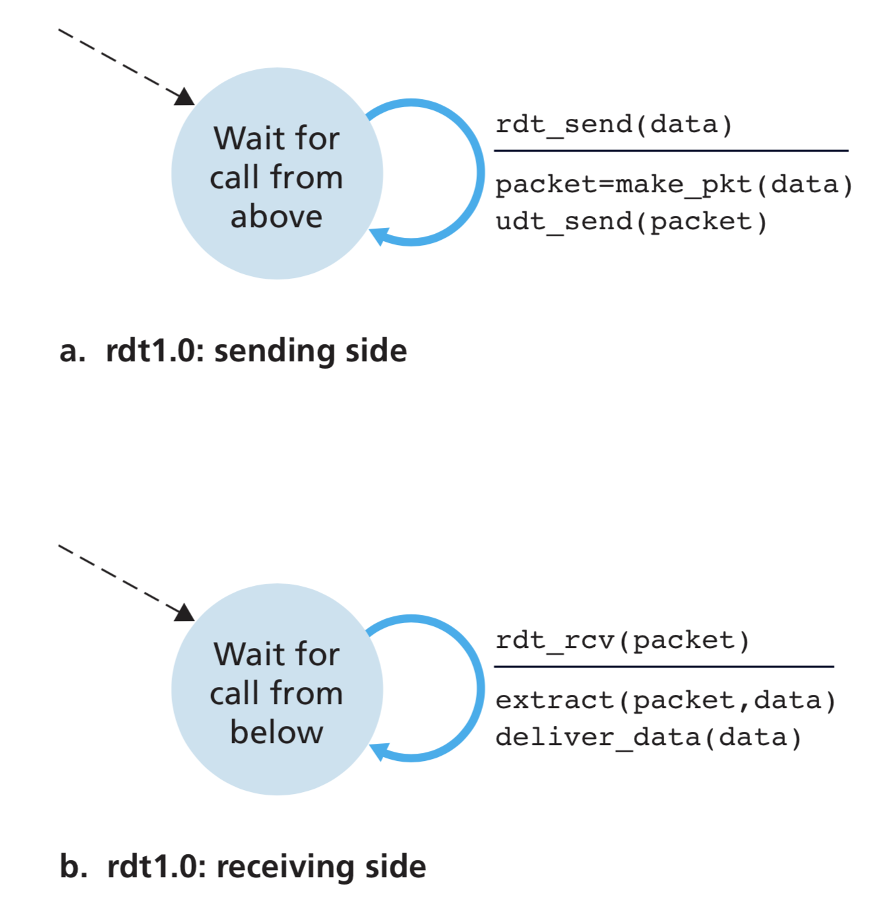
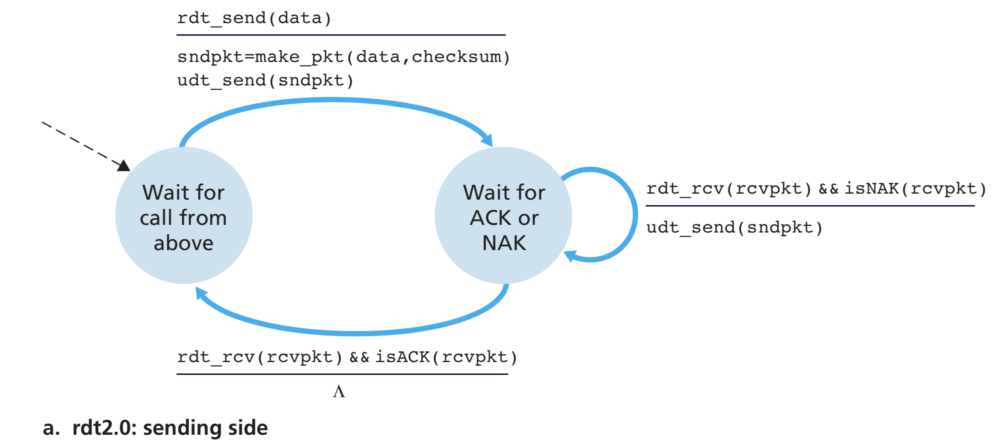
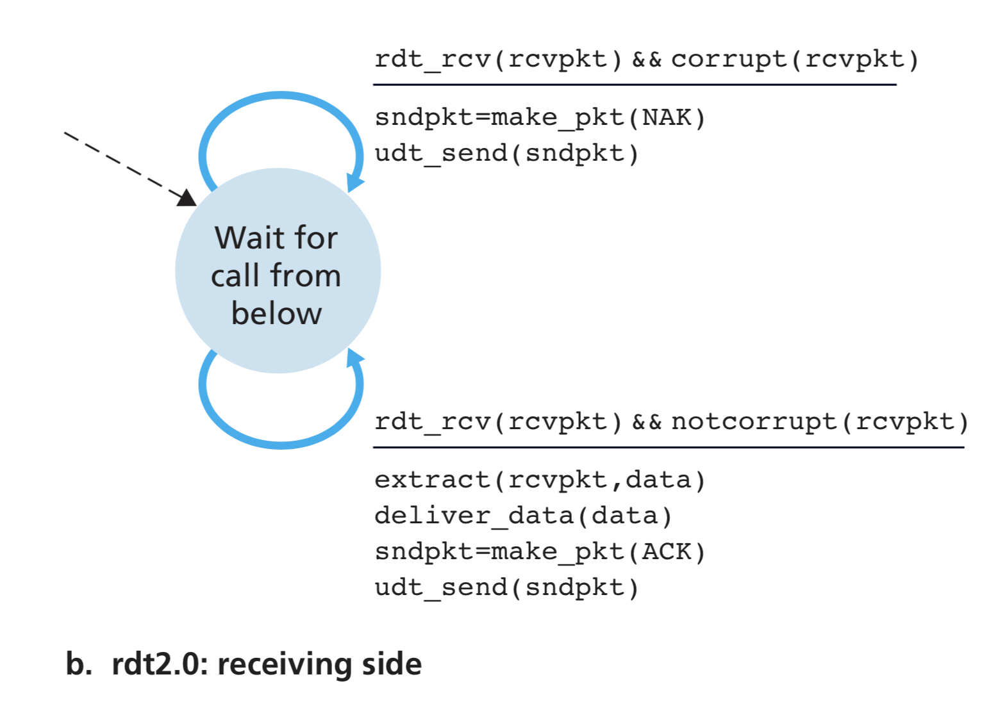
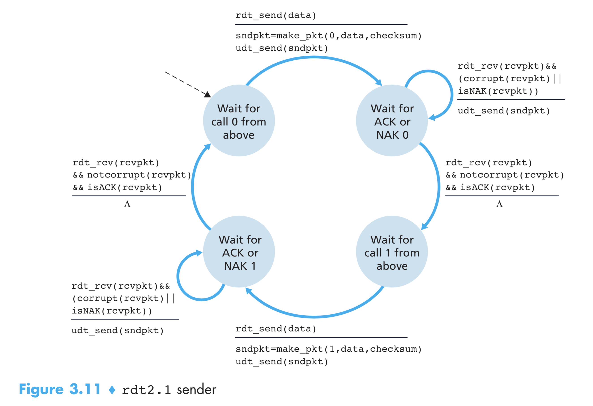
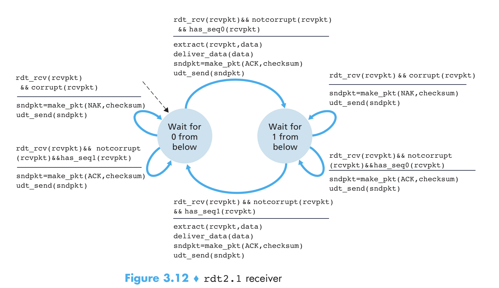
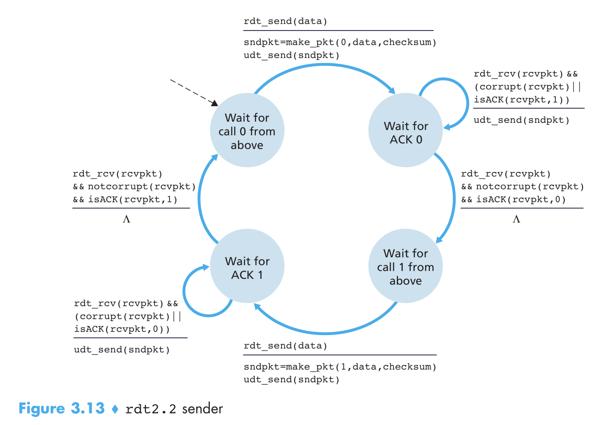
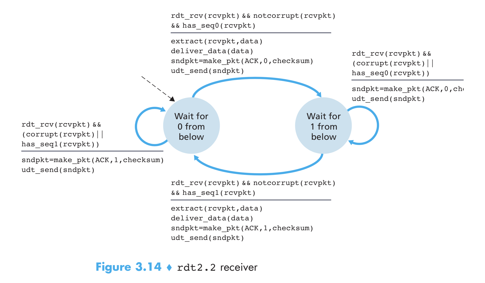

# Reliable Data Transfer

We now step through a series of protocols, each one becoming more complex, arriving at a flawless, reliable data transfer protocol.

## Reliable Data Transfer over a Perfectly Reliable Channel: rdt1.0

We first consider the simplest case, in which the underlying channel is completely reliable.

## Reliable Data Transfer over a Channel with Bit Errors: rdt2.0

A more realistic model of the underlying channel is one in which bits in a packet may be corrupted. Such bit errors typically occur in the physical components of a network as a packet is transmitted, propagates, or is buffered.

Before developing a protocol for reliably communicating over such a channel, first consider how people might deal with such a situation. Consider how you your- self might dictate a long message over the phone. In a typical scenario, the message taker might say “OK” after each sentence has been heard, understood, and recorded. If the message taker hears a garbled sentence, you’re asked to repeat the garbled sentence. This message-dictation protocol uses both **positive acknowledgments** ("OK") and **negative acknowledgments** ("Please repeat that."). These control messages allow the receiver to let the sender know what has been received correctly, and what has been received in error and thus requires repeating. In a computer network setting, reliable data transfer protocols based on such retransmission are known as **ARQ (Automatic Repeat reQuest)** protocols.

Fundamentally, three additional protocol capabilities are required in ARQ protocols to handle the presence of bit errors:

1. **Error detection**: We use the checksum method like UDP to detect error.
2. **Receiver feedback**: Our rdt2.0 protocol will send ACK and NAK packets back from the receiver to the sender. In principle, these packets need only be one bit long; for example, a 0 value could indi- cate a NAK and a value of 1 could indicate an ACK.
3. **Retransmission**: A packet that is received in error at the receiver will be retrans- mitted by the sender.

The sender will not send a new piece of data until it is sure that the receiver has correctly received the current packet. Because of this behavior, protocols such as rdt2.0 are known as **stop-and-wait** protocols.

> But what if ACK/NAK is corrupted?

If an ACK or NAK is corrupted, the sender has no way of knowing whether or not the receiver has correctly received the last piece of transmitted data. There are three scenarios on how we might handle this:

1. The sender can send ACK/NAK itself to indicate if it received the ACK/NAK. But obviouly, it moves to a never ending cycle. So this is a bad idea.
2. A second alternative is to add enough checksum bits to allow the sender not only to detect, but also to recover from, bit errors. This solves the immediate problem for a channel that can corrupt packets but not lose them.
3. A third approach is for the sender simply to resend the current data packet when it receives a garbled ACK or NAK packet. This approach, however, introduces **duplicate packets** into the sender-to-receiver channel. The fundamental diffi- culty with duplicate packets is that the receiver doesn’t know whether the ACK or NAK it last sent was received correctly at the sender. Thus, it cannot know a priori whether an arriving packet contains new data or is a retransmission!

A simple solution to this new problem (and one adopted in almost all existing data transfer protocols, including TCP) is to add a new field to the data packet and have the sender number its data packets by putting a **sequence number** into this field. The receiver then need only check this sequence number to determine whether or not the received packet is a retransmission. Hence, sequence number can handle duplicate packets in channel.

For this simple case of a stop-and- wait protocol, a 1-bit sequence number will suffice, since it will allow the receiver to know whether the sender is resending the previously transmitted packet (the sequence number of the received packet has the same sequence number as the most recently received packet) or a new packet (the sequence number changes, moving “forward” in modulo-2 arithmetic). Since we are currently assuming a channel that does not lose packets, ACK and NAK packets do not themselves need to indicate the sequence number of the packet they are acknowledging. The sender knows that a received ACK or NAK packet (whether garbled or not) was generated in response to its most recently transmitted data packet.

Notice that we don't need the NAK packages. When we recieve a corrupted package, we can just send ACK package for the previous packet again. When sender receives **duplicate ACK** for a packet, it will understand that the recently sent packet was received by reciever. So it can retransmit it.

This NAK-free rdt is rdt2.2.

One subtle change between rtdt2.1 and rdt2.2 is that the receiver must now include the sequence number of the packet being acknowledged by an ACK message (this is done by including the ACK,0 or ACK,1 argument in make_pkt() in the receiver FSM), and the sender must now check the sequence number of the packet being acknowledged by a received ACK message (this is done by including the 0 or 1 argument in isACK()in the sender FSM).

## Reliable Data Transfer over a Lossy Channel with Bit Errors: rdt3.0

Suppose now that in addition to corrupting bits, the underlying channel can _lose_ packets as well, a not-uncommon event in today’s computer networks (including the Internet).

Two additional concerns must now be addressed by the protocol: 

- How to detect packet loss.
- What to do when packet loss occurs.

There are many possible approaches toward dealing with packet loss (several more of which are explored in the exercises at the end of the chapter). Here, we’ll put the burden of detecting and recovering from lost packets on the sender. Suppose that the sender transmits a data packet and either that packet, or the receiver’s ACK of that packet, gets lost. In either case, no reply is forthcoming at the sender from the receiver. If the sender is willing to wait long enough so that it is certain that a packet has been lost, it can simply retransmit the data packet. You should convince yourself that this protocol does indeed work.

From the sender’s viewpoint, retransmission is a panacea. The sender does not know whether a data packet was lost, an ACK was lost, or if the packet or ACK was simply overly delayed. In all cases, the action is the same: retransmit. Implementing a time-based retransmission mechanism requires a **countdown timer** that can interrupt the sender after a given amount of time has expired. The sender will thus need to be able to (1) start the timer each time a packet (either a first-time packet or a retransmission) is sent, (2) respond to a timer interrupt (taking appropriate actions), and (3) stop the timer.