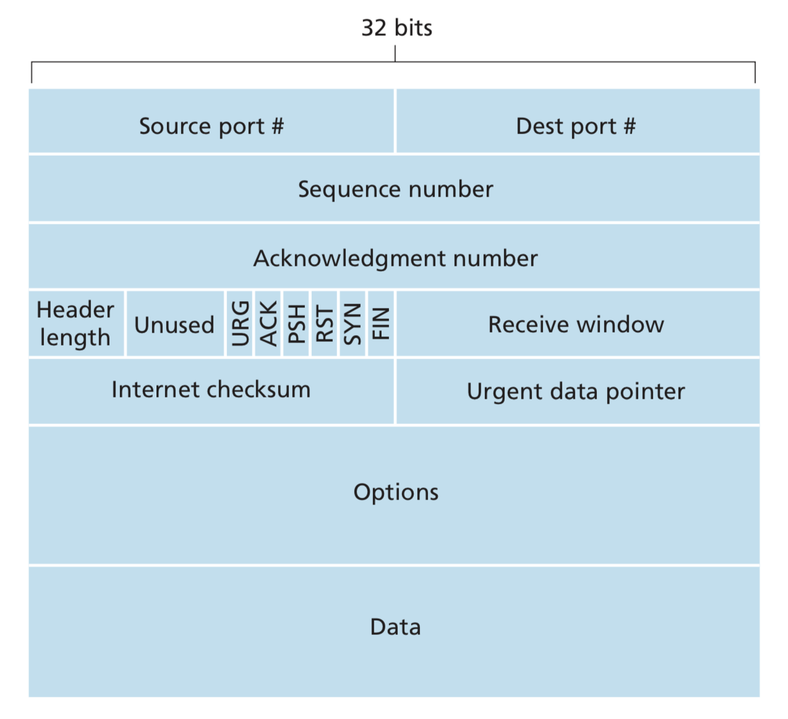
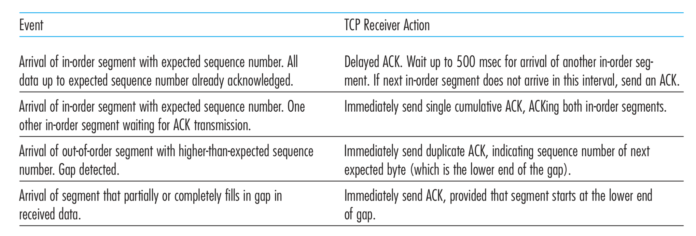
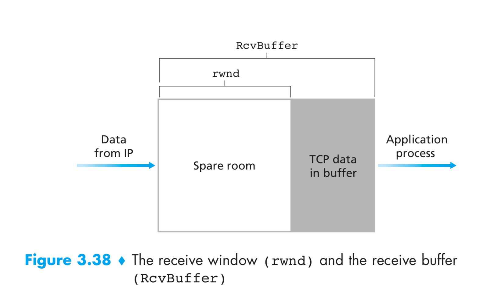
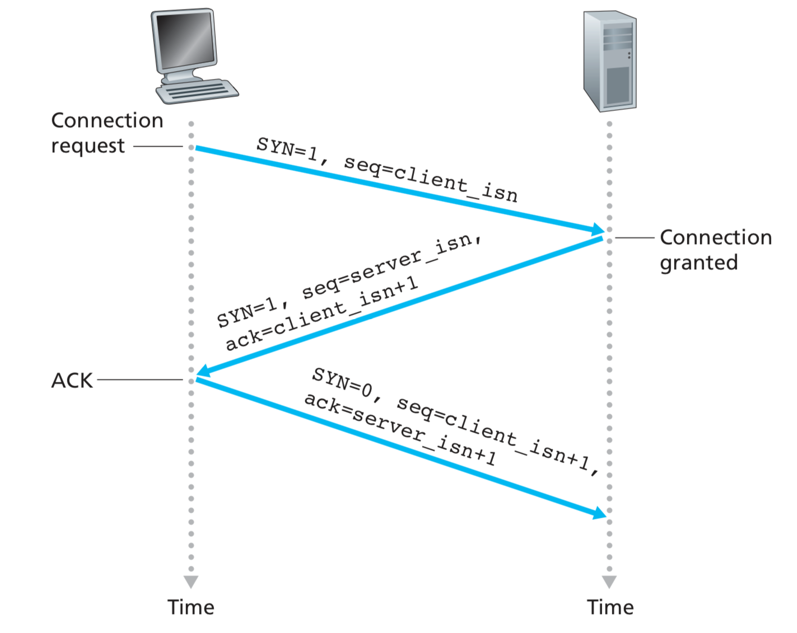
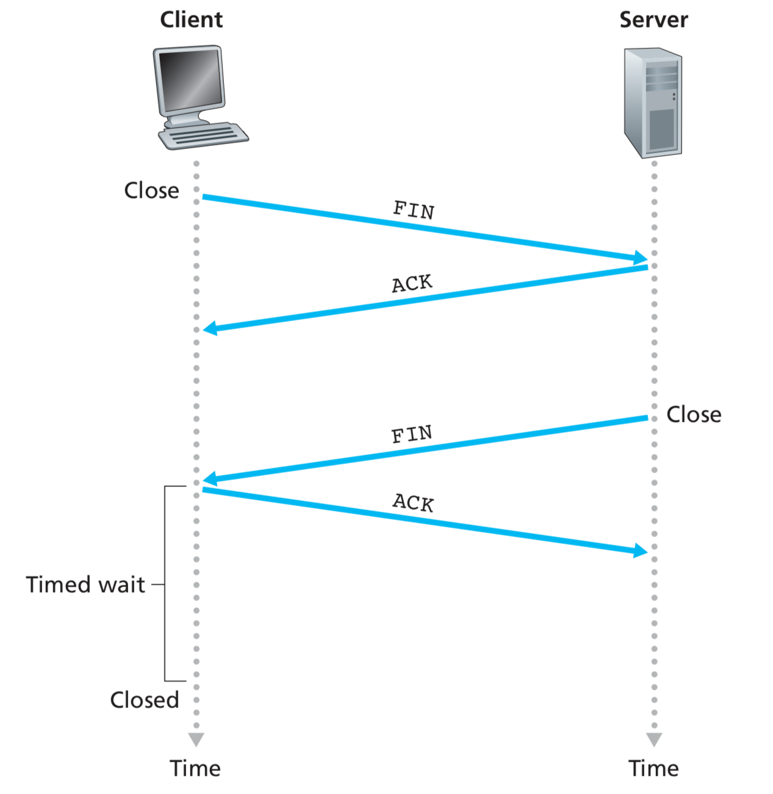
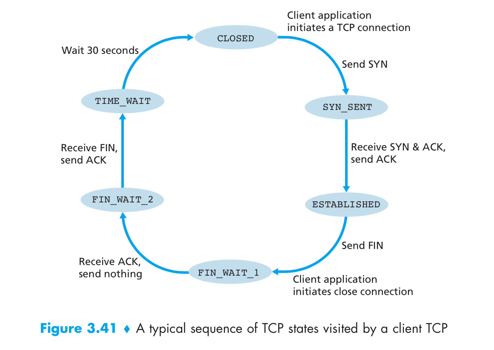
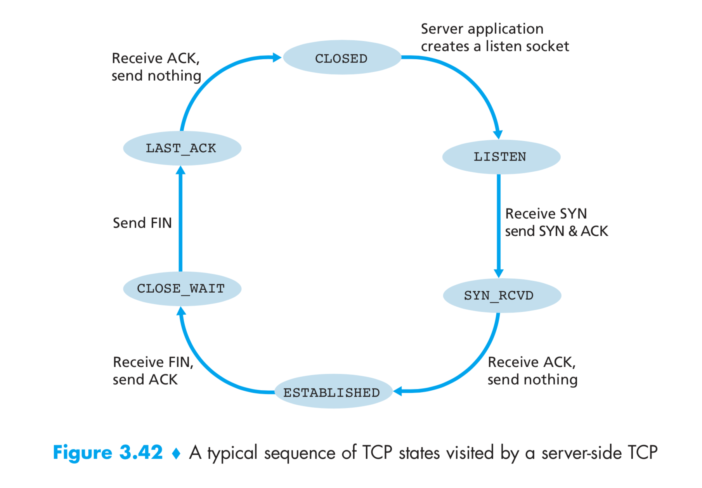
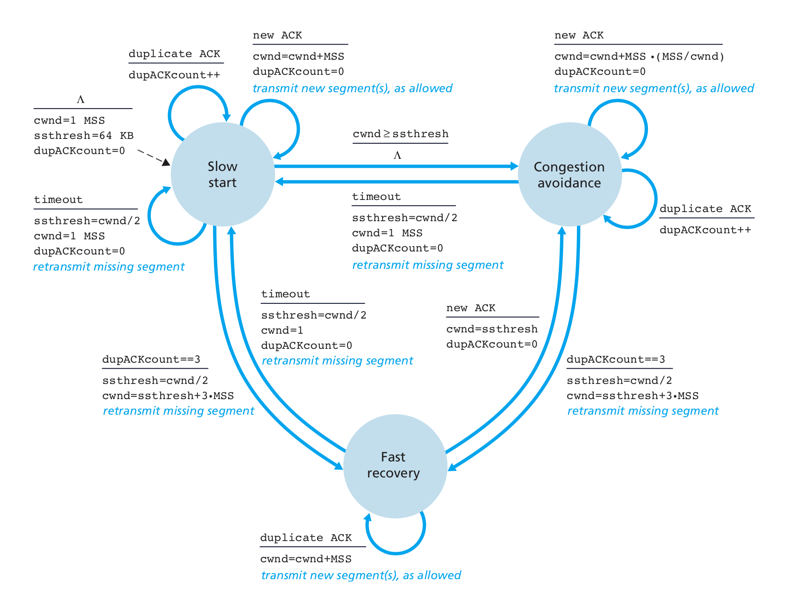

# Connection Oriented Transport: TCP

TCP is said to be **connection-oriented** because before one application process can begin to send data to another, the two processes must first “handshake” with each other—that is, they must send some preliminary segments to each other to establish the parameters of the ensuing data transfer.

- Because the TCP protocol runs only in the end systems and not in the intermediate network elements (routers and link-layer switches), the intermediate network elements do not maintain TCP connection state.
- A TCP connection provides a **full-duplex service**: If there is a TCP connection between Process A on one host and Process B on another host, then application- layer data can flow from Process A to Process B at the same time as application- layer data flows from Process B to Process A.
- A TCP connection is also always point-to-point, that is, between a single sender and a single receiver. So-called "multicasting" —the transfer of data from one sender to many receivers in a single send operation-is not possible with TCP.
- The client first sends a special TCP segment; the server responds with a second special TCP segment; and finally the client responds again with a third special segment. The first two segments carry no payload, that is, no application-layer data; the third of these segments may carry a payload. Because three segments are sent between the two hosts, this connection-establishment procedure is often referred to as a **three-way handshake**.

How TCP Sends data:

- Once a TCP connection is established, the two application processes can send data to each other. 
- The client process passes a stream of data through the socket.
- Once the data passes through the door, the data is in the hands of TCP running in the client.
- TCP directs this data to the connection’s **send buffer**, which is one of the buffers that is set aside during the initial three-way handshake.
- From time to time, TCP will grab chunks of data from the send buffer and pass the data to the network layer. The specification does not specify when TCP should send data, saying only it should do it at its convinience.
- The maximum amount of data that can be grabbed and placed in a segment is limited by the **maximum segment size (MSS)**. Note that the MSS is the maximum amount of application-layer data in the segment, not the maximum size of the TCP segment including headers.
- TCP pairs each chunk of client data with a TCP header, thereby forming **TCP segments**. The segments are passed down to the network layer, where they are separately encapsulated within network-layer IP datagrams. The IP datagrams are then sent into the network.

## TCP Segment Structure

### Sequence Numbers and Acknowledgement Numbers

- TCP views data as an unstructured, but ordered, stream of bytes.
- The sequence number for a segment is therefore the byte-stream number of the first byte in the segment.
- The acknowledgment number that Host A puts in its segment is the sequence number of the next byte Host A is expecting from Host B.
- Because TCP only acknowledges bytes up to the first missing byte in the stream, TCP is said to provide **cumulative acknowledgments**.
- Interestingly, the TCP RFCs do not impose any rules here and leave the decision up to the people programming a TCP implementation. There are basically two choices: either (1) the receiver immediately discards out-of-order segments (which, as we discussed earlier, can simplify receiver design), or (2) the receiver keeps the out-of-order bytes and waits for the missing bytes to fill in the gaps. Clearly, the latter choice is more efficient in terms of network bandwidth, and is the approach taken in practice.
- The initial sequence number is chosen randomly on both sides. This is done to minimize the possibility that a segment that is still present in the network from an earlier, already-terminated connection between two hosts is mistaken for a valid segment in a later connection between these same two hosts.
- Note that the acknowledgment for client-to-server data is carried in a segment carrying server-to-client data; this acknowledgment is said to be **piggybacked** on the server-to-client data segment.

## Round-Trip Time Estimation and Timeout

TCP, like our rdt protocol, uses a timeout/retransmit mechanism to recover from lost segments. Although this is conceptually simple, many subtle issues arise when we implement a timeout/retransmit mechanism in an actual protocol such as TCP. 

Perhaps the most obvious question is the length of the timeout intervals. Clearly, the timeout should be larger than the connection’s round-trip time (RTT), that is, the time from when a segment is sent until it is acknowledged. Otherwise, unnecessary retransmissions would be sent. But how much larger? How should the RTT be estimated in the first place? Should a timer be associated with each and every unacknowledged segment?

### Estimating the Round-Trip Time

- The sample RTT, denoted SampleRTT, for a segment is the amount of time between when the segment is sent (that is, passed to IP) and when an acknowledg- ment for the segment is received.
- Instead of measuring a SampleRTT for every transmitted segment, most TCP implementations take only one SampleRTT meas- urement at a time. That is, at any point in time, the SampleRTT is being estimated for only one of the transmitted but currently unacknowledged segments, leading to a new value of SampleRTT approximately once every RTT.
- Also, TCP never com- putes a SampleRTT for a segment that has been retransmitted; it only measures SampleRTT for segments that have been transmitted once. Why?
- Obviously, the SampleRTT values will fluctuate from segment to segment due to congestion in the routers and to the varying load on the end systems. Because of this fluctuation, any given SampleRTT value may be atypical. In order to estimate a typical RTT, it is therefore natural to take some sort of average of the Sam- pleRTT values.
  - TCP maintains an average, called EstimatedRTT, of the Sam- pleRTT values.
  - Upon obtaining a new SampleRTT, TCP updates EstimatedRTT according to the following formula: $EstimaedRTT = (1-\alpha) \cdot EstimatedRTT + \alpha \cdot SampleRTT$
  - The recommended value of 􏰂$\alpha$ is 􏰂$\frac{1}{8} = 0.125$.
  - Note that EstimatedRTT is a weighted average of the SampleRTT values.
  - In statistics, such an average is called an **exponential weighted moving average (EWMA)**.
- In addition to having an estimate of the RTT, it is also valuable to have a measure of the variability of the RTT.
    - DevRTT, as an estimate of how much SampleRTT typically deviates from EstimatedRTT.
    - $DevRTT = (1 - \beta) \cdot DevRTT + \beta \cdot | SampleRTT - EstimatedRTT |$
    - Note that DevRTT is an EWMA of the difference between SampleRTT and EstimatedRTT. If the SampleRTT values have little fluctuation, then DevRTT will be small; on the other hand, if there is a lot of fluctuation, DevRTT will be large.
    - The recommended value of β is 0.25.

### Setting and Managing the Retransmission Timeout Interval

> Given values of EstimatedRTT and DevRTT, what value should be used for TCP’s timeout interval?

- Clearly, the interval should be greater than or equal to EstimatedRTT, or unnecessary retransmissions would be sent. But the timeout interval should not be too much larger than EstimatedRTT; otherwise, when a seg- ment is lost, TCP would not quickly retransmit the segment, leading to large data transfer delays.
- It is therefore desirable to set the timeout equal to the EstimatedRTT plus some margin.
- The margin should be large when there is a lot of fluctuation in the SampleRTT values; it should be small when there is little fluctuation. The value of DevRTT should thus come into play here.
- $TimeoutInterval = EstimatedRTT + 4 \cdot DevRTT$
- An initial TimeoutInterval value of 1 second is recommended.
- Also, when a timeout occurs, the value of TimeoutInterval is doubled to avoid a premature timeout occurring for a subsequent segment that will soon be acknowledged.
- However, as soon as a segment is received and EstimatedRTT is updated, the TimeoutInterval is again computed using the formula above.

## Reliable Data Transfer

In our earlier development of reliable data transfer techniques, it was conceptu- ally easiest to assume that an individual timer is associated with each transmitted but not yet acknowledged segment. While this is great in theory, timer management can require considerable overhead. Thus, the recommended TCP timer management procedures use only a single retransmission timer, even if there are mul- tiple transmitted but not yet acknowledged segments.

> What is the difference between TCP and GBN?

Upon timeout, TCP retransmits only one segment.

### Doubling the Timeout Interval

The first concerns the length of the timeout interval after a timer expiration. In this mod- ification, whenever the timeout event occurs, TCP retransmits the not-yet- acknowledged segment with the smallest sequence number, as described above. But each time TCP retransmits, it sets the next timeout interval to twice the previous value, rather than deriving it from the last EstimatedRTT and DevRTT.

However, whenever the timer is started after either of the two other events (that is, data received from application above, and ACK received), the TimeoutInterval is derived from the most recent values of EstimatedRTT and DevRTT.

This modification provides a limited form of congestion control.

### Fast Retransmit

- One of the problems with timeout-triggered retransmissions is that the timeout period can be relatively long. When a segment is lost, this long timeout period forces the sender to delay resending the lost packet, thereby increasing the end-to- end delay.
- Fortunately, the sender can often detect packet loss well before the time- out event occurs by noting so-called duplicate ACKs.
- A **duplicate ACK** is an ACK that reacknowledges a segment for which the sender has already received an earlier acknowledgment.

- Because a sender often sends a large number of segments back to back, if one seg- ment is lost, there will likely be many back-to-back duplicate ACKs.
- If the TCP sender receives three duplicate ACKs for the same data, it takes this as an indication that the segment following the segment that has been ACKed three times has been lost.
  - > Why wait for 3 duplicate ACK instead of just 1?
  - Maybe the packet did not go missing, just went out of order.
- In the case that three duplicate ACKs are received, the TCP sender performs a **fast retransmit**, retrans- mitting the missing segment before that segment’s timer expires.

### Go-Back-N or Selective Repeat

- TCP acknowledgments are cumulative.
- Correctly received but out-of-order segments are not individually ACKed by the receiver.
- TCP retransmits only one segment at a time.

Thus it is a hybrid.

## Flow Control

- Recall that the hosts on each side of a TCP connection set aside a receive buffer for the connection. 
- When the TCP connection receives bytes that are correct and in sequence, it places the data in the receive buffer.
- The associated application process will read data from this buffer, but not necessarily at the instant the data arrives.
- If the application is rela- tively slow at reading the data, the sender can very easily overflow the connection’s receive buffer by sending too much data too quickly.

### Flow Control Service

- TCP provides a **flow-control service** to its applications to eliminate the possibility of the sender overflowing the receiver’s buffer.
- Flow control is thus a speed-matching service—matching the rate at which the sender is sending against the rate at which the receiving application is reading.
- From here on, we assume in order segment arrival for simplicity.
- TCP provides flow control by having the sender maintain a variable called the **receive window**.
- Because TCP is full-duplex, the sender at each side of the connection maintains a distinct receive window.
  

- Because TCP is not permitted to overflow the allocated buffer, we must have $LastByteRcvd – LastByteRead \leq􏰄 RcvBuffer$
- The receive window, denoted rwnd is set to the amount of spare room in the buffer: $rwnd = RcvBuffer – [LastByteRcvd – LastByteRead]$
- Because the spare room changes with time, rwnd is dynamic.
- How does the connection use the variable rwnd to provide the flow-control service? Host B tells Host A how much spare room it has in the connection buffer by placing its current value of rwnd in the receive window field of every segment it sends to A.
  - Initially, Host B sets rwnd = RcvBuffer.
- Host A in turn keeps track of two variables, LastByteSent and Last- ByteAcked, which have obvious meanings. Note that the difference between these two variables, LastByteSent – LastByteAcked, is the amount of unac- knowledged data that A has sent into the connection. By keeping the amount of unacknowledged data less than the value of rwnd, Host A is assured that it is not overflowing the receive buffer at Host B.

There is one minor technical problem with this scheme.

- Suppose Host B’s receive buffer becomes full so that rwnd = 0.
- After advertising rwnd = 0 to Host A, also suppose that B has nothing to send to A.
- As the application process at B empties the buffer, TCP does not send new seg- ments with new rwnd values to Host A; indeed, TCP sends a segment to Host A only if it has data to send or if it has an acknowledgment to send.
- Therefore, Host A is never informed that some space has opened up in Host B’s receive buffer—Host A is blocked and can transmit no more data!

To solve this problem, the TCP specification requires Host A to continue to send segments with one data byte when B’s receive window is zero. These segments will be acknowledged by the receiver. Eventually the buffer will begin to empty and the acknowledgments will contain a nonzero rwnd value.

## TCP Connection Management

In this section we discuss how a TCP connection is established and torn down.

The client appli- cation process first informs the client TCP that it wants to establish a connection to a process in the server. The TCP in the client then proceeds to establish a TCP con- nection with the TCP in the server in the following manner:

1. The client-side TCP first sends a special TCP segment to the server-side TCP. This special segment contains no application-layer data. But one of the flag bits in the segment’s header, the SYN bit, is set to 1.
    - For this reason, this special segment is referred to as a SYN segment.
    - In addition, the client randomly chooses an initial sequence number (client_isn) and puts this number in the sequence number field of the initial TCP SYN segment.
2. Once the IP datagram containing the TCP SYN segment arrives at the server host (assuming it does arrive!), the server extracts the TCP SYN segment from the datagram.
    - Then it allocates the TCP buffers and variables to the connection.
    - Sends a connection-granted segment to the client TCP.
    - his connection-granted segment also contains no application- layer data. However, it does contain three important pieces of information in the segment header.
      - First, the SYN bit is set to 1. 
      - Second, the acknowledgment field of the TCP segment header is set to client_isn+1. 
      - Finally, the server chooses its own initial sequence number (server_isn) and puts this value in the sequence number field of the TCP segment header.
    - The connection- granted segment is referred to as a SYNACK segment.
1. Upon receiving the SYNACK segment, the client also allocates buffers and variables to the connection.
    - The client host then sends the server yet another segment; this last segment acknowledges the server’s connection-granted seg- ment (the client does so by putting the value server_isn+1 in the acknowl- edgment field of the TCP segment header).
    - The SYN bit is set to zero, since the connection is established.
    - This third stage of the three-way handshake may carry client-to-server data in the segment payload.

### Ending Connection

- Either of the two processes participating in a TCP connection can end the con- nection.
- When a connection ends, the “resources” (that is, the buffers and variables) in the hosts are deallocated.
- Client sends a TCP segment with a flag bit in the segment’s header, the FIN bit, set to 1.
- When the server receives this segment, it sends the client an acknowledgment segment in return.
- The server then sends its own shutdown segment, which has the FIN bit set to 1.
- Finally, the client acknowledges the server’s shutdown segment.
- At this point, all the resources in the two hosts are now deallocated.

### When Host is not Ready

> What happens when a host receives a TCP segment whose port numbers or source IP address do not match with any of the ongoing sockets in the host?

Then the host will send a special reset seg- ment to the source. This TCP segment has the RST flag bit set to 1.

Thus, when a host sends a reset segment, it is telling the source “I don’t have a socket for that segment. Please do not resend the segment.”

## Principles of Congestion Control

### Costs of Congestion

- Large queueing delays are experienced as the packet arrival rate nears the link capacity.
- Unneeded retransmissions by the sender in the face of large delays may cause a router to use its link bandwidth to forward unneeded copies of a packet.
- When a packet is dropped along a path, the transmission capacity that was used at each of the upstream links to forward that packet to the point at which it is dropped ends up having been wasted.

## TCP Congestion Control

- TCP must use end-to-end congestion control rather than net- work-assisted congestion control, since the IP layer provides no explicit feedback to the end systems regarding network congestion.
- The TCP congestion-control mechanism operating at the sender keeps track of an variable, the **congestion window**.
- Specifically, the amount of unacknowledged data at a sender may not exceed the minimum of cwnd and rwnd, that is: $LastByteSent – LastByteAcked \leq 􏰃 min\{cwnd, rwnd\}$
- In a perfect connec- tion for which loss and packet transmission delays are negligible, at the beginning of every RTT, the constraint permits the sender to send cwnd bytes of data into the connection; at the end of the RTT the sender receives acknowledg- ments for the data. Thus the sender’s send rate is roughly cwnd/RTT bytes/sec. By adjusting the value of cwnd, the sender can therefore adjust the rate at which it sends data into its connection.
- Let us define a “loss event” at a TCP sender as the occurrence of either a timeout or the receipt of three duplicate ACKs from the receiver.
- If acknowledgments arrive at a relatively slow rate then the congestion window will be increased at a relatively slow rate. On the other hand, if acknowledgments arrive at a high rate, then the congestion window will be increased more quickly.
  - Because TCP uses acknowledgments to trigger (or clock) its increase in congestion window size, TCP is said to be self-clocking.

> How should a TCP sender determine the rate at which it should send?

- If TCP senders collectively send too fast, they can congest the network, leading to congestion collapse.
- If TCP senders are too cautious and send too slowly, they could under utilize the bandwidth in the network

TCP answers these questions using the following guiding principles:

- A lost segment implies congestion, and hence, the TCP sender’s rate should be decreased when a segment is lost.
- An acknowledged segment indicates that the network is delivering the sender’s segments to the receiver, and hence, the sender’s rate can be increased when an ACK arrives for a previously unacknowledged segment.
- Bandwidth probing:  The TCP sender’s behavior is perhaps anal- ogous to the child who requests (and gets) more and more goodies until finally he/she is finally told “No!”, backs off a bit, but then begins making requests again shortly afterwards.

### TCP Congestion Control Algorithm

- Slow Start
  - When a TCP connection begins, the value of cwnd is typically initialized to a small value of 1 MSS.
  - Since the available bandwidth to the TCP sender may be much larger than MSS/RTT, the TCP sender would like to find the amount of available bandwidth quickly.
  - Thus, in the slow-start state, the value of cwnd begins at 1 MSS and increases by 1 MSS every time a transmitted segment is first acknowledged.
  - This process results in a doubling of the sending rate every RTT. Thus, the TCP send rate starts slow but grows exponentially during the slow start phase.
  - But when should this exponential growth end?
    - First, if there is a loss event (i.e., congestion) indicated by a timeout, the TCP sender sets the value of cwnd to 1 and begins the slow start process anew. It also sets the value of a second state variable, ssthresh (shorthand for “slow start threshold”) to cwnd/2—half of the value of the con- gestion window value when congestion was detected.
    - Since ssthresh is half the value of cwnd when congestion was last detected, it might be a bit reckless to keep doubling cwnd when it reaches or surpasses the value of ssthresh. Thus, when the value of cwnd equals ssthresh, slow start ends and TCP transitions into congestion avoidance mode.
    - The final way in which slow start can end is if three duplicate ACKs are detected, in which case TCP performs a fast retransmit and enters the fast recovery state.
- Congestion Avoidance
  - On entry to the congestion-avoidance state, the value of cwnd is approximately half its value when congestion was last encountered—congestion could be just around the corner!
  - Thus, rather than doubling the value of cwnd every RTT, TCP adopts a more conservative approach and increases the value of cwnd by just a single MSS every RTT.
  - How? TCP knows how many segments it is sending per RTT. Let it be x. For each acknowledgement it gets, it increases cwnd by MSS/x bytes.
  - Recall, however, that a loss event also can be triggered by a triple dupli- cate ACK event. In this case, the network is continuing to deliver segments from sender to receiver (as indicated by the receipt of duplicate ACKs). So TCP’s behav- ior to this type of loss event should be less drastic than with a timeout-indicated loss: TCP halves the value of cwnd (adding in 3 MSS for good measure to account for the triple duplicate ACKs received) and records the value of ssthresh to be half the value of cwnd when the triple duplicate ACKs were received. The fast-recovery state is then entered.
- Fast Recovery
  - In fast recovery, the value of cwnd is increased by 1 MSS for every duplicate ACK received for the missing segment that caused TCP to enter the fast-recovery state.
  - Eventually, when an ACK arrives for the missing segment, TCP enters the congestion-avoidance state after deflating cwnd.
  - If a timeout event occurs, fast recovery transitions to the slow-start state after performing the same actions as in slow start and congestion avoidance: The value of cwnd is set to 1 MSS, and the value of ssthresh is set to half the value of cwnd when the loss event occurred

TCP congestion control is often referred to as an **additive-increase, multiplicative- decrease (AIMD)** form of congestion control.