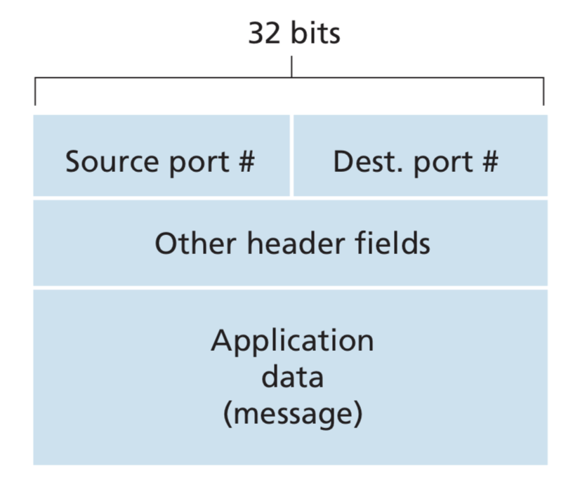
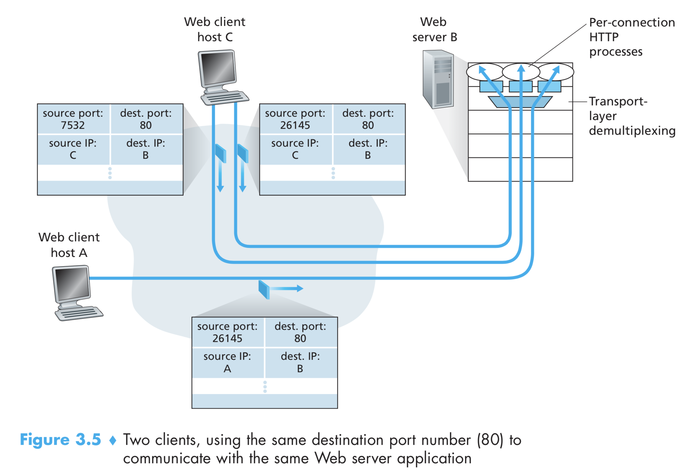

# Transport Layer

A transport-layer protocol provides for **logical communication** between application processes running on different hosts.

By logical communication, we mean that from an application’s perspective, it is as if the hosts running the processes were directly connected; in reality, the hosts may be on opposite sides of the planet, connected via numerous routers and a wide range of link types.

## Relationship between Transport and Network Layers

**Transport-layer protocols are implemented in the end systems but not in network routers**.

Sending Side:

1. Recieve application layer message.
2. Break down application message into smaller chunks.
3. Add transport-layer header to each chunk to create the transport-layer **segment**.
4. The transport layer then passes the segment to the network layer segment at the sending end system.
5. The segment is encapsulated within a network layer packet (**datagram**) and sent to the destinaion.

On receiving side, the opposite of the above steps happen to get the application message.

The network routers do not involve themselves with transport layer segments.

More than one transport-layer protocol may be available to network applications. For example, the Internet has two protocols - **TCP** and **UDP**. Each of these protocols provides a different set of transport-layer services to the invoking application.

**A transport-layer protocol provides logical communication between processes running on different hosts, a network-layer protocol provides logical communication between hosts**.

## Transport Layer Analogy

Consider two houses, one on the East Coast and the other on the West Coast, with each house being home to a dozen kids. The kids in the two households love to write to each other. Each letter is delivered by the traditional postal service in a separate envelope. In each of the households there is one kid—Ann in the West Coast house and Bill in the East Coast house—responsible for mail collection and mail distribution. Each week Ann visits all her brothers and sisters, collects the mail, and gives the mail to a postal-service mail carrier, who makes daily visits to the house. When letters arrive at the West Coast house, Ann also has the job of distributing the mail to her brothers and sisters. Bill has a similar job on the East Coast.

In this example, the postal service provides logical communication between the two houses - the postal service moves mail from house to house, not from person to person. On the other hand, Ann and Bill provide logical communication among the cousins—Ann and Bill pick up mail from, and deliver mail to, their brothers and sisters. Note that from the kids' perspective, Ann and Bill are the mail service, even though Ann and Bill are only a part (the end-system part) of the end-to-end delivery process.

## Internet's Network Layer Model

Internet's network layer is called **IP (Internet Protocol)**. IP provides logical communication between hosts. The IP service model is a **best-effort delivery service**. This means that IP makes its "best effort" to deliver segments between communicating hosts, but it makes no guarantees.

- It does not guarantee segment delivery.
- It does not guarantee orderly delivery of segments.
- It does not guarantee the integrity of the data in the segments.

For these reasons, IP is said to be an **unreliable service**. We also mention here that every host has at least one network-layer address, a so-called IP address.

## Choice of Transport Layer Model

We have two choices for transport layer protocol: **UDP (User Datagram Protocol)** and **TCP (Transmission Control Protocol)**.

- The most fundamental responsibility of UDP and TCP is to extend IP’s delivery service between two end systems to a delivery service between two processes running on the end systems. Extending host-to-host delivery to process-to-process delivery is called **transport-layer multiplexing** and **demultiplexing**.
- UDP and TCP also provide integrity checking by including error- detection fields in their segments’ headers.

The above two features are the only feature provided by UDP.

- TCP also provides **reliable data transfer**, using flow control, sequence num- bers, acknowledgments, and timers.
- TCP also provides **congestion control**. Congestion control is not so much a service provided to the invoking application as it is a service for the Internet as a whole, a service for the general good.

## Multiplexing and Demultiplexing

Suppose my pc is running multiple application. When network layer brings datagram to my machine, transport layer unwraps and gets the segment.

> Question: How will the transport layer know which process to send the segment?

- First of all, each application has one or more sockets through which data gets passed between process and network. So transport layer needs to decide which socket to pass data on.
- The segments have a set of fields for the purpose of identifying the socket to pass data on.
- This job of delivering the data in a transport-layer segment to the correct socket is called **demultiplexing**.
- The job of gathering data chunks at the source host from different sockets, encapsulating each data chunk with header information (that will later be used in demultiplexing) to create segments, and passing the segments to the network layer is called **multiplexing**.

To illustrate the demultiplexing job, recall the household analogy in the previ- ous section. Each of the kids is identified by his or her name. When Bill receives a batch of mail from the mail carrier, he performs a demultiplexing operation by observing to whom the letters are addressed and then hand delivering the mail to his brothers and sisters. Ann performs a multiplexing operation when she collects let- ters from her brothers and sisters and gives the collected mail to the mail person.

From the discussion above, we know that transport-layer multiplexing requires (1) that sockets have unique identifiers, and (2) that each segment have special fields that indicate the socket to which the segment is to be delivered. These special fields are the **source port number** field and the **destination port number** field.

### TCP Creates Socket with 4 tuple

When a client tries to connect to server, server creates a new socket (if not already created) using the 4 tuple (source IP, source port, dest IP, dest port). This means one process can open multiple socket. Hence, even though we only have around 60k ports, we can provide service to many more clients than 60k.

## Reliable Data Transfer

