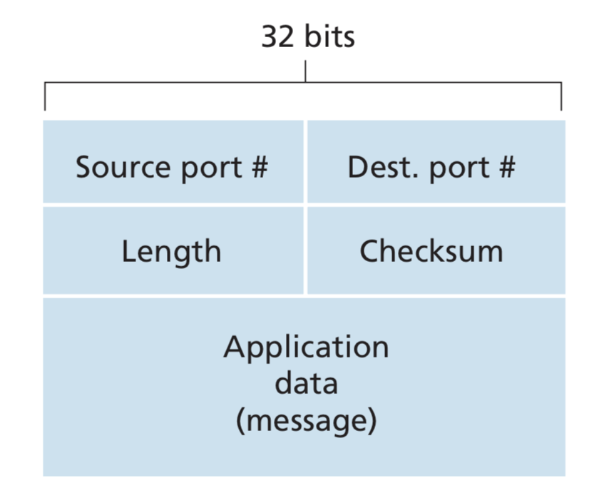

# UDP

> Why would anyone choose udp?

1. **Finer application-level control over what data is sent, and when**: There is no congestion control like TCP. Each segment gets passed to network layer immediately.
2. **No connection establishment**
3. **No connection state**
4. **Small packet header overhead**: The TCP segment has 20 bytes of header over- head in every segment, whereas UDP has only 8 bytes of overhead.

## UDP Segment Structure

The UDP header has only four fields, each consisting of two bytes. 

- the port numbers allow the destination host to pass the application data to the correct process running on the destination end system (that is, to perform the demultiplexing function). 
- The length field specifies the number of bytes in the UDP segment (header plus data). An explicit length value is needed since the size of the data field may differ from one UDP segment to the next. 
- The checksum is used by the receiving host to check whether errors have been introduced into the segment.

## UDP Checksum

The UDP checksum provides for error detection. That is, the checksum is used to determine whether bits within the UDP segment have been altered.

UDP at the sender side performs the 1s complement of the sum of all the 16-bit words in the segment, with any overflow encountered during the sum being wrapped around. This result is put in the checksum field of the UDP segment.

At the receiver, all 16-bit words are added, including the checksum. If no errors are introduced into the packet, then clearly the sum at the receiver will be 1111111111111111. If one of the bits is a 0, then we know that errors have been introduced into the packet.

Although UDP provides error checking, it does not do anything to recover from an error. Some implementations of UDP simply discard the damaged segment; others pass the dam- aged segment to the application with a warning.