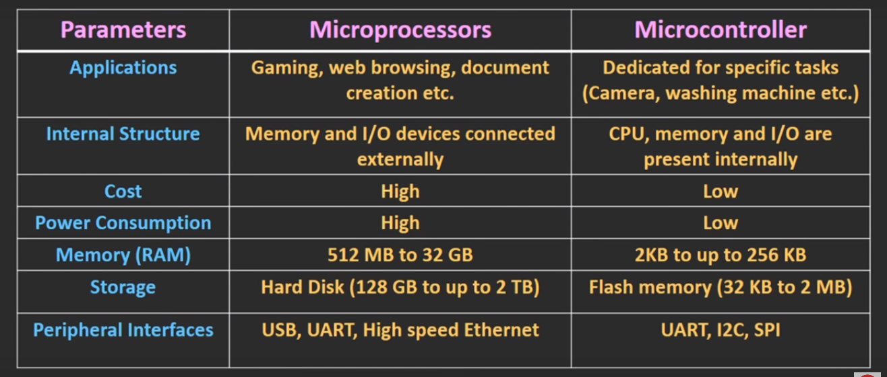

# Microcontroller vs Microprocessor

## predefined tasks

Microcontroller is used where tasks are predefined, like in oven, washing machine.

Microprocessor is used where tasks vary and we have no way to it before hand. For example in pc we don't know what game we will play and each game has different requirements and calculations.

## integrated chip

Since tasks of microcontroller is fixed, we know what amount of memory and other facilities it will need. All the facilities then can be fabricated into a single chip. So overall size of microcontroller becomes small.

But in microprocessor, computational needs and other physical needs such as memory varies with the application. Hence in order to build a system, we have to attach those facilities externally. So overall size becomes larger.

## Processing power and memory

Microprocessor have higher computational power with cpu cycle ranging in the gigahertz. Whereas microcontroller have cpu cycles in the range from 1 megahertz to 300 megahertz.

Since microcontrollers' tasks are fixed, they have lower memory needs than microprocessor.

Amount of data microprocessor can handle in a single cycle is higher than microcontrollers.

# Summary

