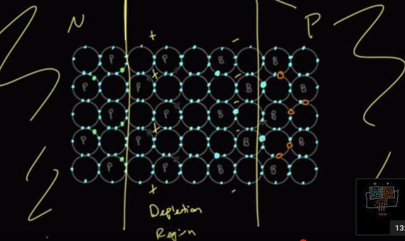
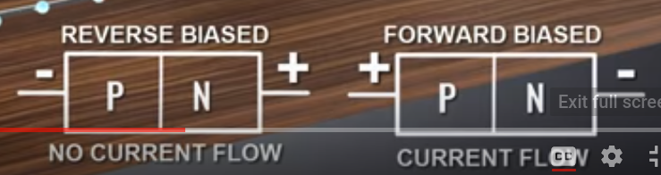

# Semiconductors

**Resources**: [How semiconductors work](https://www.youtube.com/watch?v=33vbFFFn04k&t=24s)

Crystal of silicon with covalent bonds. Silicon has 4 valence electrons.

**Why silicon?** Cause it has high **thermal stability**. Thermal stability is the ability of a compound to resist decomposing when heated.

## Generation and Recombination

When an electron leaves an atom, a hole is created. This is called Generation. When an electron fills a hole, it is called recombination

## Doping

Doping is the process where foreign substances are added to improve performance.

### N-type Semiconductor
One of the common impurities added is **Phosphorus**. Phosphorus has 5 valence electrons. The phosphorus replaces silicon atom and takes it places sharing electron with 4 adjacent silicon atom and 1 free electron.

Charge is carried by extra electron.

It is called N type cause negative charge moves through it.

### P-type Semiconductor

Another impurities is Boron that has 3 valence electron. So replacing Si with B introduces holes in the structure.

Charge is carried by holes.

It is called P type cause positive charge (holes) moves through it.

# Diode

Diode is a one way valve for electricity.

## PN Junction

A PN semiconductor is formed by attaching a N-type semiconductor with P-type conductor.

At the boundary of P and N type conductor, known as **PN-Junction**, a positive charge gets build up on P-type side and negative charge builds up on N-type side. This is cause some of the loose electron of Phosphorus gets attracted to holes in Boron.

A region forms around the PN-Junction where there is no charge carrier. This region is called **Depletion Region**. This region works like an insulator, preventing current from flowing.

It takes around 0.7 volts to cross the depletion region.

Now, if we connect power source, depending on which end is connect to which, current will flow. That is, current flows in one direction but not in other. The other direction actually increases the insulation band width.

When electron flows through diode, its called forward bias.

# Transistor

[How transistor work](https://www.youtube.com/watch?v=IcrBqCFLHIY)
