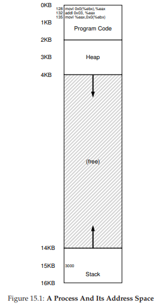
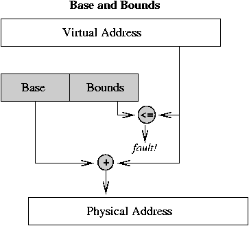

# Address Translation

> How do we maintain control over which memory locations an application can access, and thus ensure that application memory accesses are properly restricted?

With address translation, the hardware transforms each **memory access** (e.g., an instruction fetch, load, or store), changing the virtual address provided by the instruction to a **physical address** where the desired information is actually located.

## Initial Assumptions

Initially, we are going to assume the following things:

1. the user’s address space must be placed contiguously in physical memory
1.  the size of the address space is not too big; specifically, that it is less than the size of physical memory
1. each address space is exactly the same size

So a sample process will look like the following.



## Process perspective
From the program’s perspective, its address space starts at address 0 and grows to a maximum of 16 KB; all memory references it generates should be within these bounds. However, to virtualize memory, the OS wants to place the process somewhere else in physical memory, not necessarily at address 0.

> How can we relocate this process in memory in a way that is transparent to the process? How can we provide the illusion of a virtual address space starting at 0, when in reality the address space is located at some other physical address?

## Base and Bounds or Dynamic Relocation

We’ll need two hardware registers within each CPU: one is called the base register, and the other the bounds (sometimes called a limit register).

In this setup, each program is written and compiled as if it is loaded at address zero. However, when a program starts running, the OS decides where in physical memory it should be loaded and sets the base register to that value.

Interesting things start to happen when the process is running. Now, when any memory reference is generated by the process, it is translated by the processor in the following manner:
```
physical address = virtual address + base
```

Each memory reference generated by the process is a **virtual address**; the hardware in turn adds the contents of the base register to this address and the result is a **physical address** that can be issued to the memory system.

Transforming a virtual address into a physical address is exactly the technique we refer to as **address translation**; that is, the hardware takes a virtual address the process thinks it is referencing and transforms it into a physical address which is where the data actually resides. Because this relocation of the address happens at runtime, and because we can move address spaces even after the process has started running, the technique is often referred to as **dynamic relocation**.

**What about bound register?**

Bound register is used for comparing if the virtual address is within legal bound.

If a process generates a virtual address that is greater than the bounds, or one that is negative, the CPU will raise an exception, and the process will likely be terminated.

We should note that the base and bounds registers are hardware structures kept on the chip (one pair per CPU). Sometimes people call the part of the processor that helps with address translation the **memory management unit (MMU)**


