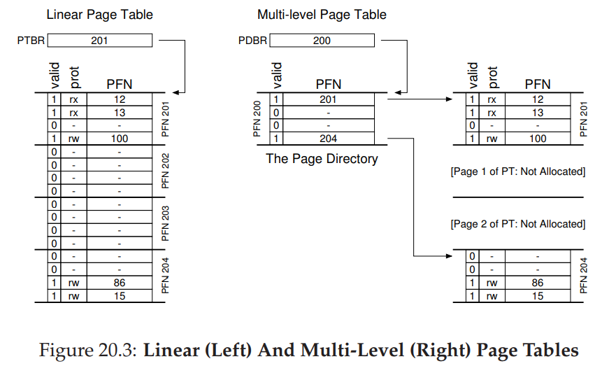
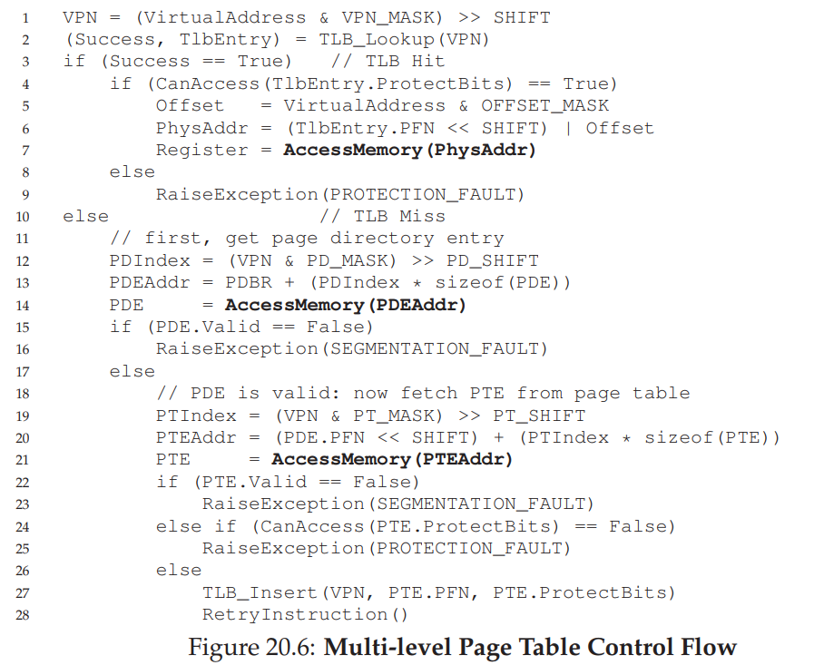

# Advanced Paging Table

## Linear Paging Table Memory Problem

We now tackle the second problem that paging introduces: page tables are too big and thus consume too much memory.

Let’s start out with a linear page table. As you might recall1 , linear page tables get pretty big. Assume again a 32-bit address space ($2^{32}$ bytes), with 4KB ($2^{12}$ byte) pages and a 4-byte page-table entry. An address space thus has roughly one million virtual pages in it ( $\frac{2^{32}}{2^{12}}$ ); multiply by the page-table entry size and you see that our page table is 4MB in size.

Recall also: we usually have one page table for every process in the system! With a hundred active processes (not uncommon on a modern system), we will be allocating hundreds of megabytes of memory just for page tables!

## Simple Solution: Bigger Pages

Increasing the page size by factor of four reduces memory requirement by factor of four.

The major problem with this approach, however, is that big pages lead to waste within each page, a problem known as internal fragmentation (as the waste is internal to the unit of allocation).

Thus, most systems use relatively small page sizes in the common case: **4KB** (as in x86) or 8KB (as in SPARCv9).

## Multi Level Page Tables

How about we split the page table into pages itself? Recursive solution!

The basic idea behind a multi-level page table is simple. First, chop up the page table into page-sized units; then, if an entire page of page-table entries (PTEs) is invalid, don’t allocate that page of the page table at all. To track whether a page of the page table is valid (and if valid, where it is in memory), use a new structure, called the **page directory**. The page directory thus either can be used to tell you where a page of the page table is, or that the entire page of the page table contains no valid pages.

The page directory, in a simple two-level table, contains one entry per page of the page table. It consists of a number of **page directory entries (PDE)**. A PDE (minimally) has a valid bit and a page frame number (PFN), similar to a PTE.

| Advantages | Disadvantages     |
| :------------- | :------------- |
| Memory Efficient: Supports sparse paging table      | On a TLB miss, two loads from memory is required: one for the page directory, and one for the PTE itself       |
| Paging table split into pages. Easier to find space in RAM.         | Complexity: both software and hardware support is now complex.                   |

## Inverted Page Tables

An even more extreme space savings in the world of page tables is found with **inverted page tables**. Here, instead of having many page tables (one per process of the system), we keep a single page table that has an entry for each physical page of the system. The entry tells us which process is using this page, and which virtual page of that process maps to this physical page.

Finding the correct entry is now a matter of searching through this data structure. A linear scan would be expensive, and thus a hash table is often built over the base structure to speed lookups.

## Resources

1. [Operating System Three Easy Pieces - Chapter 20](http://pages.cs.wisc.edu/~remzi/OSTEP/vm-smalltables.pdf)
