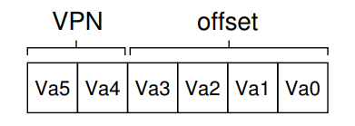
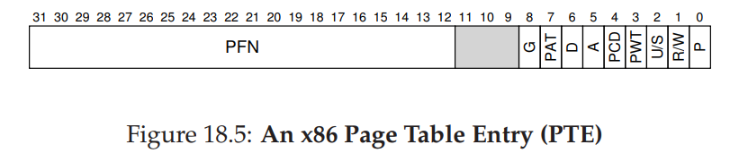
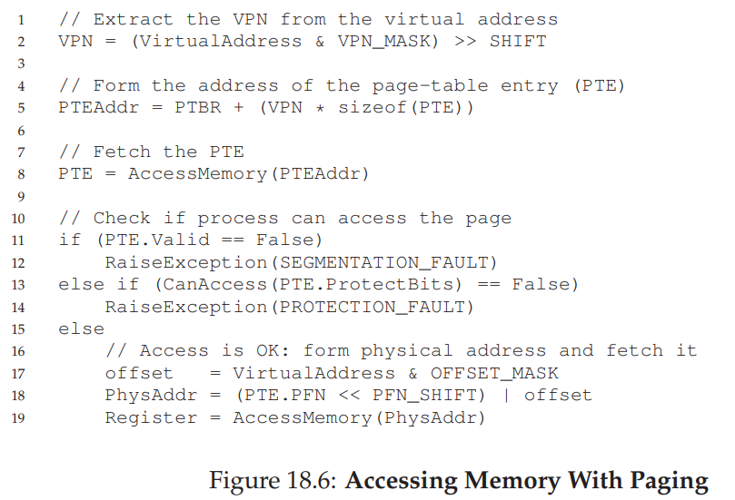

# Paging

Instead of splitting up a process’s address space into some number of variable-sized logical segments (e.g., code, heap, stack), we divide it into fixed-sized units, each of which we call a **page**. Correspondingly, we view physical memory as an array of fixed-sized slots called **page frames**; each of these frames can contain a single virtual-memory page.

## Page table

To record where each virtual page of the address space is placed in physical memory, the operating system usually keeps a **per-process data structure** known as a **page table**. The major role of the page table is to store **address translations** for each of the virtual pages of the address space, thus letting us know where in physical memory each page resides.

### Virtual Page Number

To translate virtual address that the process generated, we have to first split it into two components: the virtual page number (VPN), and the offset within the page.

Suppose address space is 64 byte. That means we require 6 bits to identify each of the bytes. Now, if the page size is 16 bytes, then there will be 64 / 16 = 4 pages.

So we can split the 6 bit virtual address into the following:

Where the leading bits are Virtual Page Number and the remaining bits are offset withing the page.

### Address Translation in Paging

We determine the VPN in virtual address. Replace the VPN with **Physical Frame Number (PFN)** to convert it into Physical Address.

### Page Table Size Calculation

Consider a system with a 32-bit logical address space. That is, it has $2^{32}$ bytes addressable. If the page size in such a system is 4 KB ($2^{12}$), then it has $2^{32}/2^{12}=2^{20}$ pages. Then a page table may consist of up to 1 million entries. Assuming that each entry consists of 4 bytes, each process may need up to 4 MB ($2^{20}\times4$) of physical address space for the page table alone.

For 100 process, this will become 400 MB.

Because page tables are so big, we don’t keep any special on-chip hardware in the MMU to store the page table of the currently-running process. Instead, we store the page table for each process in memory somewhere.

_Let’s assume for now that the page tables live in physical memory that the OS manages._

### Content of Page Table

Each VPN is mapped with PPN. For simplicity we can consider it as an array. Each array element is a 32 bit integer number. But we do not need all 32 bits for indexing available pages. Hence there are extra bits left that we can utilize for other purposes.

1.  A **valid bit** is common to indicate whether the particular translation is valid; for example, when a program starts running, it will have code and heap at one end of its address space, and the stack at the other. All the unused space in-between will be marked **invalid**, and if the process tries to access such memory, it will generate a trap to the OS which will likely terminate the process. Thus, the valid bit is crucial for supporting a **sparse address space**; by simply marking all the unused pages in the address space invalid, we remove the need to allocate physical frames for those pages and thus save a great deal of memory.
1. We also might have **protection bits**, indicating whether the page could be read from, written to, or executed from.
1. A **present bit** indicates whether this page is in physical memory or on disk (i.e., it has been swapped out).
1.  A **dirty bit** is also common, indicating whether the page has been modified since it was brought into memory.
1. A **reference bit** (a.k.a. **accessed bit**) is sometimes used to track whether a page has been accessed, and is useful in determining which pages are popular and thus should be kept in memory; such knowledge is critical during **page replacement**.

### Page Table Base Register

> How does the process know where is the page table?

The address of the page table for the corresponding process can be saved in a register called **Page Table Base Register (PTBR)**.

### What happens on Memory Reference

1. First Virtual Page Number is extracted.
2. Next, using the VPN and PTBR, we calculate the address of page table entry.
3. We access the memory for first time.
4. Next, we run series of test on it to see if it valid, legal and etc. If not, exception is thrown.
5. If everything is ok, we calculate the physical address of the virtual memory reference.
6. We access the memory for the second time.

## Problems with Paging So far

Using the process described so far, it can be seen that paging is not fast enough. It takes two memory reference for each virtual memory reference. It also takes a lot of space.

We need to resolve the two problems.

# Translation Lookaside Buffer

> How to avoid extra memory reference during translation?

To speed address translation, we are going to add what is called a **translation-lookaside buffer**, or **TLB**.

A TLB is part of the chip’s memory-management unit (MMU), and is simply a **hardware cache** of popular virtual-to-physical address translations; thus, a better name would be an address-translation cache.

Upon each virtual memory reference, the hardware first checks the TLB to see if the desired translation is held therein; if so, the translation is performed (quickly) without having to consult the page table (which has all translations).

# Reference

1. [Youtube: Paging | Memory management | OS | Operating System | part -21](https://www.youtube.com/watch?v=xAvC-MJ_Sz8)
1. [Stackoverflow: How page table is populated](https://cs.stackexchange.com/questions/28284/how-does-the-os-know-the-physical-address-of-a-process-first-memory-page)
