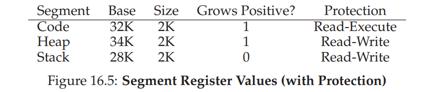

# Segmentation

> How do we support a large address space with (potentially) a lot of free space between the stack and the heap?

Instead of having just one base and bounds pair in our MMU, why not have a base and bounds pair per logical segment of the address space?

We have three logically-different segments: code, stack, and heap. What segmentation allows the OS to do is to place each one of those segments in different parts of physical memory, and thus avoid filling physical memory with unused virtual address space.

**Segmentation Fault**: The term segmentation fault or violation arises from a memory access on a segmented machine to an illegal address. Humorously, the term persists, even on machines with no support for segmentation at all.

The hardware uses segment registers during translation.

## Segment Identification
>How does it know the offset into a segment, and to which segment an address refers?

One common approach, sometimes referred to as an explicit approach, is to chop up the address space into segments based on the top few bits of the virtual address

## Backwards Growth

The stack grows backwards. So for each segment, we also need to store information about its direction of growth.

## Support for Sharing

To save memory, sometimes it is useful to share certain memory segments between address spaces. In particular, **code sharing** is common and still in use in systems today.

To support sharing, we need a little extra support from the hardware, in the form of **protection bits**. Basic support adds a few bits per segment, indicating whether or not a program can read or write a segment, or perhaps execute code that lies within the segment. By setting a code segment to read-only, the same code can be shared across multiple processes, without worry of harming isolation; while each process still thinks that it is accessing its own private memory, the OS is secretly sharing memory which cannot be modified by the process, and thus the illusion is preserved.

With protection bits, the hardware algorithm described earlier would also have to change. In addition to checking whether a virtual address is within bounds, the hardware also has to check whether a particular access is permissible. If a user process tries to write to a read-only segment, or execute from a non-executable segment, the hardware should raise an exception, and thus let the OS deal with the offending process.

Segmentation is one method of implementing **memory protection**.

# Problems

- What if large but sparsely used heap falls in one logical segment? There is still waste.

- What to do about external fragmentation?

# Reference

1. [Operating Systems Three Little Pieces Chapter 16](http://pages.cs.wisc.edu/~remzi/OSTEP/vm-segmentation.pdf)
1. [Wiki Memory Segmentation](https://en.wikipedia.org/wiki/Memory_segmentation)
