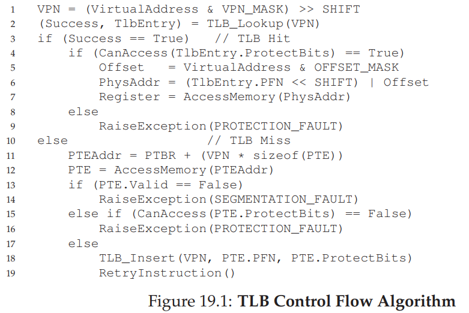
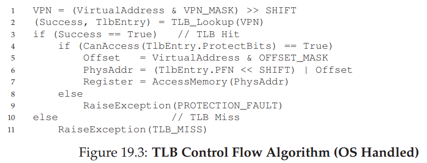
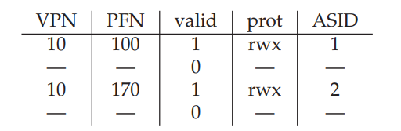

# Translation Lookaside Buffer

> How to avoid extra memory reference during translation?

To speed address translation, we are going to add what is called a **translation-lookaside buffer**, or **TLB**.

A TLB is part of the chip’s memory-management unit (MMU), and is simply a **hardware cache** of popular virtual-to-physical address translations; thus, a better name would be an address-translation cache.

Upon each virtual memory reference, the hardware first checks the TLB to see if the desired translation is held therein; if so, the translation is performed (quickly) without having to consult the page table (which has all translations).

## TLB Basic Algorithm

We either have **TLB Hit** or **TLB Miss**. Notice that on **TLB Miss**, we retry the instruction at the end.

For better understanding, read section 19.2 from [OS 3 Easy Pieces - TLB](http://pages.cs.wisc.edu/~remzi/OSTEP/vm-tlbs.pdf).

Like any cache, TLBs rely upon both **spatial locality** and **temporal locality** for success, which are program properties. If the program of interest exhibits such locality (and many programs do), the TLB hit rate will likely be high.

Read more on [Cache](./cache.md).

## Who should handle TLB Miss?

Hardware vs Software

If we let hardware handle it, like old systems, then they will need to know location of page table and it's exact format.

The primary advantage of the software-managed approach is flexibility: the OS can use any data structure it wants to implement the page table, without necessitating hardware change. Another advantage is simplicity, as seen in picture below.

## TLB Issue: Context Switches

With TLBs, some new issues arise when switching between processes (and hence address spaces). Specifically, the TLB contains virtual-to-physical translations that are only valid for the currently running process; these translations are not meaningful for other processes. As a result, when switching from one process to another, the hardware or OS (or both) must be careful to ensure that the about-to-be-run process does not accidentally use translations from some previously run process.

> How to manage TLB contents on a context switch?

One approach is to simply flush the TLB on context switches, thus emptying it before running the next process. On a software-based system, this can be accomplished with an explicit (and privileged) hardware instruction; with a hardware-managed TLB, the flush could be enacted when the page-table base register is changed (note the OS must change the PTBR on a context switch anyhow). In either case, the flush operation simply sets all valid bits to 0, essentially clearing the contents of the TLB. However, there is a cost: each time a process runs, it must incur TLB misses as it touches its data and code pages. If the OS switches between processes frequently, this cost may be high.

To reduce this overhead, some systems add hardware support to enable sharing of the TLB across context switches. In particular, some hardware systems provide an **address space identifier (ASID)** field in the TLB. You can think of the ASID as a process identifier (PID), but usually it has fewer bits (e.g., 8 bits for the ASID versus 32 bits for a PID).

Here is a depiction of a TLB with the added ASID field:

## TLB Coverage

> RAM isn’t always RAM (Culler’s law)

Due to TLB, access to pages from RAM may differ in time greatly. So all reading RAM randomly may not be ideal.

In particular, if the number of pages a program accesses in a short period of time exceeds the number of pages that fit into the TLB, the program will generate a large number of TLB misses, and thus run quite a bit more slowly. We refer to this phenomenon as exceeding the **TLB coverage**, and it can be quite a problem for certain programs.

## Resources

1. [OS Three Little Pieces: Chapter 19 Paging - Faster Translations (TLBs)](http://pages.cs.wisc.edu/~remzi/OSTEP/vm-tlbs.pdf)
