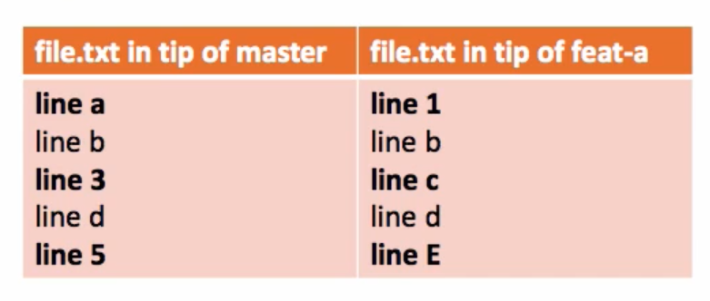
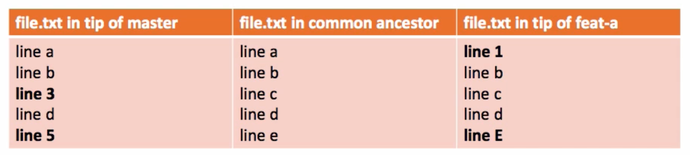

# Git

## Three Way Merge

What happens when you merge a branch? For example, you want to merge Feature_A branch with master.

What git does is, it finds 3 commits: the head of Feature_A, the head of master and lowest common ancestor of Feature_A and Master. Then uses these 3 commits to make decisions for merge.

But why do we need three commits? Can't we just use head of each branch to make the decision?



In the picture above, is it possible to figure out which branch changed made the changes to line 1, 3 and 5? No. Hence, we have to manually decide for each line.

But, if we use three commits to merge, then things get a bit easier.



Now, we can easily determine which branch made changes to each line. Only for the last line we have merge conflict. For the rest, we have auto merge.

And this is the reason git uses three way merging.

## Git tag

```bash
git tag # show tags
git tag -a v1.4 -m "my version 1.4" # Annotated tags
git show v1.4
git push origin v1.4
git checkout v1.4
```

## Squashing multiple commits

`git rebase -i HEAD~3` or however many commits instead of 3.

Turn this

```text
pick YourCommitMessageWhatever
pick YouGetThePoint
pick IdkManItsACommitMessage
```

into this

```text
pick YourCommitMessageWhatever
s YouGetThePoint
s IdkManItsACommitMessage
```

Save and come out.

It's a lot easier than it looks. There are plenty of helpful comments to guide you once the rebase starts.

## Delete Submodule

1. Delete the relevant section from the .gitmodules file.
2. Stage the .gitmodules changes git add .gitmodules
3. Delete the relevant section from .git/config.
4. Run `git rm --cached path_to_submodule` (no trailing slash).
5. Run `rm -rf .git/modules/path_to_submodule`
6. Commit git commit -m "Removed submodule XXX"
7. Delete the now untracked submodule files `rm -rf path_to_submodule`

## Upstream

Setting upstream allows you to view extra info during `git status`


You can learn if your branch is ahead or behind a particular remote branch.

```bash
git branch --set-upstream-to origin/my_branch
git branch -u origin/my_branch
```

## Default to ssh always 

This is useful when you have 2FA enabled in some website. You can't submit 2FA from terminal, can you? So force git to use ssh.

```bash
git config --global url."git@github.com:".insteadOf "https://github.com/"
```